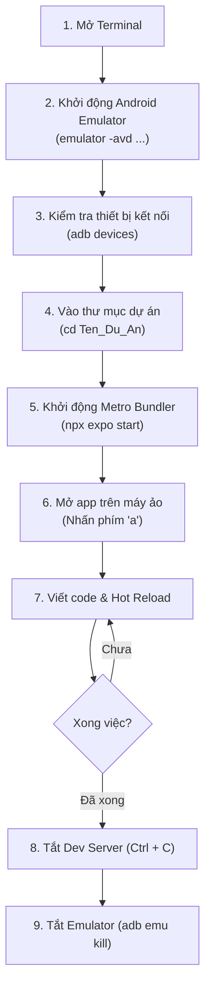

# 📖 CẨM NANG TOÀN TẬP: Hướng Dẫn Chạy & Quản Lý Dự Án React Native Từ A Đến Z

> **Dành cho:** Lập trình viên React Native sử dụng macOS & Android Emulator.  
> **Mục đích:** Hướng dẫn chi tiết từng bước, giải thích ý nghĩa bản chất của mọi câu lệnh từ lúc bật máy ảo, khởi chạy dự án, gỡ lỗi đến khi tắt giải phóng tài nguyên.

---

## 🗺️ 1. Sơ Đồ Quy Trình Phát Triển Hàng Ngày (Daily Workflow)



---

## 📱 2. Quản Lý Android Emulator Bằng Dòng Lệnh (CLI)

Trước khi chạy code React Native, bạn luôn cần một thiết bị (máy ảo hoặc máy thật) đang hoạt động.

### 2.1 Xem danh sách máy ảo đang có trên máy
```bash
emulator -list-avds
```
* **Ý nghĩa:** `avds` = *Android Virtual Devices*. Lệnh này quét thư mục `~/.android/avd` để liệt kê tên các máy ảo bạn đã tạo trong Android Studio (ví dụ: `Medium_Phone`, `Pixel_7_API_34`).

---

### 2.2 Khởi động máy ảo (Android Emulator)

#### Cách 1: Chạy có giao diện bình thường
```bash
emulator -avd Medium_Phone
```
* **Ý nghĩa:** Bật máy ảo có tên là `Medium_Phone`.
* **Lưu ý:** Terminal này sẽ bị giữ lại để hiển thị log của máy ảo.

#### Cách 2: Chạy ở chế độ nền (Background) — **KHUYÊN DÙNG**
```bash
emulator -avd Medium_Phone -no-snapshot-load &
```
* **Giải thích cờ lệnh:**
  * `-avd Medium_Phone`: Chọn máy ảo cần bật.
  * `-no-snapshot-load`: Buộc máy ảo khởi động mới hoàn toàn (cold boot), tránh bị treo trạng thái cũ.
  * `&` (dấu và ở cuối): Cho phép lệnh chạy ngầm dưới background, giải phóng Terminal để bạn gõ lệnh khác ngay lập tức.

---

### 2.3 Kiểm tra máy ảo đã sẵn sàng chưa
```bash
adb devices
```
* **Ý nghĩa:** `adb` (*Android Debug Bridge*) là công cụ giao tiếp giữa máy Mac và thiết bị Android.
* **Kết quả mong đợi:**
  ```text
  List of devices attached
  emulator-5554    device
  ```
  * `device`: Máy ảo đã khởi động xong và sẵn sàng nhận app.
  * `offline`: Máy ảo đang boot dở, cần đợi thêm vài giây.

```bash
adb wait-for-device
```
* **Ý nghĩa:** Tạm dừng kịch bản cho đến khi máy ảo khởi động xong hoàn toàn mới thực hiện lệnh kế tiếp.

---

### 2.4 Tắt máy ảo an toàn
```bash
adb emu kill
```
* **Ý nghĩa:** Gửi tín hiệu shutdown an toàn tới emulator, tương tự như việc bạn nhấn nút Power tắt điện thoại. Tránh làm hỏng phân vùng dữ liệu của máy ảo.

---

## 🚀 3. Khởi Tạo & Chạy Dự Án React Native / Expo

### 3.1 Tạo dự án mới
```bash
npx create-expo-app@latest Ten_Du_An -y
```
* **Giải thích từng từ khóa:**
  * `npx`: Trình thực thi gói npm (chạy trực tiếp phiên bản mới nhất mà không cần cài đặt cố định vào máy).
  * `create-expo-app@latest`: Công cụ chính thức để khởi tạo cấu trúc dự án Expo chuẩn.
  * `Ten_Du_An`: Tên thư mục dự án bạn muốn tạo.
  * `-y` (*--yes*): Tự động đồng ý với các tùy chọn mặc định (dùng template TypeScript + Expo Router chuẩn).

---

### 3.2 Di chuyển vào thư mục dự án
```bash
cd Ten_Du_An
```

---

### 3.3 Cài đặt thêm thư viện mới (khi cần)
Khi bạn cần cài thêm package trong quá trình học:
```bash
# Cài đặt thư viện của Expo (Expo sẽ tự chọn phiên bản tương thích nhất với SDK hiện tại)
npx expo install expo-camera expo-location

# Hoặc cài đặt package npm thông thường
npm install zustand axios
```
* **Lưu ý:** Luôn ưu tiên dùng `npx expo install` đối với các package có tiền tố `expo-` hoặc liên quan đến Native modules.

---

## 💻 4. Khởi Chạy Metro Bundler & Tương Tác Với App

### 4.1 Khởi động Dev Server
Có 2 cách thông dụng:

#### Cách 1: Bật server trước, mở app sau
```bash
npx expo start
```
* **Ý nghĩa:** Khởi chạy **Metro Bundler** (mặc định tại cổng `http://localhost:8081`). Sau khi server chạy, màn hình Terminal sẽ hiện menu tương tác và mã QR. Bạn bấm phím `a` để kích hoạt mở app trên Android.

#### Cách 2: Bật server và tự động mở luôn trên Android (Nhanh gọn)
```bash
npm run android
# Hoặc: npx expo start --android
```
* **Ý nghĩa:** Vừa bật Metro Bundler, vừa tự động phát hiện emulator đang chạy và cài đặt/mở app lên ngay lập tức.

---

### 4.2 Các phím tắt quyền năng trong Terminal (Khi Expo đang chạy)

Khi Metro Bundler đang hoạt động, bạn chỉ cần bấm **1 ký tự trên bàn phím** trực tiếp vào Terminal:

| Phím | Chức năng | Ý nghĩa chi tiết |
|:---:|:---|:---|
| **`a`** | **Open on Android** | Mở app trên Android Emulator hoặc thiết bị thật cắm dây |
| **`i`** | **Open on iOS** | Mở app trên iOS Simulator (yêu cầu cài Xcode) |
| **`w`** | **Open on Web** | Mở app dưới dạng trang web trên trình duyệt Chrome/Safari |
| **`r`** | **Reload App** | Ép app tải lại toàn bộ code (Full Reload) |
| **`m`** | **Toggle Dev Menu** | Bật menu nhà phát triển trên màn hình điện thoại (để bật debug, show FPS...) |
| **`j`** | **Open Debugger** | Mở công cụ gỡ lỗi (React Native DevTools / Chrome Inspect) |
| **`c`** | **Show Terminal QR** | Hiển thị lại mã QR để quét bằng điện thoại thật |
| **`shift + m`** | **More Tools** | Mở rộng menu cấu hình nâng cao |
| **`?`** | **Show Help** | Liệt kê lại toàn bộ các phím tắt hỗ trợ |

---

### 4.3 Các thao tác trực tiếp trên Android Emulator

| Thao tác | Phím tắt macOS | Chức năng |
|:---|:---:|:---|
| **Mở Dev Menu** | `Cmd + M` (hoặc `Ctrl + M`) | Bật popup công cụ: Element Inspector, Performance Monitor, Reload |
| **Reload nhanh** | Nhấn liên tiếp 2 lần phím `R` | Tải lại giao diện |
| **Quay lại (Back)** | `Esc` hoặc `Cmd + Backspace` | Tương đương phím Back vật lý trên Android |

---

## 🛑 5. Cách Tắt Dự Án Sạch Sẽ (Graceful Shutdown)

Khi kết thúc buổi học hoặc muốn chuyển sang dự án khác, hãy thực hiện theo thứ tự:

1. **Bước 1: Dừng Metro Bundler**
   * Nhấn tổ hợp phím `Ctrl + C` tại cửa sổ Terminal đang chạy `npx expo start`.
2. **Bước 2: Tắt Android Emulator**
   * Chạy lệnh `adb emu kill` hoặc bấm nút dấu `X` trên thanh điều khiển của cửa sổ máy ảo.

---

## 📋 6. Bảng Tra Cứu Nhanh (Cheatsheet)

| Nhu cầu của bạn | Câu lệnh chính xác |
|:---|:---|
| Xem tên các máy ảo có sẵn | `emulator -list-avds` |
| Bật máy ảo ngầm không bị chiếm Terminal | `emulator -avd Medium_Phone -no-snapshot-load &` |
| Kiểm tra máy ảo đã kết nối adb chưa | `adb devices` |
| Tạo dự án Expo mới | `npx create-expo-app@latest <Tên_Du_An> -y` |
| Chạy dự án trên Android | `npx expo start --android` |
| Xóa sạch cache khi gặp lỗi kỳ lạ | `npx expo start -c` |
| Tắt máy ảo từ dòng lệnh | `adb emu kill` |
| Reset dự án mẫu về trắng tinh | `npm run reset-project` |

---

## 🛠️ 7. Xử Lý Các Sự Cố Thường Gặp (Troubleshooting)

### ⚠️ Lỗi 1: `zsh: command not found: adb` hoặc `emulator`
* **Nguyên nhân:** Shell Terminal mới mở chưa nạp các biến môi trường từ file `.zshrc`.
* **Cách khắc phục:** Chạy lệnh nạp lại cấu hình:
  ```bash
  source ~/.zshrc
  ```

---

### ⚠️ Lỗi 2: Cổng `8081` bị chiếm (Port 8081 is already in use)
* **Nguyên nhân:** Lần trước bạn tắt server chưa hết hoặc có tiến trình Metro cũ đang chạy ngầm.
* **Cách khắc phục:**
  ```bash
  # Tìm tiến trình đang chiếm cổng 8081
  lsof -i :8081
  
  # Tiêu diệt tiến trình đó (thay PID bằng số tìm được, hoặc dùng lệnh 1 dòng dưới đây)
  kill -9 $(lsof -t -i:8081)
  ```

---

### ⚠️ Lỗi 3: Code đã sửa nhưng máy ảo không cập nhật (Stale Cache)
* **Nguyên nhân:** Metro Bundler lưu cache file cũ và chưa nhận diện đúng thay đổi.
* **Cách khắc phục:** Khởi động kèm cờ `-c` (*--clear*):
  ```bash
  npx expo start -c
  ```

---

### ⚠️ Lỗi 4: ADB bị mất kết nối với máy ảo (`device offline` hoặc không nhận)
* **Nguyên nhân:** ADB Server bị treo ngầm.
* **Cách khắc phục:** Khởi động lại ADB Server:
  ```bash
  adb kill-server && adb start-server
  adb devices
  ```

---

## 🎯 Tóm Lại: 3 Lệnh Mở Đầu Mỗi Buổi Học

Mỗi ngày khi ngồi vào bàn học React Native, bạn chỉ cần mở Terminal và gõ đúng 3 dòng:

```bash
# 1. Bật máy ảo ngầm
emulator -avd Medium_Phone -no-snapshot-load &

# 2. Chờ 5-10 giây, rồi vào thư mục bài học
cd /Users/vovantu/HTML_CSS/ReactNative/Bai1_HelloReactNative

# 3. Chạy app lên Android
npx expo start --android
```
*(Xong việc thì bấm `Ctrl + C` và gõ `adb emu kill`)*.
