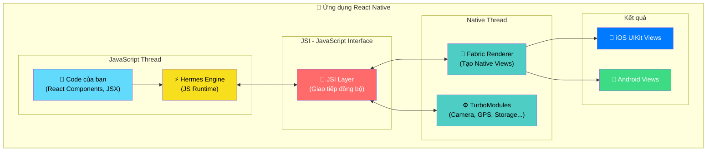
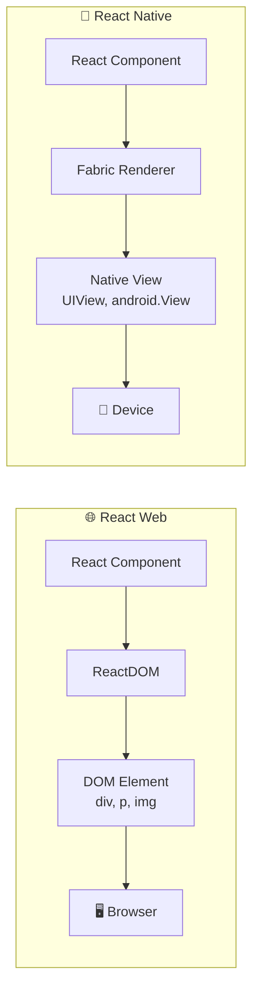
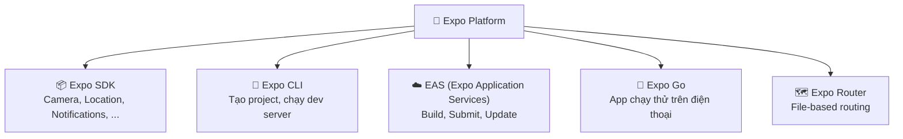
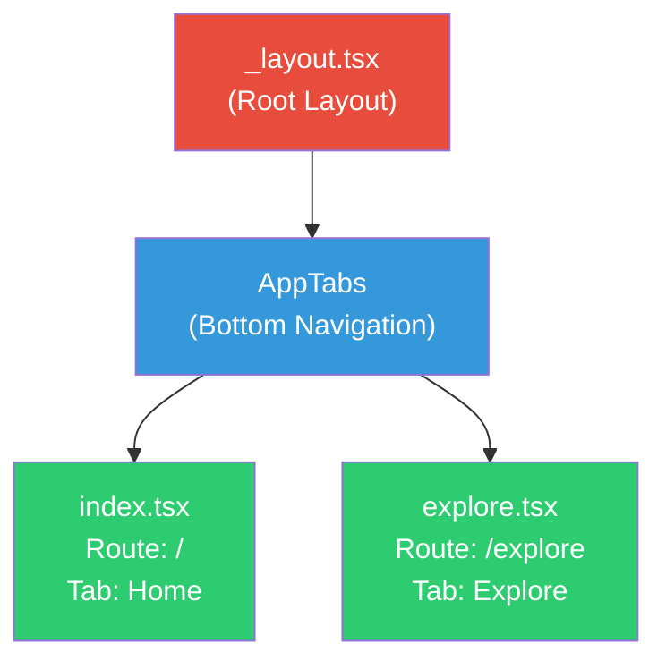
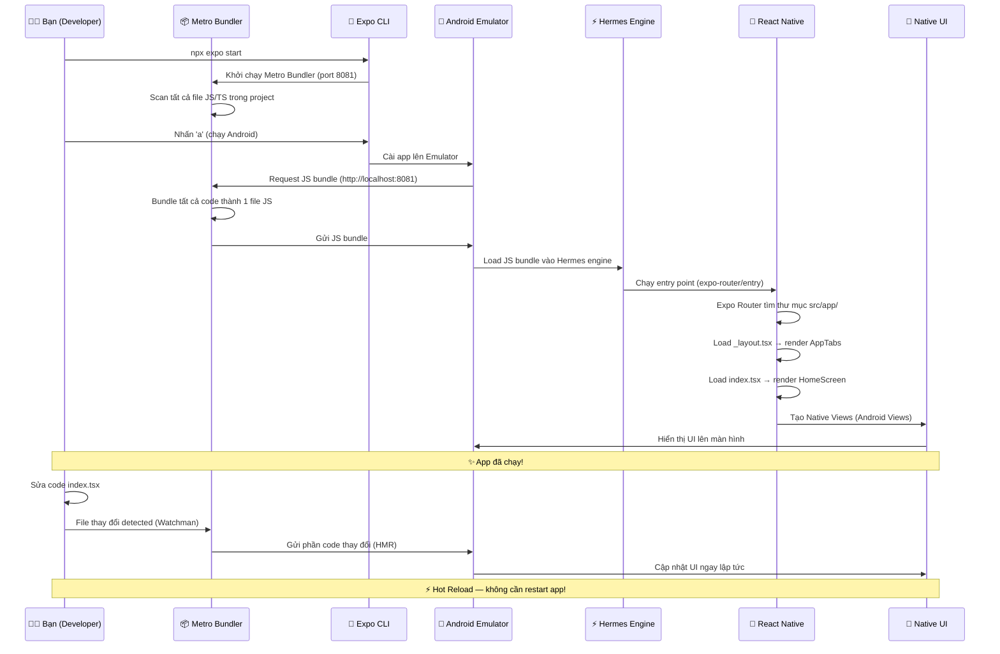
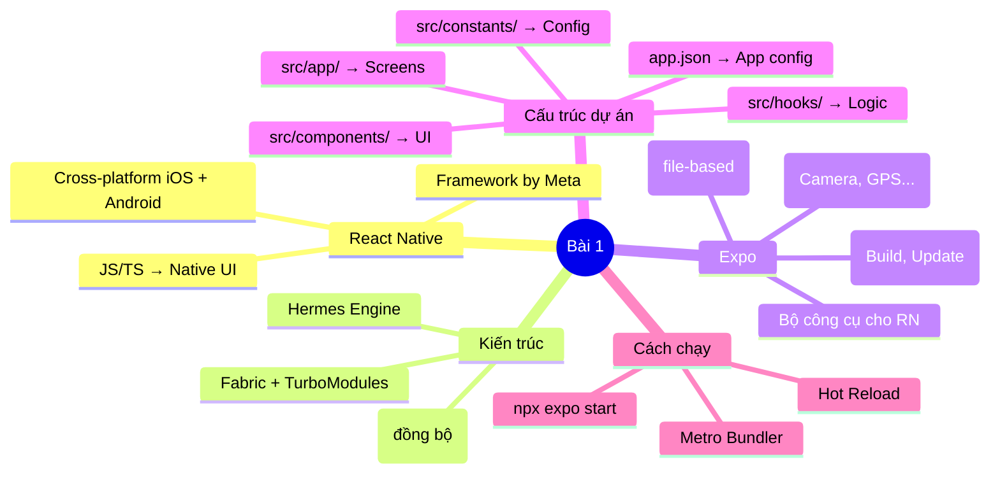

# 📘 BÀI 1: Giới Thiệu React Native — Cài Đặt & Khởi Chạy Dự Án Đầu Tiên

> **Thời lượng:** ~3-4 giờ | **Độ khó:** ⭐ Cơ bản | **Dự án thực hành:** `Bai1_HelloReactNative`

---

## 🎯 Mục tiêu bài học

Sau bài này, bạn sẽ:
- [ ] Hiểu React Native là gì, hoạt động ra sao, khác gì với React web
- [ ] Hiểu kiến trúc mới (New Architecture) của React Native
- [ ] Biết Expo là gì và tại sao dùng Expo
- [ ] Hiểu rõ cấu trúc từng file/thư mục trong dự án thực tế
- [ ] Hiểu luồng khởi động app từ khi chạy lệnh đến khi hiển thị UI
- [ ] Chạy app thành công trên Android Emulator
- [ ] Biết cách sửa code và xem kết quả qua Hot Reload

---

## Phần 1: React Native Là Gì?

### 1.1 Định nghĩa

**React Native** là một framework mã nguồn mở do **Meta (Facebook)** phát triển (2015), cho phép xây dựng ứng dụng mobile **native** cho cả **iOS** và **Android** bằng **JavaScript/TypeScript** và **React**.

> [!IMPORTANT]
> **"Native" nghĩa là gì?**  
> Khác với WebView apps (Cordova, Ionic) chạy web bên trong wrapper, React Native **tạo ra các UI component native thật sự** — `UIView` trên iOS, `android.view.View` trên Android. Người dùng sẽ cảm nhận app giống hệt app native.

### 1.2 So sánh React Web vs React Native

Bạn đã biết React web, nên hãy xem **cái gì giống và khác**:

| Tiêu chí | React (Web) | React Native (Mobile) |
|:---|:---|:---|
| **Chạy trên** | Browser (Chrome, Firefox, ...) | iOS & Android native |
| **Render engine** | ReactDOM → DOM elements | React Native → Native Views |
| **Ngôn ngữ** | JavaScript/TypeScript | JavaScript/TypeScript ✅ *Giống nhau* |
| **Component syntax** | JSX ✅ *Giống nhau* | JSX ✅ *Giống nhau* |
| **Hooks** | `useState`, `useEffect`, ... | `useState`, `useEffect`, ... ✅ *Giống nhau* |
| **HTML elements** | `<div>`, `<p>`, ``, `<input>` | ❌ **Không có HTML!** → `<View>`, `<Text>`, `<Image>`, `<TextInput>` |
| **CSS styling** | CSS file, className | ❌ **Không có CSS file!** → `StyleSheet.create()`, inline JS objects |
| **Layout** | Flexbox + Grid + Block + Inline | Chỉ có **Flexbox** (mặc định `column`) |
| **Routing** | React Router, Next.js | React Navigation, Expo Router |
| **Bundler** | Webpack, Vite | **Metro Bundler** |

> [!TIP]
> **Tin tốt:** ~80% kiến thức React web của bạn **dùng được ngay** trong React Native (component, props, state, hooks, context, ...). Chỉ cần học thêm các native components và cách styling mới.

### 1.3 So sánh với các công nghệ mobile khác

| Tiêu chí | Native (Swift/Kotlin) | React Native | Flutter |
|:---|:---:|:---:|:---:|
| Ngôn ngữ | Swift / Kotlin | **JavaScript / TypeScript** | Dart |
| Code sharing iOS + Android | ❌ 0% | ✅ ~90% | ✅ ~95% |
| Hiệu năng | ⭐⭐⭐⭐⭐ | ⭐⭐⭐⭐ | ⭐⭐⭐⭐ |
| UI | 100% Native | ✅ Native components | Custom widgets (Skia) |
| Hệ sinh thái / Community | Lớn | **Rất lớn** (npm) | Đang phát triển |
| Hot Reload | ❌ Không | ✅ Có | ✅ Có |
| Dễ học (đã biết JS/React) | ❌ Học ngôn ngữ mới | ✅ **Dễ nhất** | ⚠️ Phải học Dart |
| Ai dùng? | Apple, Google | Meta, Shopify, Discord, Microsoft | Google, BMW, Alibaba |

---

## Phần 2: Kiến Trúc React Native

### 2.1 Kiến trúc tổng quan

Để hiểu React Native hoạt động ra sao, hãy xem nó gồm những thành phần nào:



### 2.2 Giải thích từng thành phần

| Thành phần | Vai trò | Ví dụ dễ hiểu |
|:---|:---|:---|
| **Hermes** | JS engine chạy code của bạn, tối ưu cho mobile (khởi động nhanh, ít RAM) | Giống V8 trong Chrome, nhưng nhẹ hơn |
| **JSI** (JavaScript Interface) | Cầu nối giữa JS và Native, cho phép gọi **đồng bộ** (synchronous) | Giống "thông dịch viên" giữa 2 ngôn ngữ |
| **Fabric** | Renderer mới, tạo native views từ React components | Giống ReactDOM trên web, nhưng tạo native views |
| **TurboModules** | Truy cập tính năng native (camera, GPS, ...) theo kiểu lazy-load | Chỉ load module khi cần, không load hết từ đầu |

> [!NOTE]
> **New Architecture (từ RN 0.73+):** Trước đây RN dùng "Bridge" — giao tiếp **bất đồng bộ** (asynchronous) qua JSON, gây chậm. Kiến trúc mới dùng **JSI** — giao tiếp **đồng bộ** (synchronous) trực tiếp, nhanh hơn đáng kể. Dự án của bạn dùng RN **0.86.2** — đã sử dụng New Architecture!

### 2.3 So sánh cách render: Web vs React Native



**Điểm mấu chốt:** Code React của bạn **giống nhau**, chỉ khác ở bước cuối — web render ra HTML DOM, React Native render ra **Native Views thật**.

---

## Phần 3: Expo Là Gì?

### 3.1 Expo — Bộ công cụ cho React Native

**Expo** là một nền tảng (platform) và bộ công cụ giúp phát triển React Native **dễ dàng hơn rất nhiều**. Nó cung cấp:



### 3.2 Tại sao dùng Expo?

| Không có Expo | Có Expo |
|:---|:---|
| Cài Xcode + Android Studio + cấu hình phức tạp | `npx create-expo-app` → chạy ngay |
| Build trên máy (chậm, tốn tài nguyên) | Build trên cloud (EAS Build) |
| Tự viết native code cho camera, GPS, ... | Expo SDK có sẵn, chỉ cần `import` |
| Deep linking cấu hình thủ công | Expo Router tự động |
| Tự setup OTA updates | EAS Update có sẵn |

> [!TIP]
> **Ví dụ thực tế:** Để sử dụng Camera trên React Native thuần, bạn cần viết native code (Swift/Kotlin), link thư viện, cấu hình Gradle/Xcode. Với Expo, chỉ cần:
> ```tsx
> import { Camera } from 'expo-camera';
> // Dùng luôn!
> ```

---

## Phần 4: Phân Tích Cấu Trúc Dự Án Thực Tế

Dưới đây là cấu trúc dự án [Bai1_HelloReactNative](file:///Users/vovantu/HTML_CSS/ReactNative/Bai1_HelloReactNative) mà chúng ta vừa tạo:

### 4.1 Sơ đồ cấu trúc thư mục

```
Bai1_HelloReactNative/
│
├── 📁 src/                          ← 🔥 THƯ MỤC CHÍNH - Code của bạn nằm ở đây
│   ├── 📁 app/                      ← Các màn hình (screens/routes)
│   │   ├── _layout.tsx              ← Root layout (bọc toàn bộ app)
│   │   ├── index.tsx                ← Tab "Home" (trang chủ)
│   │   └── explore.tsx              ← Tab "Explore"
│   │
│   ├── 📁 components/               ← Components tái sử dụng
│   │   ├── animated-icon.tsx        ← Icon Expo có animation
│   │   ├── app-tabs.tsx             ← Cấu hình bottom tabs
│   │   ├── themed-text.tsx          ← Component Text theo theme
│   │   ├── themed-view.tsx          ← Component View theo theme
│   │   └── hint-row.tsx             ← Component hiển thị gợi ý
│   │
│   ├── 📁 constants/                ← Hằng số
│   │   └── theme.ts                 ← Colors, Fonts, Spacing
│   │
│   ├── 📁 hooks/                    ← Custom hooks
│   │   ├── use-theme.ts             ← Hook lấy màu theo theme
│   │   └── use-color-scheme.ts      ← Hook detect light/dark mode
│   │
│   └── global.css                   ← CSS cho web (chỉ dùng trên web)
│
├── 📁 assets/                       ← Tài nguyên tĩnh (ảnh, fonts, icons)
│   └── 📁 images/
│
├── 📁 scripts/                      ← Scripts tiện ích
│   └── reset-project.js             ← Script reset project về trắng
│
├── ⚙️ app.json                      ← CẤU HÌNH CHÍNH của app
├── 📦 package.json                  ← Dependencies & scripts
├── ⚙️ tsconfig.json                 ← Cấu hình TypeScript
└── 📁 node_modules/                 ← Thư viện (KHÔNG sửa)
```

### 4.2 Giải thích chi tiết từng file quan trọng

---

#### 📄 `package.json` — Trái tim của dự án

File: [package.json](file:///Users/vovantu/HTML_CSS/ReactNative/Bai1_HelloReactNative/package.json)

```json
{
  "name": "bai1_helloreactnative",
  "main": "expo-router/entry",     // ← Entry point: Expo Router xử lý khởi tạo
  "version": "1.0.0",
  "scripts": {
    "start": "expo start",          // ← Khởi chạy Metro dev server
    "android": "expo start --android", // ← Chạy trên Android
    "ios": "expo start --ios",       // ← Chạy trên iOS
    "web": "expo start --web"        // ← Chạy trên web browser
  }
}
```

| Field | Ý nghĩa |
|:---|:---|
| `"main": "expo-router/entry"` | Điểm khởi đầu của app — Expo Router sẽ tự tìm thư mục `app/` bên trong `src/` |
| `"expo": "~57.0.14"` | Expo SDK version 57 (mới nhất) |
| `"react-native": "0.86.2"` | React Native version (New Architecture) |
| `"react": "19.2.3"` | React 19 — phiên bản mới nhất |

---

#### 📄 `app.json` — Cấu hình ứng dụng

File: [app.json](file:///Users/vovantu/HTML_CSS/ReactNative/Bai1_HelloReactNative/app.json)

```json
{
  "expo": {
    "name": "Bai1_HelloReactNative",  // ← Tên hiển thị trên màn hình điện thoại
    "slug": "Bai1_HelloReactNative",  // ← URL-friendly name (dùng cho Expo)
    "version": "1.0.0",               // ← Phiên bản app
    "orientation": "portrait",         // ← Chỉ dọc (không cho xoay ngang)
    "icon": "./assets/images/icon.png", // ← Icon app
    "scheme": "bai1helloreactnative",  // ← Deep link scheme (vd: bai1helloreactnative://)
    "userInterfaceStyle": "automatic", // ← Tự động theo light/dark của hệ thống

    "android": {
      "adaptiveIcon": { ... }          // ← Icon adaptive cho Android
    },

    "plugins": [
      "expo-router",                   // ← Plugin Expo Router
      ["expo-splash-screen", {         // ← Plugin Splash Screen
        "backgroundColor": "#208AEF",
        "image": "./assets/images/splash-icon.png"
      }]
    ],

    "experiments": {
      "typedRoutes": true,             // ← Type-safe routes (TypeScript)
      "reactCompiler": true            // ← React Compiler (tối ưu tự động)
    }
  }
}
```

> [!NOTE]
> **`app.json` là nơi bạn cấu hình mọi thứ** liên quan đến app: tên, icon, splash screen, permissions, plugins, ... Tương tự như `AndroidManifest.xml` (Android) hoặc `Info.plist` (iOS), nhưng gọn hơn nhiều.

---

#### 📄 `src/app/_layout.tsx` — Root Layout (bọc toàn bộ app)

File: [_layout.tsx](file:///Users/vovantu/HTML_CSS/ReactNative/Bai1_HelloReactNative/src/app/_layout.tsx)

```tsx
import { DarkTheme, DefaultTheme, ThemeProvider } from 'expo-router';
import * as SplashScreen from 'expo-splash-screen';
import { useColorScheme } from 'react-native';

import { AnimatedSplashOverlay } from '@/components/animated-icon';
import AppTabs from '@/components/app-tabs';

// Giữ Splash Screen hiển thị cho đến khi app sẵn sàng
SplashScreen.preventAutoHideAsync();

export default function TabLayout() {
  // Detect light/dark mode từ hệ thống
  const colorScheme = useColorScheme();

  return (
    // ThemeProvider cung cấp theme cho toàn bộ app
    <ThemeProvider value={colorScheme === 'dark' ? DarkTheme : DefaultTheme}>
      <AnimatedSplashOverlay />  {/* Splash animation */}
      <AppTabs />                 {/* Bottom Tab Navigation */}
    </ThemeProvider>
  );
}
```

**Vai trò của `_layout.tsx`:**
- Là component **bọc tất cả** các screen khác (giống `App.tsx` trong React web)
- Prefix `_` nghĩa là file **layout**, không phải screen
- Cấu hình theme (light/dark), splash screen, và navigation structure

---

#### 📄 `src/app/index.tsx` — Màn hình Home

File: [index.tsx](file:///Users/vovantu/HTML_CSS/ReactNative/Bai1_HelloReactNative/src/app/index.tsx)

```tsx
export default function HomeScreen() {
  return (
    <ThemedView style={styles.container}>
      <SafeAreaView style={styles.safeArea}>
        {/* Hero section với logo Expo */}
        <ThemedView style={styles.heroSection}>
          <AnimatedIcon />
          <ThemedText type="title" style={styles.title}>
            Welcome to Expo
          </ThemedText>
        </ThemedView>

        {/* Hướng dẫn bắt đầu */}
        <ThemedView type="backgroundElement" style={styles.stepContainer}>
          <HintRow title="Try editing" hint={...} />
          <HintRow title="Dev tools" hint={...} />
          <HintRow title="Fresh start" hint={...} />
        </ThemedView>
      </SafeAreaView>
    </ThemedView>
  );
}
```

**Những điều quan trọng cần lưu ý:**

| Điểm | Giải thích |
|:---|:---|
| `export default function HomeScreen()` | Expo Router dùng **default export** để render screen |
| `<ThemedView>` thay vì `<div>` | Trong RN không có HTML — dùng `View` (hoặc custom `ThemedView`) |
| `<ThemedText>` thay vì `<p>` hay `<h1>` | Mọi text PHẢI nằm trong `<Text>` component |
| `<SafeAreaView>` | Đảm bảo nội dung không bị che bởi notch, status bar |
| `StyleSheet.create({...})` | Cách tạo styles trong RN (giống CSS objects) |
| `@/components/...` | Alias `@/` trỏ tới thư mục `src/` (cấu hình trong tsconfig.json) |

---

#### 📄 `src/constants/theme.ts` — Hệ thống Theme

File: [theme.ts](file:///Users/vovantu/HTML_CSS/ReactNative/Bai1_HelloReactNative/src/constants/theme.ts)

```tsx
export const Colors = {
  light: {
    text: '#000000',
    background: '#ffffff',
    backgroundElement: '#F0F0F3',
  },
  dark: {
    text: '#ffffff',
    background: '#000000',
    backgroundElement: '#212225',
  },
};

export const Spacing = {
  half: 2,
  one: 4,
  two: 8,
  three: 16,
  four: 24,
  five: 32,
  six: 64,
};
```

> [!TIP]
> **Design pattern tốt:** Thay vì hardcode màu sắc khắp nơi (`'#333'`, `'#fff'`), tập trung vào file constants. Khi cần đổi theme, chỉ sửa 1 chỗ.

---

### 4.3 Expo Router — File-based Routing

Expo Router sử dụng **file-based routing** — tên file trong thư mục `app/` tự động trở thành route:

| File | Route URL | Mô tả |
|:---|:---|:---|
| `src/app/index.tsx` | `/` | Trang chủ (Home tab) |
| `src/app/explore.tsx` | `/explore` | Trang Explore tab |
| `src/app/_layout.tsx` | — | Layout (không phải route) |
| `src/app/about.tsx` *(tạo mới)* | `/about` | Sẽ tự thành route `/about` |
| `src/app/user/[id].tsx` *(tạo mới)* | `/user/123` | Dynamic route |



---

## Phần 5: Luồng Khởi Động App

Khi bạn gõ `npx expo start` → chọn Android, đây là **toàn bộ quá trình** xảy ra:



### Giải thích từng bước:

| Bước | Điều gì xảy ra | Thời gian |
|:---|:---|:---:|
| 1. `npx expo start` | Khởi chạy Metro Bundler — dev server tại `localhost:8081` | ~2-3s |
| 2. Nhấn `a` | Expo build app và cài lên Android Emulator | ~10-30s (lần đầu) |
| 3. Request bundle | Emulator request JS bundle từ Metro | ~1s |
| 4. Metro bundling | Metro scan, transform, bundle tất cả code thành 1 file | ~3-10s |
| 5. Load vào Hermes | Hermes engine compile bytecode và chạy | ~1-2s |
| 6. Expo Router | Tìm `src/app/_layout.tsx` → load layout + screens | ~0.5s |
| 7. Render | React tạo Virtual DOM → Fabric tạo Native Views | ~0.5s |
| 8. **Hot Reload** | Khi sửa code → chỉ gửi phần thay đổi → cập nhật tức thì | **< 1s** |

---

## Phần 6: Chạy Dự Án Trên Android Emulator

### 6.1 Bước chạy

```bash
# Bước 1: Mở Android Emulator trước
# (Mở Android Studio → Virtual Device Manager → Start emulator)
# Hoặc chạy lệnh:
emulator -list-avds          # Xem danh sách emulators
emulator -avd <tên_emulator>  # Chạy emulator

# Bước 2: Di chuyển vào thư mục dự án và chạy
cd /Users/vovantu/HTML_CSS/ReactNative/Bai1_HelloReactNative
npx expo start

# Bước 3: Trong menu Expo, nhấn 'a' để chạy trên Android
# Hoặc chạy trực tiếp:
npm run android
```

### 6.2 Các phím tắt trong Expo Dev Server

Khi `npx expo start` đang chạy, bạn có thể dùng các phím:

| Phím | Chức năng |
|:---|:---|
| `a` | Mở app trên Android Emulator |
| `i` | Mở app trên iOS Simulator (cần Xcode) |
| `w` | Mở app trên Web browser |
| `r` | Reload app (restart hoàn toàn) |
| `m` | Mở Dev Menu trên emulator |
| `j` | Mở Debugger (React DevTools) |
| `shift+m` | Chọn dev tools |
| `?` | Xem tất cả phím tắt |

---

## Phần 7: Thực Hành — Sửa Code Đầu Tiên (Hot Reload)

### 7.1 Sửa trang Home

Mở file [src/app/index.tsx](file:///Users/vovantu/HTML_CSS/ReactNative/Bai1_HelloReactNative/src/app/index.tsx) và thay đổi nội dung:

```tsx
// Tìm dòng này:
<ThemedText type="title" style={styles.title}>
  Welcome to&nbsp;Expo
</ThemedText>

// Đổi thành:
<ThemedText type="title" style={styles.title}>
  Xin chào React Native! 🚀
</ThemedText>
```

**Kết quả:** Sau khi lưu file (`Cmd+S`), app trên emulator sẽ **tự động cập nhật** trong chưa đầy 1 giây — đó là **Hot Reload**!

### 7.2 Thay đổi `app.json`

Mở file [app.json](file:///Users/vovantu/HTML_CSS/ReactNative/Bai1_HelloReactNative/app.json) và thử thay đổi:

```json
{
  "expo": {
    "name": "Bài 1 - Hello RN",  // ← Đổi tên app
    "version": "1.0.1",           // ← Đổi version
    ...
  }
}
```

> [!WARNING]
> Khi thay đổi `app.json`, bạn cần **restart** Expo (`Ctrl+C` rồi `npx expo start` lại) vì đây là file cấu hình, không phải code — Hot Reload không áp dụng.

---

## Phần 8: Khái Niệm Quan Trọng Tổng Kết

| Khái niệm | Mô tả | File liên quan |
|:---|:---|:---|
| **Component** | Khối xây dựng UI cơ bản, viết bằng JSX, nhận props và quản lý state | Mọi file `.tsx` |
| **Screen** | Component đại diện cho 1 màn hình, export default trong `app/` | `app/index.tsx`, `app/explore.tsx` |
| **Layout** | Component bọc nhiều screens, tên file bắt đầu `_` | `app/_layout.tsx` |
| **Metro Bundler** | Dev server, bundle JS code, phục vụ Hot Reload | Chạy tự động khi `npx expo start` |
| **Hermes** | JS engine tối ưu cho mobile (nhẹ, khởi động nhanh) | Tự động trong RN 0.86 |
| **Expo Router** | File-based routing — tên file = route URL | Thư mục `app/` |
| **StyleSheet** | Cách viết styles trong RN (JS objects, camelCase) | `StyleSheet.create({...})` |
| **SafeAreaView** | Đảm bảo content không bị notch/status bar che | Import từ `react-native-safe-area-context` |
| **Hot Reload (HMR)** | Cập nhật UI ngay khi lưu file, giữ nguyên state | Tự động hoạt động |
| **`@/` alias** | Shortcut trỏ tới `src/`, tránh relative path dài | Cấu hình trong `tsconfig.json` |

---

## 📝 Bài Tập Thực Hành

### BT1: Chạy app thành công ✅
- Mở Android Emulator
- Chạy `npx expo start` → nhấn `a`
- Xác nhận thấy màn hình "Welcome to Expo"

### BT2: Sửa nội dung Home Screen
- Mở `src/app/index.tsx`
- Đổi text "Welcome to Expo" → "Xin chào, [Tên bạn]! 🇻🇳"
- Quan sát Hot Reload cập nhật tức thì

### BT3: Tìm hiểu `app.json`
- Đổi `"name"` thành tên khác
- Đổi `"orientation"` từ `"portrait"` sang `"default"` (cho phép xoay ngang)
- Đổi màu splash screen (`backgroundColor`)
- Restart Expo và xem kết quả

### BT4: Khám phá cấu trúc dự án
- Mở từng file trong `src/components/` — đọc hiểu từng component
- Mở `src/constants/theme.ts` — thử đổi màu `Colors.light.background` thành `'#f0e68c'` (vàng nhạt) → xem app thay đổi
- Mở `src/hooks/use-theme.ts` — đọc hiểu cách hook lấy màu theo theme

---

## 🎓 Tổng Kết Bài 1



> **Bài tiếp theo:** [Bài 2 — Core Components & JSX trong React Native](file:///Users/vovantu/HTML_CSS/ReactNative) — Bạn sẽ học cách sử dụng `View`, `Text`, `Image`, `TextInput`, `Pressable` và sự khác biệt so với HTML.

---

*Khi bạn hoàn thành các bài tập, hãy báo cho tôi để bắt đầu Bài 2!* 🚀
