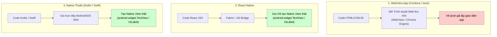
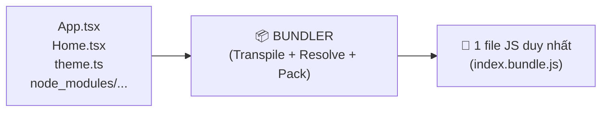
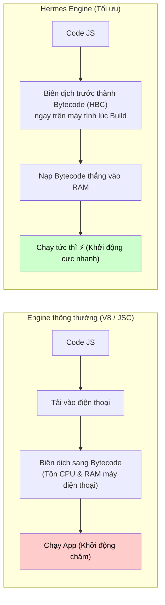
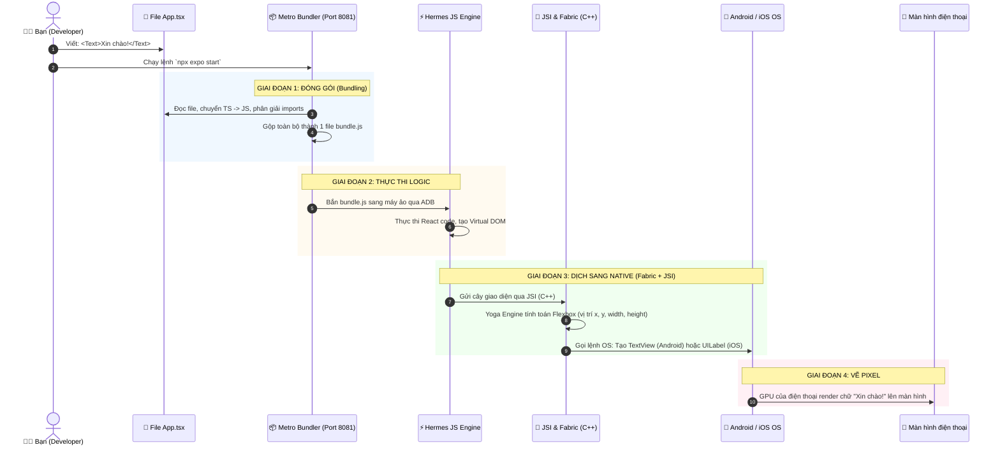

# 🧠 GIẢI THÍCH CHUYÊN SÂU: Bản Chất "Native", Bundler, Hermes & Toàn Bộ Luồng Hoạt Động Của React Native

> **Dành cho:** Sinh viên IT muốn hiểu tận gốc cơ chế bên dưới ("under the hood") của React Native thay vì chỉ học vẹt cú pháp.

---

## 📑 Mục lục
1. [Phần 1: "Native Component Thật Sự" Là Gì?](#phần-1-native-component-thật-sự-là-gì)
2. [Phần 2: Bundler Là Gì? Tại Sao Cần Metro Bundler?](#phần-2-bundler-là-gì-tại-sao-cần-metro-bundler)
3. [Phần 3: Hermes Engine Là Gì & Làm Nhiệm Vụ Gì?](#phần-3-hermes-engine-là-gì--làm-nhiệm-vụ-gì)
4. [Phần 4: JSI & Fabric Renderer — Cầu Nối Kỳ Diệu](#phần-4-jsi--fabric-renderer--cầu-nối-kỳ-diệu)
5. [Phần 5: Luồng Hoạt Động Tuần Tự Từ A Đến Z (Sequence Flow)](#phần-5-luồng-hoạt-động-tuần-tự-từ-a-đến-z-sequence-flow)
6. [Phần 6: Bảng Tổng Kết & Thuật Ngữ "Bỏ Túi"](#phần-6-bảng-tổng-kết--thuật-ngữ-bỏ-túi)

---

## Phần 1: "Native Component Thật Sự" Là Gì?

Để hiểu câu này, bạn hãy so sánh **3 cách làm app** từ trước đến nay:

### 1.1 So sánh 3 mô hình làm Mobile App



### 1.2 Đi sâu vào bản chất: Điều gì xảy ra trên hệ điều hành Android / iOS?

Vì bạn đã từng học **Kotlin cho Android**, bạn biết rằng trên Android:
* Một khung chứa là một class Java/Kotlin tên là `android.view.ViewGroup` hoặc `android.widget.FrameLayout`.
* Một đoạn chữ là một class tên là `android.widget.TextView`.
* Một nút bấm là một class tên là `android.widget.Button`.

Trên **iOS (Swift/Objective-C)**:
* Khung chứa là class `UIView`.
* Đoạn chữ là class `UILabel`.
* Nút bấm là class `UIButton`.

#### Khi bạn viết trong React Native:
```tsx
<View style={{ padding: 10 }}>
  <Text>Xin chào sinh viên IT!</Text>
</View>
```

React Native **KHÔNG** tạo ra thẻ `<div>` hay `<p>` nào cả. Thay vào đó, khi ứng dụng chạy:
* **Trên Android:** Hệ thống tự động chạy code tương đương:
  ```kotlin
  val layout = FrameLayout(context)
  val textView = TextView(context)
  textView.text = "Xin chào sinh viên IT!"
  layout.addView(textView)
  ```
* **Trên iOS:** Hệ thống tự động chạy code tương đương:
  ```swift
  let layout = UIView()
  let label = UILabel()
  label.text = "Xin chào sinh viên IT!"
  layout.addSubview(label)
  ```

> [!IMPORTANT]
> **Kết luận:**  
> **"Native Component thật sự"** nghĩa là: Bạn dùng JavaScript/JSX để ra lệnh, nhưng đối tượng được tạo ra trong RAM và vẽ lên màn hình chính là **các đối tượng UI gốc của hệ điều hành (Android SDK / iOS UIKit)**.  
> Do đó, người dùng lướt màn hình thấy mượt mà, bàn phím nảy lên đúng kiểu Android, font chữ, độ rung phản hồi (haptic), đổ bóng đều là 100% gốc của hệ điều hành!

---

## Phần 2: Bundler Là Gì? Tại Sao Cần Metro Bundler?

### 2.1 Bundler là gì?

Khi làm dự án thực tế, bạn có **hàng trăm file**:
* File `index.tsx`, `HomeScreen.tsx`, `useTheme.ts`, `button.tsx`...
* File ảnh `logo.png`, icon `home.svg`...
* Hàng nghìn file trong thư mục `node_modules` (như `react`, `expo-router`, `zustand`...).
* Code của bạn viết bằng **TypeScript** và **JSX** (những thứ mà điện thoại không thể đọc trực tiếp).

👉 **Bundler (Bộ đóng gói)** là công cụ có 3 nhiệm vụ sống còn:
1. **Biên dịch (Transpile):** Chuyển TypeScript (`.ts/.tsx`) thành JavaScript thuần (`.js`) và chuyển JSX thành hàm `React.createElement()`.
2. **Giải quyết phụ thuộc (Resolve Dependencies):** Lần theo các lệnh `import ... from ...` để biết file nào cần file nào.
3. **Đóng gói (Bundle):** Gộp hàng trăm file rời rạc đó thành **1 hoặc vài file JavaScript duy nhất** (ví dụ: `index.bundle.js`) để nạp vào điện thoại chạy 1 lần.



### 2.2 So sánh Webpack, Vite và Metro Bundler

| Tiêu chí | Webpack / Vite | Metro Bundler |
|:---|:---|:---|
| **Mục đích** | Dành cho **Web Browser** | Dành riêng cho **React Native Mobile** |
| **Output** | HTML + CSS + JS chunks | 1 file JavaScript Bundle tối ưu cho Engine Mobile |
| **Tốc độ Hot Reload** | Tốt trên Web | Cực nhanh cho mobile app có hàng triệu dòng code |
| **Xử lý hình ảnh** | Tạo URL `http://.../img.png` | Đăng ký thành số ID tài nguyên Android `R.drawable.xxx` |
| **Tích hợp** | Chạy trên trình duyệt máy tính | Kết nối trực tiếp qua cổng `8081` tới Android Emulator / iPhone |

> [!NOTE]
> **Tại sao không dùng Webpack/Vite cho React Native?**  
> Vì mobile app không có thanh địa chỉ web, không nạp file qua thẻ `<script src="...">`. Metro Bundler được Meta tối ưu riêng để bắn code trực tiếp vào máy ảo qua ADB socket cực nhanh.

---

## Phần 3: Hermes Engine Là Gì & Làm Nhiệm Vụ Gì?

### 3.1 Hermes Engine là gì?

Trên máy tính, trình duyệt Chrome có engine **V8** để chạy JavaScript.  
Trên điện thoại, nếu dùng V8 thì app sẽ rất nặng, ngốn nhiều RAM và mở app rất lâu.

👉 **Hermes** là một **JavaScript Engine mã nguồn mở do Meta tạo ra**, được thiết kế **dành riêng cho việc chạy React Native trên Android & iOS**.



### 3.2 Nhiệm vụ của Hermes:
1. Nhận file JavaScript Bundle từ Metro Bundler.
2. Thực thi logic JS: chạy các hàm, tính toán toán học, quản lý State (`useState`), xử lý Event (`onPress`).
3. Chạy thuật toán so sánh Virtual DOM (Reconciliation) của React để biết UI nào cần thay đổi.

---

## Phần 4: JSI & Fabric Renderer — Cầu Nối Kỳ Diệu

Đây là điểm mấu chốt giải thích **làm sao JavaScript điều khiển được Java/Kotlin (Android) hay Swift/Objective-C (iOS)**.

### 4.1 JSI (JavaScript Interface) là gì?

* **Kiến trúc CŨ (Bridge - trước 2023):** JS muốn bảo Native "Hãy vẽ cái nút" -> phải biến lệnh đó thành chuỗi văn bản JSON -> gửi qua một chiếc "cầu" bất đồng bộ -> Native đọc JSON rồi mới vẽ. Khi cuộn nhanh, JSON gửi không kịp làm app bị giật/trắng màn hình.
* **Kiến trúc MỚI (JSI - hiện tại):** JSI được viết bằng **C++**. Nó cho phép JavaScript **giữ trực tiếp con trỏ bộ nhớ (reference) của đối tượng C++/Native**. JavaScript có thể gọi thẳng hàm của Android/iOS ngay lập tức theo thời gian thực (đồng bộ), không cần ép kiểu JSON!

### 4.2 Fabric Renderer là gì?

**Fabric** là hệ thống Render thế hệ mới của React Native:
1. Nhận cây giao diện Virtual DOM từ React.
2. Dùng thư viện **Yoga** (viết bằng C++) để tính toán layout Flexbox (chiều cao, chiều rộng, tọa độ x, y).
3. Gọi thẳng API của hệ điều hành để tạo ra các Native View tương ứng.

---

## Phần 5: Luồng Hoạt Động Tuần Tự Từ A Đến Z (Sequence Flow)

Dưới đây là toàn bộ hành trình từ lúc bạn viết 1 dòng code cho đến khi pixel sáng lên trên màn hình điện thoại:



### Giải thích từng bước trong sơ đồ:

1. **Bước 1-2 (Bạn viết code):** Bạn viết component `<Text>Xin chào!</Text>` bằng TypeScript/JSX trong file `.tsx`.
2. **Bước 3-4 (Metro Bundler làm việc):** Metro đọc code của bạn + thư viện, transpile thành JavaScript thuần và gom thành 1 bundle.
3. **Bước 5-6 (Hermes thực thi):** Bundle được nạp vào engine Hermes trên máy ảo. React chạy bên trong Hermes, tính toán và nhận ra: *"Cần hiển thị 1 node văn bản nội dung 'Xin chào!'"*.
4. **Bước 7-8 (JSI & Fabric):** Thông qua JSI, C++ lấy thông tin từ Hermes, thư viện layout **Yoga** tính toán xem dòng text này nằm ở tọa độ pixel nào (ví dụ: `x=20, y=50, width=200, height=40`).
5. **Bước 9-10 (Hệ điều hành tạo View):** Fabric gọi trực tiếp Android SDK: `new TextView(context)`. Android OS đặt TextView vào layout.
6. **Bước 11 (Hiển thị):** Chip đồ họa (GPU) của điện thoại quét qua bộ đệm khung hình và hiển thị chữ "Xin chào!" lên màn hình kính.

---

## Phần 6: Bảng Tổng Kết & Thuật Ngữ "Bỏ Túi"

| Thuật ngữ | Là gì? | Vai trò chính |
|:---|:---|:---|
| **Native Component** | Đối tượng UI thật của hệ điều hành (`TextView`, `UILabel`) | Đảm bảo giao diện và trải nghiệm 100% gốc, mượt mà |
| **Metro Bundler** | Trình đóng gói code (giống Webpack/Vite trên web) | Gom hàng trăm file TS/JSX/Ảnh thành 1 file bundle nạp vào app |
| **Hermes** | Trình thông dịch JavaScript của Meta | Đọc và chạy logic JS cực nhanh, tốn rất ít RAM |
| **JSI** | JavaScript Interface (viết bằng C++) | Cầu nối trực tiếp cho phép JS gọi hàm Native không qua trung gian JSON |
| **Yoga** | Layout Engine (viết bằng C++) | Tính toán vị trí Flexbox (căn trái, phải, giữa) thành pixel thực |
| **Fabric** | Hệ thống Renderer thế hệ mới | Nhận lệnh từ React và ra lệnh cho Android/iOS tạo Native View |
| **Hot Reload (HMR)** | Tính năng cập nhật tức thì | Khi sửa code, Metro chỉ gửi đúng đoạn thay đổi vào Hermes mà không cần khởi động lại toàn bộ app |

---

> 💡 **Bài học cốt lõi:**  
> Bạn viết **React (JS/TS)** -> **Metro** đóng gói -> **Hermes** chạy logic -> **JSI/Fabric/Yoga** tính toán -> **Android/iOS** tạo View gốc thật sự!
