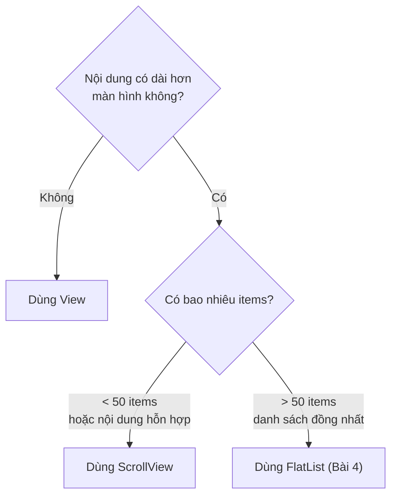
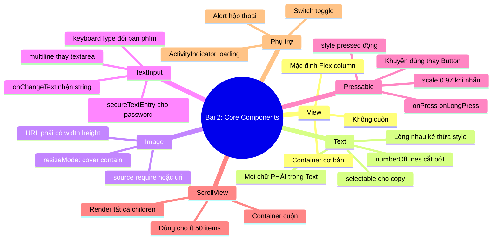

# 📘 BÀI 2: Core Components & Cú Pháp JSX Trong React Native

> **Thời lượng:** ~3-4 giờ | **Độ khó:** ⭐⭐ Cơ bản-Trung bình | **Dự án:** Tái sử dụng `Bai1_HelloReactNative`

---

## 🎯 Mục tiêu bài học

Sau bài này, bạn sẽ:
- [ ] Nắm vững các Core Components cơ bản: `View`, `Text`, `Image`, `TextInput`, `ScrollView`
- [ ] Hiểu sự khác biệt giữa JSX trên web và React Native
- [ ] Sử dụng `Pressable` để tạo nút bấm tương tác
- [ ] Biết cách xử lý sự kiện (event handling) — `onPress`, `onChangeText`, `onLongPress`
- [ ] Sử dụng `StyleSheet.create()` để viết styles
- [ ] Xây dựng được Profile Card và Form nhập liệu hoàn chỉnh

---

## Phần 1: Quy Tắc JSX Trong React Native — Khác Gì Web?

### 1.1 Những khác biệt QUAN TRỌNG so với React Web

> [!IMPORTANT]
> **3 quy tắc vàng mà người từ React Web chuyển sang React Native HAY quên:**
> 1. **KHÔNG có HTML!** — Không có `<div>`, `<p>`, ``, `<input>`, `<button>`. Dùng components của React Native thay thế.
> 2. **Mọi text PHẢI nằm trong `<Text>`!** — Viết chữ trần ngoài `<View>` = App crash ngay lập tức.
> 3. **KHÔNG có CSS file!** — Không có `className`, không có `.css` file. Styling bằng `StyleSheet.create()` hoặc inline JS objects.

### 1.2 Bảng ánh xạ HTML Web → React Native

| HTML Web | React Native | Import từ | Ghi chú |
|:---|:---|:---|:---|
| `<div>` | `<View>` | `react-native` | Container không cuộn |
| `<p>`, `<span>`, `<h1>`...`<h6>` | `<Text>` | `react-native` | **Tất cả text** dùng chung `<Text>`, tự style fontSize |
| `` | `<Image source={{uri: "..."}}>` | `react-native` | Ảnh URL **bắt buộc** chỉ định width & height |
| `<input type="text">` | `<TextInput>` | `react-native` | Dùng `onChangeText` thay vì `onChange` |
| `<textarea>` | `<TextInput multiline>` | `react-native` | Thêm prop `multiline={true}` |
| `<button>` | `<Pressable>` | `react-native` | Linh hoạt nhất, **khuyên dùng** |
| `<a href="...">` | `<Link href="...">` | `expo-router` | Điều hướng giữa các màn hình |
| `<div style="overflow: scroll">` | `<ScrollView>` | `react-native` | Container cuộn được |
| `<ul>` / `<ol>` | `<FlatList>` | `react-native` | Danh sách hiệu suất cao (học ở Bài 4) |
| `<select>` | `<Picker>` | `@react-native-picker/picker` | Cần cài thêm package |
| `<input type="checkbox">` | `<Switch>` | `react-native` | Toggle bật/tắt |

---

## Phần 2: View — Container Cơ Bản

### 2.1 View là gì?

`<View>` là component container cơ bản nhất trong React Native, tương tự `<div>` trên web:
- **Mặc định là Flex container** (giống `display: flex` trên web)
- **`flexDirection` mặc định là `'column'`** (khác web mặc định `row`)
- Không tự cuộn — dùng `<ScrollView>` khi nội dung dài

### 2.2 Code ví dụ

```tsx
import { View, Text, StyleSheet } from 'react-native';

export default function ViewExample() {
  return (
    <View style={styles.container}>
      {/* View lồng nhau */}
      <View style={styles.blueBox}>
        <Text style={styles.whiteText}>Box xanh dương</Text>
      </View>
      <View style={styles.redBox}>
        <Text style={styles.whiteText}>Box đỏ</Text>
      </View>
    </View>
  );
}

const styles = StyleSheet.create({
  container: { flex: 1, padding: 20, backgroundColor: '#f5f5f5' },
  blueBox: {
    backgroundColor: '#3498db',
    padding: 15,
    borderRadius: 10,
    marginBottom: 10,
  },
  redBox: {
    backgroundColor: '#e74c3c',
    padding: 15,
    borderRadius: 10,
  },
  whiteText: { color: '#fff', fontSize: 18 },
});
```

### 2.3 Props quan trọng của View

| Prop | Kiểu | Mô tả |
|:---|:---|:---|
| `style` | `ViewStyle` | Object style (hoặc mảng styles) |
| `pointerEvents` | `'auto'` / `'none'` / `'box-none'` | Điều khiển cảm ứng |
| `accessible` | `boolean` | Hỗ trợ accessibility |
| `testID` | `string` | ID cho testing |

---

## Phần 3: Text — Hiển Thị Văn Bản

### 3.1 Quy tắc quan trọng

> [!CAUTION]
> **Mọi chữ PHẢI nằm trong `<Text>`!** Nếu bạn viết text trần bên ngoài View, app sẽ **crash** ngay lập tức:
> ```tsx
> // ❌ SAI — App crash!
> <View>Hello World</View>
> 
> // ✅ ĐÚNG
> <View><Text>Hello World</Text></View>
> ```

### 3.2 Các cách dùng Text

```tsx
import { View, Text } from 'react-native';

function TextExamples() {
  return (
    <View style={{ padding: 20 }}>
      {/* 1. Heading — Tự style fontSize, fontWeight */}
      <Text style={{ fontSize: 28, fontWeight: 'bold' }}>
        Tiêu đề lớn
      </Text>

      {/* 2. Text lồng nhau — Kế thừa style cha */}
      <Text style={{ fontSize: 16, color: '#333' }}>
        Text bình thường.{' '}
        <Text style={{ fontWeight: 'bold', color: '#e74c3c' }}>
          In đậm màu đỏ.
        </Text>
      </Text>

      {/* 3. Cắt bớt text dài (ellipsis) */}
      <Text numberOfLines={2} ellipsizeMode="tail">
        Đoạn text rất dài sẽ bị cắt sau 2 dòng...
      </Text>

      {/* 4. Text cho phép chọn và copy */}
      <Text selectable>Nhấn giữ để copy đoạn này</Text>
    </View>
  );
}
```

### 3.3 Props quan trọng của Text

| Prop | Kiểu | Mô tả |
|:---|:---|:---|
| `style` | `TextStyle` | Style chữ (fontSize, color, fontWeight, ...) |
| `numberOfLines` | `number` | Giới hạn số dòng hiển thị |
| `ellipsizeMode` | `'head'` / `'middle'` / `'tail'` / `'clip'` | Cách cắt text khi vượt quá |
| `selectable` | `boolean` | Cho phép người dùng chọn và copy |
| `onPress` | `() => void` | Xử lý khi nhấn vào text (Text cũng bấm được!) |

> [!NOTE]
> **Text lồng nhau kế thừa style:** Trong React Native, `<Text>` bên trong sẽ kế thừa style từ `<Text>` cha (giống CSS inheritance cho text trên web). Đây là **component duy nhất** có tính kế thừa style trong RN.

---

## Phần 4: Image — Hiển Thị Hình Ảnh

### 4.1 Hai cách nạp ảnh

```tsx
import { Image } from 'react-native';

// Cách 1: Ảnh local (dùng require)
<Image
  source={require('@/assets/images/icon.png')}
  style={{ width: 100, height: 100 }}
/>

// Cách 2: Ảnh từ URL (BẮT BUỘC chỉ định width & height)
<Image
  source={{ uri: 'https://picsum.photos/200/200' }}
  style={{ width: 200, height: 200, borderRadius: 100 }}
  resizeMode="cover"
/>
```

### 4.2 Bảng resizeMode

| Giá trị | Hành vi | Khi nào dùng? |
|:---|:---|:---|
| `cover` | Lấp đầy khung, **có thể cắt** phần thừa | Avatar, banner, ảnh nền (phổ biến nhất) |
| `contain` | Nằm gọn trong khung, **có thể có khoảng trống** | Logo, icon, ảnh sản phẩm cần thấy toàn bộ |
| `stretch` | Kéo giãn ảnh theo đúng kích thước khung | Hiếm dùng (ảnh bị méo) |
| `center` | Giữ nguyên kích thước gốc, căn giữa | Ảnh nhỏ hơn khung |
| `repeat` | Lặp lại ảnh theo pattern | Background pattern |

---

## Phần 5: TextInput — Trường Nhập Liệu

### 5.1 Khác biệt quan trọng so với Web

| React Web (`<input>`) | React Native (`<TextInput>`) |
|:---|:---|
| `onChange={(e) => setVal(e.target.value)}` | `onChangeText={(text) => setVal(text)}` ← **Nhận trực tiếp string!** |
| `value={val}` | `value={val}` ✅ Giống nhau |
| `<textarea>` (tag riêng) | `<TextInput multiline />` (cùng component, thêm prop) |
| `type="password"` | `secureTextEntry={true}` |
| `type="email"` | `keyboardType="email-address"` |
| `type="tel"` | `keyboardType="phone-pad"` |

### 5.2 Bảng `keyboardType` phổ biến

| Giá trị | Bàn phím hiển thị | Platform |
|:---|:---|:---:|
| `default` | Bàn phím chữ mặc định | Both |
| `email-address` | Có phím `@` và `.` | Both |
| `numeric` | Chỉ số 0-9 | Both |
| `phone-pad` | Bàn phím kiểu điện thoại | Both |
| `decimal-pad` | Số và dấu thập phân | Both |
| `number-pad` | Chỉ số, không có dấu chấm | Both |
| `url` | Có phím `.com` và `/` | iOS |

### 5.3 Code mẫu TextInput hoàn chỉnh

```tsx
import { useState } from 'react';
import { View, Text, TextInput, StyleSheet } from 'react-native';

function FormExample() {
  const [name, setName] = useState('');

  return (
    <View style={{ padding: 20 }}>
      <TextInput
        style={styles.input}
        placeholder="Nhập tên..."
        placeholderTextColor="#999"
        value={name}
        onChangeText={setName}  // ← Nhận string trực tiếp, KHÔNG cần e.target.value
      />
      <Text>Xin chào, {name || '...'} 👋</Text>
    </View>
  );
}

const styles = StyleSheet.create({
  input: {
    borderWidth: 1,
    borderColor: '#ddd',
    borderRadius: 10,
    padding: 14,
    fontSize: 16,
    backgroundColor: '#fff',
    marginBottom: 12,
  },
});
```

---

## Phần 6: Pressable — Nút Bấm Tương Tác (Khuyên Dùng)

### 6.1 Tại sao dùng Pressable?

| Component | Hiệu ứng khi nhấn | Tùy chỉnh | Khuyên dùng? |
|:---|:---|:---:|:---:|
| `Button` | Mặc định theo platform | ❌ Ít (không đổi được style) | Chỉ khi prototype nhanh |
| `TouchableOpacity` | Giảm opacity | ✅ Tốt | ⚠️ Cũ, vẫn dùng được |
| **`Pressable`** | **Tùy chỉnh 100%** | ✅✅ **Tốt nhất** | ✅✅ **KHUYÊN DÙNG** |

### 6.2 Anatomy của Pressable

```tsx
<Pressable
  // 1. Style động theo trạng thái nhấn
  style={({ pressed }) => [
    styles.button,
    pressed && styles.buttonPressed,  // Style khi đang nhấn
  ]}

  // 2. Xử lý sự kiện
  onPress={() => console.log('Nhấn!')}          // Nhấn bình thường
  onLongPress={() => console.log('Giữ lâu!')}   // Nhấn giữ
  delayLongPress={500}                            // Thời gian giữ để kích hoạt (ms)

  // 3. Disabled
  disabled={false}
>
  {/* 4. Children cũng nhận trạng thái pressed */}
  {({ pressed }) => (
    <Text>{pressed ? 'Đang nhấn...' : 'Nhấn tôi!'}</Text>
  )}
</Pressable>
```

> [!TIP]
> **Pattern hay:** Dùng `transform: [{ scale: 0.97 }]` khi `pressed` để tạo hiệu ứng "nút bị ấn xuống" rất tự nhiên:
> ```tsx
> pressed && { opacity: 0.8, transform: [{ scale: 0.97 }] }
> ```

---

## Phần 7: ScrollView — Container Cuộn Được

### 7.1 Khi nào dùng ScrollView?



### 7.2 Code mẫu

```tsx
import { ScrollView, View, Text } from 'react-native';

function ScrollExample() {
  return (
    <ScrollView
      style={{ flex: 1 }}
      contentContainerStyle={{ padding: 20, paddingBottom: 100 }}
      showsVerticalScrollIndicator={false}  // Ẩn thanh cuộn
    >
      <Text style={{ fontSize: 24 }}>Nội dung rất dài...</Text>
      {/* Nhiều components khác... */}
    </ScrollView>
  );
}
```

> [!WARNING]
> **`ScrollView` render TẤT CẢ children cùng lúc!** Nếu có 1000 items, nó sẽ render hết 1000 items ngay lập tức → rất chậm. Với danh sách dài, hãy dùng `FlatList` (sẽ học ở Bài 4).

---

## Phần 8: Các Component Hỗ Trợ Khác

### 8.1 Alert — Hộp thoại thông báo

```tsx
import { Alert } from 'react-native';

// Alert đơn giản
Alert.alert('Tiêu đề', 'Nội dung thông báo');

// Alert với nút chọn
Alert.alert(
  'Xác nhận',
  'Bạn có chắc muốn xóa?',
  [
    { text: 'Hủy', style: 'cancel' },
    { text: 'Xóa', onPress: () => deleteItem(), style: 'destructive' },
  ]
);
```

### 8.2 Switch — Toggle bật/tắt

```tsx
import { Switch } from 'react-native';

const [isEnabled, setIsEnabled] = useState(false);

<Switch
  value={isEnabled}
  onValueChange={setIsEnabled}
  trackColor={{ false: '#ddd', true: '#3498db' }}
  thumbColor={isEnabled ? '#2980b9' : '#ccc'}
/>
```

### 8.3 ActivityIndicator — Loading spinner

```tsx
import { ActivityIndicator } from 'react-native';

<ActivityIndicator size="large" color="#3498db" />
```

---

## Phần 9: Thực Hành Trên Dự Án

Tôi đã tạo sẵn **2 màn hình thực hành** trong dự án `Bai1_HelloReactNative`:

### 9.1 Màn hình lý thuyết — Demo tất cả components

File: [bai2-components.tsx](file:///Users/vovantu/HTML_CSS/ReactNative/Bai1_HelloReactNative/src/app/bai2-components.tsx)

Truy cập trên emulator bằng URL: `http://localhost:8081/bai2-components`

**Nội dung:** Demo trực quan tất cả 6 loại component cơ bản (View, Text, Image, TextInput, Pressable, Switch + ActivityIndicator).

### 9.2 Màn hình bài tập — Profile Card + Contact Form

File: [bai2-practice.tsx](file:///Users/vovantu/HTML_CSS/ReactNative/Bai1_HelloReactNative/src/app/bai2-practice.tsx)

Truy cập trên emulator bằng URL: `http://localhost:8081/bai2-practice`

**Nội dung:**
- **BT1:** Profile Card hoàn chỉnh — Avatar, tên, bio, stats, nút Follow toggle
- **BT2:** Contact Form — 4 trường nhập (tên, email, SĐT, lời nhắn) + validation + hiển thị kết quả

### 9.3 Cách truy cập màn hình bài tập

Vì Expo Router dùng file-based routing, bạn chỉ cần:

```tsx
// Thêm vào file index.tsx hoặc explore.tsx để điều hướng
import { router } from 'expo-router';

// Nhấn nút để đi tới màn hình bài 2
<Pressable onPress={() => router.push('/bai2-components')}>
  <Text>Đi tới Bài 2: Components</Text>
</Pressable>

<Pressable onPress={() => router.push('/bai2-practice')}>
  <Text>Đi tới Bài 2: Bài tập</Text>
</Pressable>
```

Hoặc trên trình duyệt web (nếu chạy `npx expo start --web`), truy cập trực tiếp:
- `http://localhost:8081/bai2-components`
- `http://localhost:8081/bai2-practice`

---

## Phần 10: Tổng Kết Kiến Thức Bài 2



---

## 📝 Bài Tập Thực Hành

### BT1: Đọc và chạy màn hình demo ✅
- Mở file [bai2-components.tsx](file:///Users/vovantu/HTML_CSS/ReactNative/Bai1_HelloReactNative/src/app/bai2-components.tsx)
- Đọc hiểu từng component, chạy trên emulator
- Thử sửa text, màu sắc, kích thước

### BT2: Chạy và tương tác với bài tập
- Mở [bai2-practice.tsx](file:///Users/vovantu/HTML_CSS/ReactNative/Bai1_HelloReactNative/src/app/bai2-practice.tsx)
- Nhấn nút Follow trên Profile Card → quan sát state toggle
- Điền form, nhấn Gửi, xem kết quả hiển thị

### BT3: Tự tạo thêm (Challenge)
- Thêm field "Mật khẩu" vào Contact Form với `secureTextEntry`
- Thêm ảnh avatar vào Contact Form (dùng `<Image>`)
- Tạo thêm 1 component `ProductCard` gồm: ảnh sản phẩm, tên, giá, nút "Thêm vào giỏ"

### BT4: Phân tích code
- Mở từng file `.tsx` trong `src/components/` của Expo template
- Đọc hiểu cách họ tạo `ThemedText`, `ThemedView` — đây là pattern Custom Component tái sử dụng

---

> **Bài tiếp theo:** Bài 3 — StyleSheet & Flexbox — Xây Dựng Giao Diện. Bạn sẽ học chi tiết cách layout với Flexbox và responsive design!

*Khi hoàn thành, hãy báo cho tôi để tiếp tục Bài 3!* 🚀
