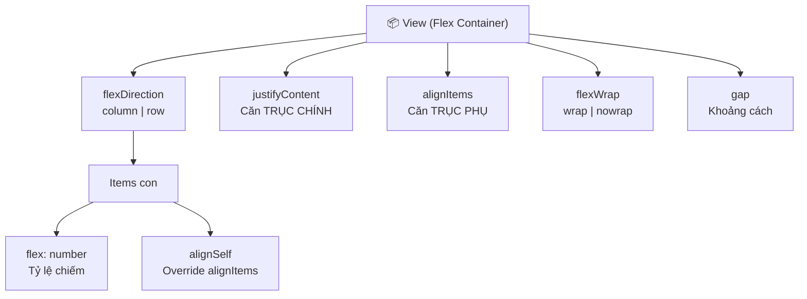
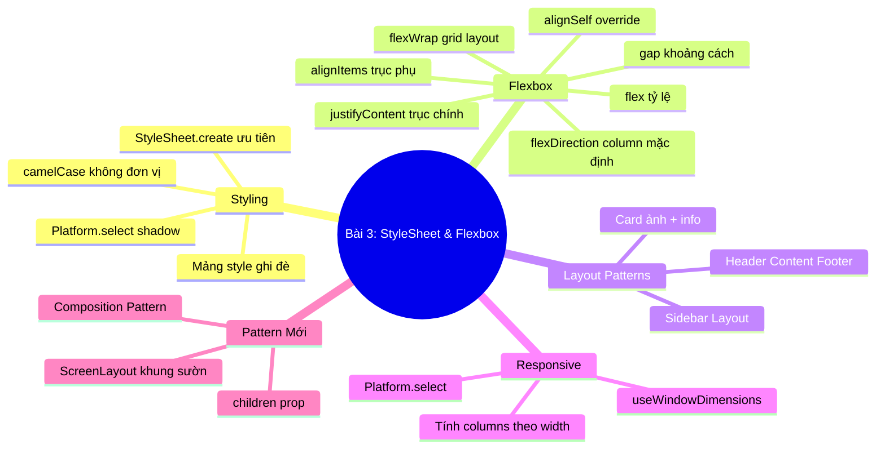

# 📘 BÀI 3: StyleSheet & Flexbox — Xây Dựng Giao Diện

> **Thời lượng:** ~3-4 giờ | **Độ khó:** ⭐⭐⭐ Trung bình | **Dự án:** Tái sử dụng `Bai1_HelloReactNative`

---

## 🎯 Mục tiêu bài học

Sau bài này, bạn sẽ:
- [ ] Hiểu rõ sự khác biệt giữa CSS Web và React Native Styling
- [ ] Thành thạo `StyleSheet.create()` và các cách styling
- [ ] Nắm vững Flexbox layout (đặc biệt **mặc định column** khác web)
- [ ] Biết cách tạo responsive layout với `useWindowDimensions`
- [ ] Áp dụng 3 Layout Patterns phổ biến nhất trong app mobile
- [ ] Hiểu thêm Pattern mới: **Composition Pattern**

---

## Phần 1: Styling Trong React Native — Khác Gì CSS Web?

### 1.1 Bảng so sánh CSS Web vs React Native

> [!IMPORTANT]
> **React Native KHÔNG có CSS!** Không có file `.css`, không có `className`, không có `@media`, không có `:hover`. Mọi style đều viết bằng JavaScript objects.

| Tiêu chí | CSS Web | React Native |
|:---|:---|:---|
| **Cú pháp** | `background-color: red;` | `backgroundColor: 'red'` (camelCase) |
| **Đơn vị** | `16px`, `1rem`, `50%` | `16` (không đơn vị, mặc định **dp**) |
| **Cách áp dụng** | `className="btn"` | `style={styles.btn}` (JS object) |
| **File riêng** | `styles.css` | Viết ngay trong file `.tsx` |
| **Kế thừa** | CSS cascade phức tạp | **Không kế thừa** (trừ Text lồng nhau) |
| **Border** | `border: 1px solid red` | `borderWidth: 1, borderColor: 'red'` (tách riêng) |
| **Shadow** | `box-shadow: 0 2px 4px rgba(0,0,0,0.1)` | iOS: `shadowColor/Offset/Opacity/Radius` — Android: `elevation: 3` |
| **Display** | `block`, `inline`, `flex`, `grid`, `none` | Chỉ có `'flex'` (mặc định) và `'none'` |
| **Position** | `static`, `relative`, `absolute`, `fixed` | Chỉ có `'relative'` (mặc định) và `'absolute'` |
| **Responsive** | `@media (max-width: 768px)` | `useWindowDimensions()` hook |
| **Pseudo-class** | `:hover`, `:focus`, `:active` | Dùng `Pressable` với `({ pressed }) => ...` |

> [!NOTE]
> **dp là gì?** dp = density-independent pixels. 1dp = 1px trên màn hình 160dpi. React Native tự scale theo mật độ pixel của thiết bị, nên bạn không cần lo về đơn vị.

### 1.2 Tại sao dùng `StyleSheet.create()` thay vì inline style?

```tsx
// ❌ Inline style — Tạo object MỚI mỗi lần re-render
<View style={{ flex: 1, backgroundColor: '#fff' }}>

// ✅ StyleSheet.create() — Tạo 1 lần, tái sử dụng
<View style={styles.container}>

const styles = StyleSheet.create({
  container: { flex: 1, backgroundColor: '#fff' },
});
```

| Tiêu chí | Inline Style | `StyleSheet.create()` |
|:---|:---|:---|
| Hiệu năng | ❌ Tạo object mới mỗi render | ✅ Tạo 1 lần, cache tham chiếu |
| Validation | ❌ Không báo lỗi nếu viết sai property | ✅ Báo lỗi TypeScript nếu viết sai |
| Đọc code | ❌ Code JSX dài và khó đọc | ✅ Tách biệt rõ ràng UI và style |
| Tái sử dụng | ❌ Phải copy-paste | ✅ `styles.xxx` dùng ở nhiều nơi |

### 1.3 Kết hợp nhiều styles (Mảng style)

```tsx
// Mảng style — phần tử sau ghi đè phần tử trước
<Text style={[
  styles.base,                              // 1. Style mặc định
  isActive && styles.active,                 // 2. Conditional style
  { marginTop: 10 },                         // 3. Inline bổ sung (ưu tiên cao nhất)
]}>
  Hello
</Text>
```

---

### 1.4 Chi tiết về Kế Thừa (Inheritance) — CSS Cascade vs React Native

> [!NOTE]
> **Web (CSS):** Có cơ chế **Cascade (Xếp tầng)**. Nếu bạn đặt `color: blue`, `font-size: 18px` ở thẻ cha (`div` hay `body`), tất cả các thẻ con (`p`, `span`, `h1`...) sẽ tự động thừa hưởng.
> 
> **React Native:** **KHÔNG CÓ KẾ THỪA** giữa các components khác nhau. Mỗi component là một thực thể độc lập.

#### ❌ View KHÔNG truyền style cho Text con:
```tsx
// ❌ SAI: View có style màu/chữ nhưng Text bên trong KHÔNG nhận được
<View style={{ color: 'blue', fontSize: 20 }}>
  <Text>Tôi vẫn mang màu và font mặc định của hệ thống!</Text>
</View>

// ✅ ĐÚNG: Phải style trực tiếp cho từng thẻ Text
<View>
  <Text style={{ color: 'blue', fontSize: 20 }}>Đoạn 1</Text>
  <Text style={{ color: 'blue', fontSize: 20 }}>Đoạn 2</Text>
</View>
```

#### ✅ Ngoại lệ DUY NHẤT: `<Text>` lồng trong `<Text>` (Nested Text)
Trường hợp duy nhất có tính kế thừa trong React Native là khi bạn lồng `<Text>` bên trong `<Text>`. Thẻ con sẽ thừa hưởng toàn bộ style của thẻ cha và có thể ghi đè/bổ sung:

```tsx
<Text style={{ color: '#2c3e50', fontSize: 18, fontFamily: 'Arial' }}>
  Xin chào,{' '}
  {/* Kế thừa fontSize: 18, fontFamily: Arial + Thêm in đậm */}
  <Text style={{ fontWeight: 'bold' }}>
    Vũ Anh Tú!
  </Text>
  
  {/* Kế thừa fontSize: 18 + Ghi đè color thành đỏ */}
  <Text style={{ color: '#e74c3c', fontStyle: 'italic' }}>
    {' '}(Tài khoản VIP)
  </Text>
</Text>
```

*Tại sao RN bỏ kế thừa CSS?* Vì Native engine (iOS/Android) không có CSS tree calculation như trình duyệt web. Bỏ kế thừa giúp app render cực nhanh, tiết kiệm pin và tránh lỗi "sửa CSS cha làm vỡ giao diện con".

---

### 1.5 Chi tiết về `position` — Khác Biệt Giữa Web và React Native

| Tiêu chí | Web (CSS) | React Native |
|:---|:---|:---|
| **Các giá trị** | `static`, `relative`, `absolute`, `fixed`, `sticky` | **Chỉ có `'relative'` và `'absolute'`** |
| **Giá trị mặc định** | `static` | **`'relative'`** (mọi View mặc định đã là relative) |
| **Mốc toạ độ `absolute`** | Tìm thẻ cha gần nhất có `position: relative/absolute` | **LUÔN LUÔN** tính theo thẻ cha trực tiếp (không cần set cha là `relative`) |
| **`position: fixed`** | Có sẵn để ghim lên màn hình | ❌ Không có (dùng layout ngoài `ScrollView` hoặc `absolute`) |

#### 🔹 1. `position: 'relative'` (Mặc định)
Phần tử nằm bình thường trong luồng Flexbox. Nếu thêm `top`, `left`, `bottom`, `right`, nó sẽ dịch chuyển vị trí so với vị trí ban đầu của chính nó mà không làm ảnh hưởng đến vị trí của các phần tử xung quanh.

#### 🔹 2. `position: 'absolute'` (Thoát khỏi luồng Flexbox)
Phần tử bị nhấc ra khỏi luồng bố cục bình thường và định vị theo 4 góc (`top`, `bottom`, `left`, `right`) của **thẻ cha trực tiếp**.

#### 📱 Ví dụ thực tế 1: Notification Badge (Chấm đỏ thông báo trên icon chuông)
```tsx
function BellNotification() {
  return (
    <View style={{ width: 40, height: 40 }}>
      {/* Icon chuông */}
      <Text style={{ fontSize: 30 }}>🔔</Text>

      {/* Chấm đỏ đè lên góc trên bên phải */}
      <View
        style={{
          position: 'absolute',
          top: 0,
          right: 0,
          backgroundColor: 'red',
          borderRadius: 8,
          width: 16,
          height: 16,
          justifyContent: 'center',
          alignItems: 'center',
        }}
      >
        <Text style={{ color: '#fff', fontSize: 10, fontWeight: 'bold' }}>3</Text>
      </View>
    </View>
  );
}
```

#### 📱 Ví dụ thực tế 2: Floating Action Button (Nút tròn nổi cố định ở góc dưới màn hình — Thay thế `position: fixed`)
Trên Web bạn dùng `position: fixed; bottom: 20px; right: 20px`. Trong React Native, ta đặt nút bấm nổi ngang hàng với `ScrollView` trong một container cha:

```tsx
export default function ScreenWithFAB() {
  return (
    <View style={{ flex: 1 }}>
      {/* Nội dung chính cuộn được */}
      <ScrollView style={{ flex: 1 }}>
        <Text>Nội dung rất dài...</Text>
      </ScrollView>

      {/* Nút FAB nổi ở góc phải dưới — không bị cuộn theo nội dung */}
      <Pressable
        style={{
          position: 'absolute',
          bottom: 24,
          right: 24,
          width: 56,
          height: 56,
          borderRadius: 28,
          backgroundColor: '#16a085',
          justifyContent: 'center',
          alignItems: 'center',
          elevation: 6, // Shadow Android
          shadowColor: '#000', // Shadow iOS
          shadowOffset: { width: 0, height: 3 },
          shadowOpacity: 0.3,
          shadowRadius: 4,
        }}
        onPress={() => console.log('Thêm mới!')}
      >
        <Text style={{ color: '#fff', fontSize: 28, fontWeight: 'bold' }}>＋</Text>
      </Pressable>
    </View>
  );
}
```

---

## Phần 2: Flexbox — Hệ Thống Layout Chính

### 2.1 Khác biệt QUAN TRỌNG so với Web

> [!CAUTION]
> **2 khác biệt hay gây nhầm lẫn nhất:**
> 1. **`flexDirection` mặc định là `'column'`** (web mặc định `'row'`)
> 2. **Mọi `View` đều là flex container** (web cần `display: flex`)

```
Web:    display: flex; flex-direction: row;    ← Phải khai báo cả hai
RN:     (mặc định đã là flex + column)        ← Không cần khai báo gì
```

### 2.2 flexDirection — Hướng sắp xếp items

```
flexDirection: "column" (Mặc định RN)    flexDirection: "row"
┌──────────────────┐                     ┌──────────────────────────┐
│  ┌────────────┐  │                     │ ┌──────┐ ┌──────┐ ┌────┐│
│  │     1      │  │                     │ │  1   │ │  2   │ │ 3  ││
│  └────────────┘  │                     │ └──────┘ └──────┘ └────┘│
│  ┌────────────┐  │                     └──────────────────────────┘
│  │     2      │  │
│  └────────────┘  │
│  ┌────────────┐  │
│  │     3      │  │
│  └────────────┘  │
└──────────────────┘
```

### 2.3 justifyContent — Căn chỉnh TRỤC CHÍNH

Trục chính = hướng mà `flexDirection` trỏ tới.

| Giá trị | Hiệu ứng |
|:---|:---|
| `flex-start` | Items dồn về đầu (mặc định) |
| `center` | Items căn giữa |
| `flex-end` | Items dồn về cuối |
| `space-between` | Item đầu & cuối sát mép, giãn đều khoảng giữa |
| `space-around` | Khoảng cách đều quanh mỗi item (2 bên = nửa khoảng giữa) |
| `space-evenly` | Khoảng cách hoàn toàn bằng nhau |

```
justifyContent: "space-between"          justifyContent: "center"
┌────────────────────────┐               ┌────────────────────────┐
│ ┌──┐              ┌──┐│               │        ┌──┐┌──┐        │
│ │1 │     ┌──┐     │3 ││               │        │1 ││2 │        │
│ └──┘     │2 │     └──┘│               │        └──┘└──┘        │
│          └──┘         │               └────────────────────────┘
└────────────────────────┘
```

### 2.4 alignItems — Căn chỉnh TRỤC PHỤ

Trục phụ = vuông góc với trục chính.

| Giá trị | Hiệu ứng |
|:---|:---|
| `stretch` | Items kéo dài đầy trục phụ (mặc định) |
| `flex-start` | Items sát mép đầu trục phụ |
| `center` | Items căn giữa trục phụ |
| `flex-end` | Items sát mép cuối trục phụ |

### 2.5 flex — Phân chia không gian theo tỷ lệ

```tsx
// flex: 1 nghĩa là "chiếm TẤT CẢ không gian còn lại"
// Nếu nhiều items cùng có flex → chia tỷ lệ

<View style={{ flexDirection: 'row', height: 60 }}>
  <View style={{ flex: 1, backgroundColor: 'red' }} />    {/* 25% */}
  <View style={{ flex: 2, backgroundColor: 'blue' }} />   {/* 50% */}
  <View style={{ flex: 1, backgroundColor: 'green' }} />  {/* 25% */}
</View>

// Tổng flex = 1+2+1 = 4
// Red   = 1/4 = 25%
// Blue  = 2/4 = 50%
// Green = 1/4 = 25%
```

### 2.6 gap — Khoảng cách giữa items

```tsx
// Thay vì dùng margin cho từng item:
<View style={{ flexDirection: 'row', gap: 10 }}>
  <View style={styles.box} />   {/* Không cần marginRight */}
  <View style={styles.box} />   {/* Tự có gap 10 giữa các items */}
  <View style={styles.box} />
</View>
```

### 2.7 flexWrap — Xuống dòng tự động (Grid layout)

```tsx
<View style={{
  flexDirection: 'row',
  flexWrap: 'wrap',    // ← Items tự xuống dòng khi hết chỗ
  gap: 10,
}}>
  {items.map(item => (
    <View style={{ width: itemWidth, height: 100 }} />  // Tính width để vừa 2-3 cột
  ))}
</View>
```

### 2.8 alignSelf — Override alignItems cho 1 item cụ thể

```tsx
// Tất cả items căn flex-start, nhưng item thứ 2 căn flex-end
<View style={{ alignItems: 'flex-start' }}>
  <View style={styles.box} />                           {/* flex-start */}
  <View style={[styles.box, { alignSelf: 'flex-end' }]} /> {/* flex-end (ghi đè) */}
  <View style={styles.box} />                           {/* flex-start */}
</View>
```

> [!TIP]
> **alignSelf rất hay dùng cho Chat layout:** Tin nhắn của mình `alignSelf: 'flex-end'` (căn phải), tin nhắn người khác `alignSelf: 'flex-start'` (căn trái).

---

## Phần 3: Bảng Tổng Kết Flexbox



| Thuộc tính | Đặt ở | Tác dụng | Giá trị mặc định |
|:---|:---:|:---|:---:|
| `flexDirection` | Container | Hướng sắp xếp items | `column` |
| `justifyContent` | Container | Căn chỉnh trục chính | `flex-start` |
| `alignItems` | Container | Căn chỉnh trục phụ | `stretch` |
| `flexWrap` | Container | Cho phép xuống dòng | `nowrap` |
| `gap` | Container | Khoảng cách giữa items | `0` |
| `flex` | Item | Tỷ lệ chiếm không gian | — |
| `alignSelf` | Item | Override alignItems | `auto` |

---

## Phần 4: Layout Patterns Phổ Biến Nhất

### Pattern 1: Header — Content — Footer

```tsx
<View style={{ flex: 1 }}>
  {/* Header: Chiều cao cố định */}
  <View style={{ height: 60, backgroundColor: '#2c3e50' }}>
    <Text>Header</Text>
  </View>

  {/* Content: flex: 1 chiếm TẤT CẢ không gian còn lại */}
  <ScrollView style={{ flex: 1 }}>
    <Text>Content...</Text>
  </ScrollView>

  {/* Footer: Chiều cao cố định */}
  <View style={{ height: 50, backgroundColor: '#16a085' }}>
    <Text>Footer</Text>
  </View>
</View>
```

### Pattern 2: Sidebar Layout (Row direction)

```tsx
<View style={{ flex: 1, flexDirection: 'row' }}>
  <View style={{ width: 80, backgroundColor: '#2c3e50' }}>
    {/* Sidebar: Width cố định */}
  </View>
  <View style={{ flex: 1 }}>
    {/* Content: Chiếm phần còn lại */}
  </View>
</View>
```

### Pattern 3: Card Layout (Image + Info)

```tsx
<View style={{ flexDirection: 'row' }}>
  <Image source={{uri: '...'}} style={{ width: 100, height: 100 }} />
  <View style={{ flex: 1, padding: 12 }}>
    {/* flex: 1 → thông tin chiếm hết không gian bên phải ảnh */}
    <Text>Tên sản phẩm</Text>
    <Text>Giá</Text>
  </View>
</View>
```

---

## Phần 5: Responsive Design

### 5.1 `useWindowDimensions` Hook

```tsx
import { useWindowDimensions } from 'react-native';

function MyScreen() {
  const { width, height } = useWindowDimensions();
  // Tự động cập nhật khi xoay màn hình!

  const isLandscape = width > height;
  const columns = width >= 768 ? 3 : 2;  // Tablet: 3 cột, Phone: 2 cột

  const cardWidth = (width - padding * 2 - gap * (columns - 1)) / columns;
  // ↑ Tính width cho mỗi card trong grid
}
```

### 5.2 `Platform.select()` — Style khác nhau theo platform

```tsx
import { Platform, StyleSheet } from 'react-native';

const styles = StyleSheet.create({
  shadow: {
    // Shadow cho iOS
    ...Platform.select({
      ios: {
        shadowColor: '#000',
        shadowOffset: { width: 0, height: 2 },
        shadowOpacity: 0.1,
        shadowRadius: 4,
      },
      android: {
        elevation: 3,       // Android dùng elevation thay vì shadow*
      },
    }),
  },
});
```

---

## Phần 6: 🆕 Pattern Mới — Composition Pattern

### Vấn đề: Nhiều màn hình cùng cấu trúc

```tsx
// Screen A:
<SafeAreaView style={{ flex: 1, backgroundColor: '#f5f5f5' }}>
  <ScrollView contentContainerStyle={{ paddingBottom: 100 }}>
    <View style={styles.header}>...</View>
    {/* Nội dung A */}
  </ScrollView>
</SafeAreaView>

// Screen B — Lặp lại y hệt khung sườn!
<SafeAreaView style={{ flex: 1, backgroundColor: '#f5f5f5' }}>
  <ScrollView contentContainerStyle={{ paddingBottom: 100 }}>
    <View style={styles.header}>...</View>
    {/* Nội dung B */}
  </ScrollView>
</SafeAreaView>
```

### Giải pháp: Tạo Layout Component bọc bên ngoài

```tsx
// components/ScreenLayout.tsx
import { ReactNode } from 'react';
import { View, Text, ScrollView, StyleSheet } from 'react-native';
import { SafeAreaView } from 'react-native-safe-area-context';

type ScreenLayoutProps = {
  title: string;
  subtitle?: string;
  headerColor?: string;
  children: ReactNode;     // ← children là keyword đặc biệt: chứa MỌI THỨ bên trong tag
};

export function ScreenLayout({
  title,
  subtitle,
  headerColor = '#2c3e50',
  children,                 // ← Nhận children qua props
}: ScreenLayoutProps) {
  return (
    <SafeAreaView style={{ flex: 1, backgroundColor: '#f5f5f5' }}>
      <ScrollView
        contentContainerStyle={{ paddingBottom: 100 }}
        showsVerticalScrollIndicator={false}
      >
        <View style={[styles.header, { backgroundColor: headerColor }]}>
          <Text style={styles.headerTitle}>{title}</Text>
          {subtitle && <Text style={styles.headerSubtitle}>{subtitle}</Text>}
        </View>

        {children}      {/* ← Render children ở đây */}
      </ScrollView>
    </SafeAreaView>
  );
}
```

**Cách sử dụng — Gọn hơn nhiều!**

```tsx
// Screen A:
<ScreenLayout title="📘 Bài 3" subtitle="Flexbox" headerColor="#16a085">
  <FlexDemo />        {/* ← Đây chính là children */}
  <AlignDemo />
</ScreenLayout>

// Screen B:
<ScreenLayout title="📝 Bài tập" headerColor="#8e44ad">
  <ProductGrid />     {/* ← children khác */}
  <ChatLayout />
</ScreenLayout>
```

> [!TIP]
> **Composition Pattern** = Tạo component "khung sườn" nhận `children` prop. Các screen chỉ cần truyền nội dung riêng vào bên trong.
>
> Đây là pattern **rất quan trọng** và **cực kỳ phổ biến** trong React — bạn sẽ dùng nó ở khắp nơi!

### So sánh với Custom Component Pattern (Bài trước):

| Pattern | Mục đích | Ví dụ |
|:---|:---|:---|
| **Custom Component** | Bọc 1 component gốc, thêm preset style/logic | `ThemedText`, `MyButton` |
| **Composition Pattern** | Tạo "khung sườn" layout, nhận `children` làm nội dung | `ScreenLayout`, `Card`, `Modal` |

Cả 2 đều dùng kỹ thuật "bọc component" nhưng khác mục đích:
- Custom Component → **thay thế** component gốc (dùng `ThemedText` thay `Text`)
- Composition → **bọc bên ngoài** nhiều components (dùng `ScreenLayout` bọc cả màn hình)

---

## Phần 7: Thực Hành Trên Dự Án

Tôi đã tạo sẵn **2 màn hình** trong dự án:

### 7.1 Flexbox Playground — Tương tác trực tiếp

File: [bai3-flexbox.tsx](file:///Users/vovantu/HTML_CSS/ReactNative/Bai1_HelloReactNative/src/app/bai3-flexbox.tsx)

**Nội dung:** 8 demo tương tác — nhấn nút để thay đổi `flexDirection`, `justifyContent`, `alignItems`, `flex ratio`, `flexWrap`, layout pattern, responsive, và centering **trong thời gian thực**.

### 7.2 Bài tập thực tế — Product List, Grid, Chat

File: [bai3-practice.tsx](file:///Users/vovantu/HTML_CSS/ReactNative/Bai1_HelloReactNative/src/app/bai3-practice.tsx)

**Nội dung:**
- **BT1:** Product List — Card sản phẩm dạng row (ảnh trái + info phải)
- **BT2:** Product Grid 2 cột — `flexWrap` + responsive width + search filter
- **BT3:** Chat Layout — Tin nhắn trái/phải (giống Messenger) dùng `alignSelf`

### 7.3 Cách truy cập

Trên Home screen, nhấn các nút **"📖 Bài 3: Flexbox Playground"** hoặc **"📝 Bài 3: Bài tập Layout"**.

---

## Phần 8: Tổng Kết Bài 3



---

## 📝 Bài Tập Tự Làm

### BT1: Chạy Flexbox Playground ✅
- Nhấn từng nút để hiểu trực quan `flexDirection`, `justifyContent`, `alignItems`

### BT2: Đọc hiểu bài tập Practice
- Mở [bai3-practice.tsx](file:///Users/vovantu/HTML_CSS/ReactNative/Bai1_HelloReactNative/src/app/bai3-practice.tsx)
- Chú ý comment giải thích Flexbox trong code

### BT3: Tự tạo (Challenge)
- Tạo component `ScreenLayout` theo Composition Pattern ở Phần 6
- Tạo layout "Settings Screen" gồm: Avatar trên, danh sách setting items dưới
- Mỗi setting item dùng row layout: icon trái + text giữa (flex:1) + arrow phải

---

> **Bài tiếp theo:** Bài 4 — FlatList, SectionList & ScrollView — Danh sách hiệu suất cao. Bạn sẽ học cách render danh sách hàng ngàn items mà không lag!

*Khi hoàn thành, hãy báo cho tôi để tiếp tục Bài 4!* 🚀
