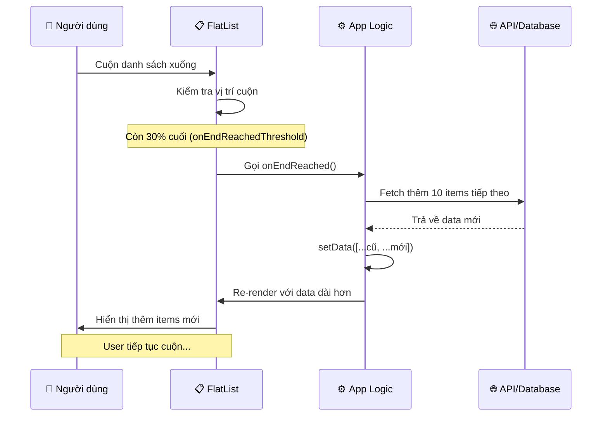
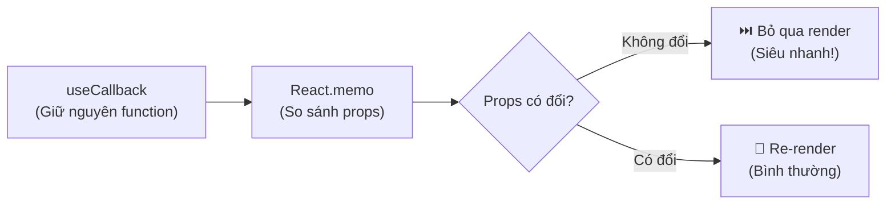
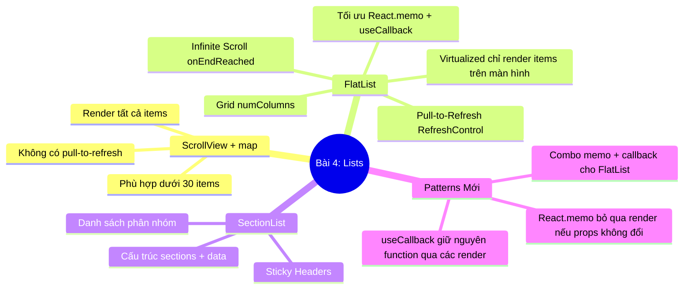

# 📘 BÀI 4: FlatList, SectionList & ScrollView — Danh Sách Hiệu Suất Cao

> **Thời lượng:** ~3-4 giờ | **Độ khó:** ⭐⭐⭐ Trung bình - Nâng cao | **Dự án:** Tái sử dụng `Bai1_HelloReactNative`

---

## 🎯 Mục tiêu bài học

Sau bài này, bạn sẽ:
- [ ] Hiểu tại sao cần `FlatList` thay vì `ScrollView` + `.map()` cho danh sách dài
- [ ] Sử dụng thành thạo `FlatList` với Pull-to-Refresh và Infinite Scroll
- [ ] Sử dụng `SectionList` cho danh sách phân nhóm (như danh bạ điện thoại)
- [ ] Biết tạo Grid layout với `numColumns`
- [ ] Nắm vững 2 Pattern mới: **React.memo** và **useCallback**
- [ ] Hiểu cách tối ưu hiệu suất render cho danh sách hàng ngàn items

---

## Phần 1: Tại Sao Cần FlatList? — Vấn Đề Với ScrollView + .map()

### 1.1 Ở Bài 3, bạn đã học cách render danh sách bằng `.map()`:

```tsx
<ScrollView>
  {PRODUCTS.map((product) => (
    <ProductCard key={product.id} item={product} />
  ))}
</ScrollView>
```

Cách này **hoạt động tốt khi danh sách ngắn** (dưới 30-50 items). Nhưng khi danh sách dài (100, 500, 10.000 items), nó sẽ gây ra vấn đề nghiêm trọng:

### 1.2 Vấn đề hiệu suất:

```
ScrollView + .map() (100 items)           FlatList (100 items)
┌───────────────────────────┐           ┌───────────────────────────┐
│ 📱 Màn hình (5 items)     │           │ 📱 Màn hình (5 items)     │
│ ┌───────────────────────┐ │           │ ┌───────────────────────┐ │
│ │  Item 1  ✅ Render    │ │           │ │  Item 1  ✅ Render    │ │
│ │  Item 2  ✅ Render    │ │           │ │  Item 2  ✅ Render    │ │
│ │  Item 3  ✅ Render    │ │           │ │  Item 3  ✅ Render    │ │
│ │  Item 4  ✅ Render    │ │           │ │  Item 4  ✅ Render    │ │
│ │  Item 5  ✅ Render    │ │           │ │  Item 5  ✅ Render    │ │
│ └───────────────────────┘ │           │ └───────────────────────┘ │
├───────────────────────────┤           ├───────────────────────────┤
│  Item 6   ✅ Render      │           │  Item 6   ⏸️ Chưa render │
│  Item 7   ✅ Render      │           │  Item 7   ⏸️ Chưa render │
│  ...                      │           │  ...                      │
│  Item 100 ✅ Render      │           │  Item 100 ⏸️ Chưa render │
│                           │           │                           │
│ ❌ RENDER TẤT CẢ 100     │           │ ✅ CHỈ RENDER 5-10 items  │
│    items ngay từ đầu!     │           │    đang hiển thị!         │
│                           │           │                           │
│ → Tốn RAM, lag, giật      │           │ → Nhẹ, mượt, tiết kiệm   │
└───────────────────────────┘           └───────────────────────────┘
```

> [!CAUTION]
> **ScrollView + .map()** render **TẤT CẢ items cùng lúc** vào bộ nhớ, kể cả items không hiển thị trên màn hình. Với 1000 items, app sẽ lag nghiêm trọng, thậm chí crash (hết RAM)!

---

## Phần 2: Bảng So Sánh 3 Component Danh Sách

| Tiêu chí | `ScrollView` + `.map()` | `FlatList` | `SectionList` |
|:---|:---:|:---:|:---:|
| **Cơ chế render** | Tất cả items cùng lúc | Chỉ items trên màn hình (Virtualized) | Chỉ items trên màn hình (Virtualized) |
| **Hiệu suất** | ❌ Chậm với >50 items | ✅ Tốt với hàng ngàn items | ✅ Tốt với hàng ngàn items |
| **Pull-to-Refresh** | ❌ Tự implement | ✅ Có sẵn (`refreshControl`) | ✅ Có sẵn |
| **Infinite Scroll** | ❌ Tự implement | ✅ `onEndReached` | ✅ `onEndReached` |
| **Phân nhóm (Section)** | ❌ Không có | ❌ Không có | ✅ Có sẵn (nhóm A, B, C,...) |
| **Grid layout** | ❌ Phải tự chia cột | ✅ `numColumns={2}` | ❌ Không hỗ trợ |
| **Sticky Header** | ❌ Không | ❌ Không | ✅ `stickySectionHeadersEnabled` |
| **Khi nào dùng?** | <30 items, nội dung hỗn hợp | Danh sách dài, đồng nhất | Danh sách phân nhóm |

---

## Phần 3: FlatList — Chi Tiết Props Quan Trọng

### 3.1 Cấu trúc cơ bản:

```tsx
<FlatList
  // ═══ BẮT BUỘC ═══
  data={USERS}                              // Mảng dữ liệu
  renderItem={({ item }) => <UserCard user={item} />}  // Render từng item
  keyExtractor={(item) => item.id}          // Key duy nhất cho mỗi item

  // ═══ THÀNH PHẦN PHỤ TRỢ ═══
  ListHeaderComponent={<Header />}          // Phần tử ở đỉnh danh sách
  ListFooterComponent={<Footer />}          // Phần tử ở đáy danh sách
  ListEmptyComponent={<EmptyState />}       // Hiển thị khi data = []
  ItemSeparatorComponent={<Separator />}    // Đường kẻ giữa items

  // ═══ PULL TO REFRESH ═══
  refreshControl={
    <RefreshControl
      refreshing={isRefreshing}             // true = đang quay spinner
      onRefresh={handleRefresh}             // Hàm gọi khi kéo xuống
    />
  }

  // ═══ INFINITE SCROLL ═══
  onEndReached={loadMore}                   // Hàm gọi khi cuộn gần cuối
  onEndReachedThreshold={0.3}               // Trigger khi còn 30% cuối

  // ═══ TỐI ƯU HIỆU SUẤT ═══
  initialNumToRender={10}                   // Render 10 items đầu tiên
  maxToRenderPerBatch={5}                   // Mỗi batch render tối đa 5
  windowSize={5}                            // Giữ 5 "cửa sổ" trong memory
/>
```

### 3.2 Giải thích Infinite Scroll (Cuộn vô tận):



---

### 3.3 Chi Tiết Cơ Chế Ảo Hoá & Bộ 3 Props Tối Ưu (`initialNumToRender`, `maxToRenderPerBatch`, `windowSize`)

> [!IMPORTANT]
> **Khái niệm cốt lõi:** Phân biệt rõ **Dữ liệu trong mảng JS (`data`)** và **Giao diện thực sự được vẽ & lưu trong RAM (UI/Memory Render)**. Dữ liệu có thể có 10.000 phần tử, nhưng RAM chỉ vẽ và giữ lại một số lượng nhỏ.

#### 1️⃣ `initialNumToRender={10}` — Ban đầu vẽ bao nhiêu phần tử?
* Khi màn hình vừa mở lên, dù mảng `data` có chứa 1.000 phần tử, `FlatList` sẽ **chỉ vẽ đúng 10 phần tử đầu tiên** lên giao diện.
* **Mục đích:** Giúp màn hình xuất hiện ngay lập tức (dưới 16ms), không bị đơ giật vì không phải render cùng lúc 1.000 cái thẻ.

#### 2️⃣ `maxToRenderPerBatch={5}` — Vẽ thêm bao nhiêu và cộng vào hay thay thế?
* Khi bạn cuộn màn hình, `FlatList` sẽ vẽ tiếp các phần tử mới theo từng đợt (**batch**), mỗi đợt **tối đa 5 phần tử**.
* Các phần tử mới sẽ được **vẽ tiếp nối (cộng dồn) vào bên dưới** theo đúng thứ tự danh sách, **KHÔNG PHẢI thay thế**.
* **Tại sao không render hết một lần mà phải chia đợt (Batch)?**  
  Nếu bạn lướt thật nhanh, thay vì bắt chip xử lý render một lúc 50 items làm drop fps (giật/lag), `FlatList` sẽ render từ từ 5 items mỗi frame để giữ cho hiệu ứng cuộn luôn đạt **60fps - 120fps mượt mà**.

#### 3️⃣ `windowSize={5}` — ⚠️ Điểm hay bị hiểu lầm nhất!
* ❌ **KHÔNG PHẢI là giữ 5 phần tử trong memory!**  
* ✅ **1 "Window" = 1 Chiều cao màn hình (Viewport Height).**

`windowSize={5}` nghĩa là `FlatList` sẽ giữ trong bộ nhớ một vùng không gian tương đương **5 lần chiều cao màn hình**, phân bổ như sau:

```
┌──────────────────────────────────────────────┐
│  🔼 2 màn hình PHÍA TRÊN (Đã cuộn qua)        │ ──┐
│     (Vẫn giữ trong RAM để khi cuộn ngược     │   │
│      lên trên không bị trắng màn hình)       │   │
├──────────────────────────────────────────────┤   │
│  📱 1 màn hình CHÍNH GIỮA (Đang nhìn thấy)   │   ├── Tổng cộng = 5 CỬA SỔ
├──────────────────────────────────────────────┤   │   (5 chiều cao màn hình)
│  🔽 2 màn hình PHÍA DƯỚI (Sắp cuộn tới)       │   │
│     (Render sẵn để khi lướt xuống là có ngay)│   │
└──────────────────────────────────────────────┘ ──┘
         ▲                                ▲
         │                                │
  Items nằm NGOÀI vùng này         Items nằm NGOÀI vùng này
  sẽ bị GỠ BỎ (Unmount)            sẽ CHƯA ĐƯỢC RENDER
  khỏi bộ nhớ RAM!                 để tiết kiệm RAM!
```

* **Cơ chế hoạt động:**
  * Giả sử 1 màn hình chứa được 5 items $\rightarrow$ `windowSize={5}` sẽ giữ khoảng **$5 \times 5 = 25$ items** trong bộ nhớ xung quanh vị trí đang xem.
  * **Những items cuộn đi quá xa (cách hơn 2 màn hình về phía trên hoặc phía dưới):** `FlatList` sẽ **tự động gỡ bỏ (unmount)** giao diện của chúng ra khỏi RAM và thay bằng một khoảng trống rỗng.
  * Nhờ vậy, dù danh sách có **10.000 phần tử**, bộ nhớ RAM của điện thoại vẫn chỉ tốn dung lượng cho khoảng 25 items!

#### 📊 Bảng tổng kết vòng đời hiển thị của 1 phần tử trong FlatList

| Thuộc tính | Ý nghĩa thực tế |
|:---|:---|
| **`initialNumToRender={10}`** | Vừa vào app $\rightarrow$ Vẽ nhanh 10 items đầu tiên để người dùng thấy ngay. |
| **`maxToRenderPerBatch={5}`** | Khi cuộn $\rightarrow$ Cứ mỗi nhịp xử lý, vẽ tiếp tối đa 5 items để không bị giật lag. |
| **`windowSize={5}`** | Chỉ giữ lại các items nằm trong phạm vi **2 màn hình trước + 1 màn hình hiện tại + 2 màn hình sau**. Items nằm xa hơn sẽ bị giải phóng bộ nhớ. |
| **`windowSize mặc định`** | Giá trị mặc định của React Native là `21` (10 trên + 1 giữa + 10 dưới). Ta chỉnh xuống `5` giúp **tiết kiệm RAM gấp 4 lần**! |

---

## Phần 4: SectionList — Danh Sách Phân Nhóm

### 4.1 Khi nào dùng SectionList?

Dùng khi danh sách có **cấu trúc phân nhóm rõ ràng**, ví dụ:
* **Danh bạ điện thoại:** Nhóm theo chữ cái A, B, C...
* **Cài đặt (Settings):** Nhóm "Tài khoản", "Thông báo", "Bảo mật"...
* **Lịch sử đơn hàng:** Nhóm theo tháng/năm

### 4.2 Cấu trúc dữ liệu bắt buộc:

```tsx
// SectionList YÊU CẦU dữ liệu có format đặc biệt:
const sections = [
  {
    title: "A",                    // ← Tên section (hiển thị làm header)
    data: [                        // ← Mảng items trong section này
      { id: "a1", name: "An" },
      { id: "a2", name: "Anh" },
    ],
  },
  {
    title: "B",
    data: [
      { id: "b1", name: "Bình" },
    ],
  },
];
```

### 4.3 Sticky Section Headers:

```tsx
<SectionList
  sections={data}
  stickySectionHeadersEnabled={true}  // ⭐ Header dính ở đỉnh khi cuộn
  renderSectionHeader={({ section }) => (
    <View style={styles.sectionHeader}>
      <Text>{section.title}</Text>    // "A", "B", "C"...
    </View>
  )}
  renderItem={({ item }) => (
    <ContactItem contact={item} />
  )}
/>
```

> [!TIP]
> **Sticky Header** nghĩa là khi bạn cuộn qua nhóm "A", header "A" sẽ dính ở đỉnh màn hình cho đến khi header "B" đẩy nó lên — giống hệt danh bạ trên iPhone!

---

## Phần 5: FlatList Grid — Hiển Thị Dạng Lưới

```tsx
<FlatList
  data={PHOTOS}
  renderItem={({ item }) => <PhotoCard photo={item} />}
  numColumns={3}           // ⭐ Chia thành 3 cột tự động
/>
```

Mỗi item cần style:
```tsx
photoCard: {
  flex: 1 / 3,            // Chiếm 1/3 chiều rộng
  aspectRatio: 1,          // Hình vuông (width = height)
  margin: 1,
}
```

> [!WARNING]
> **Lưu ý:** Khi dùng `numColumns`, bạn **KHÔNG THỂ** thay đổi giá trị `numColumns` động (ví dụ responsive từ 2 cột sang 3 cột). Nếu cần responsive grid, hãy dùng `flexWrap` như đã học ở Bài 3!

---

## Phần 6: 🆕 Pattern Mới — `React.memo` (Memoization)

### 6.1 Vấn đề: Component render lại khi không cần thiết

Mặc định trong React, khi **component cha re-render**, **TẤT CẢ component con bên trong đều re-render theo**, kể cả khi props của chúng KHÔNG thay đổi.

```
Khi pull-to-refresh → FlatList re-render → TẤT CẢ UserCard re-render
                                            (Kể cả UserCard không đổi data!)
```

### 6.2 Giải pháp: Bọc component bằng `React.memo()`

```tsx
// ❌ KHÔNG có memo: Re-render mỗi khi FlatList re-render
function UserCard({ user }: { user: User }) {
  return (
    <View><Text>{user.name}</Text></View>
  );
}

// ✅ CÓ memo: Chỉ re-render khi props (user) THỰC SỰ thay đổi
const UserCard = React.memo(function UserCard({ user }: { user: User }) {
  return (
    <View><Text>{user.name}</Text></View>
  );
});
```

`React.memo()` sẽ tự động so sánh props cũ và mới:
* **Props giống nhau** → **Bỏ qua render**, dùng lại kết quả cũ (nhanh hơn nhiều!)
* **Props khác nhau** → Render lại bình thường

---

## Phần 7: 🆕 Pattern Mới — `useCallback` (Cache Function)

### 7.1 Vấn đề: Function được tạo mới mỗi lần render

```tsx
function MyScreen() {
  // ❌ Mỗi khi MyScreen re-render, renderItem được TẠO MỚI
  const renderItem = ({ item }) => <UserCard user={item} />;
  //                  ↑ Function mới → React.memo thấy props "khác" → re-render hết!

  return <FlatList renderItem={renderItem} />;
}
```

### 7.2 Giải pháp: Bọc function bằng `useCallback()`

```tsx
function MyScreen() {
  // ✅ useCallback: Giữ nguyên function cũ nếu dependencies không đổi
  const renderItem = useCallback(
    ({ item }) => <UserCard user={item} />,
    []   // ← Dependencies rỗng = function KHÔNG BAO GIỜ thay đổi
  );

  return <FlatList renderItem={renderItem} />;
}
```

### 7.3 `useCallback` + `React.memo` = Combo tối ưu hoàn hảo



| Pattern | Tác dụng | Khi nào dùng |
|:---|:---|:---|
| `React.memo()` | Bọc **component con** — bỏ qua render nếu props không đổi | Khi component xuất hiện nhiều lần trong list |
| `useCallback()` | Bọc **function** — giữ nguyên tham chiếu function qua các lần render | Khi function được truyền làm prop cho component memo |

> [!TIP]
> **Quy tắc vàng cho FlatList:**
> 1. Bọc item component bằng `React.memo()`
> 2. Bọc `renderItem` bằng `useCallback()`
> 3. Bọc `keyExtractor` bằng `useCallback()`
> 4. Bọc các handler (`onRefresh`, `loadMore`) bằng `useCallback()`

---

## Phần 8: Bảng Tối Ưu Hiệu Suất FlatList

| Kỹ thuật | Prop / Cách làm | Tác dụng |
|:---|:---|:---|
| **Memo renderItem** | `React.memo()` + `useCallback()` | Tránh re-render item không thay đổi |
| **getItemLayout** | `getItemLayout={(data, index) => ({length: 80, offset: 80 * index, index})}` | Bỏ qua tính toán layout (cần fixed height) |
| **windowSize** | `windowSize={5}` | Giảm số items giữ trong memory |
| **removeClippedSubviews** | `removeClippedSubviews={true}` | Unmount items ngoài viewport (Android) |
| **initialNumToRender** | `initialNumToRender={10}` | Render ít items ban đầu, nhanh hơn |
| **maxToRenderPerBatch** | `maxToRenderPerBatch={5}` | Giới hạn render mỗi batch, giảm lag |

---

## Phần 9: Thực Hành Trên Dự Án

Tôi đã tạo sẵn **1 màn hình** với **3 tab** chuyển đổi:

File: [bai4-lists.tsx](file:///Users/vovantu/HTML_CSS/ReactNative/Bai1_HelloReactNative/src/app/bai4-lists.tsx)

### Tab 1: 📋 FlatList
* Danh sách 100 users với avatar, tên, email, role badge
* **Pull-to-Refresh:** Kéo xuống để reload
* **Infinite Scroll:** Bắt đầu 20 users, cuộn tới cuối → tự động load thêm 10
* **Tối ưu:** `React.memo` + `useCallback` + `windowSize`

### Tab 2: 📑 SectionList
* Danh bạ liên hệ phân nhóm theo chữ cái (A, B, C, D, H, T)
* **Sticky Headers:** Header dính ở đỉnh khi cuộn
* **Search Filter:** Thanh tìm kiếm lọc liên hệ theo tên
* **Pressable:** Nhấn vào liên hệ → Alert gọi điện

### Tab 3: 🖼️ Grid
* Thư viện ảnh 30 hình hiển thị dạng lưới 3 cột
* Nút like trên mỗi ảnh
* **`numColumns={3}`** + `aspectRatio: 1` (hình vuông)

### Cách truy cập:
Trên Home screen, nhấn nút **"📘 Bài 4: FlatList & SectionList"**.

---

## Phần 10: Tổng Kết Bài 4



---

## 📝 Bài Tập Tự Làm

### BT1: Chạy và tương tác
- Chạy app, nhấn vào Bài 4
- Tab FlatList: thử Pull-to-Refresh (kéo xuống) và Infinite Scroll (cuộn tới cuối)
- Tab SectionList: thử tìm kiếm, nhấn gọi

### BT2: Đọc hiểu code
- Mở [bai4-lists.tsx](file:///Users/vovantu/HTML_CSS/ReactNative/Bai1_HelloReactNative/src/app/bai4-lists.tsx)
- Chú ý cách dùng `React.memo`, `useCallback`, `RefreshControl`, `onEndReached`

### BT3: Challenge
- Thêm nút "Xóa" cho mỗi UserCard, khi nhấn xóa user khỏi danh sách
- Thêm bộ đếm: "Đã tải X/100 users"

---

> **Bạn đã hoàn thành Phase 1 (Nền tảng)!** 🎉  
> **Bài tiếp theo:** Bài 5 — React Navigation (Điều hướng) — Bắt đầu Phase 2!
>
> *Khi hoàn thành, hãy báo cho tôi để tiếp tục!* 🚀
