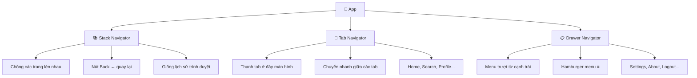
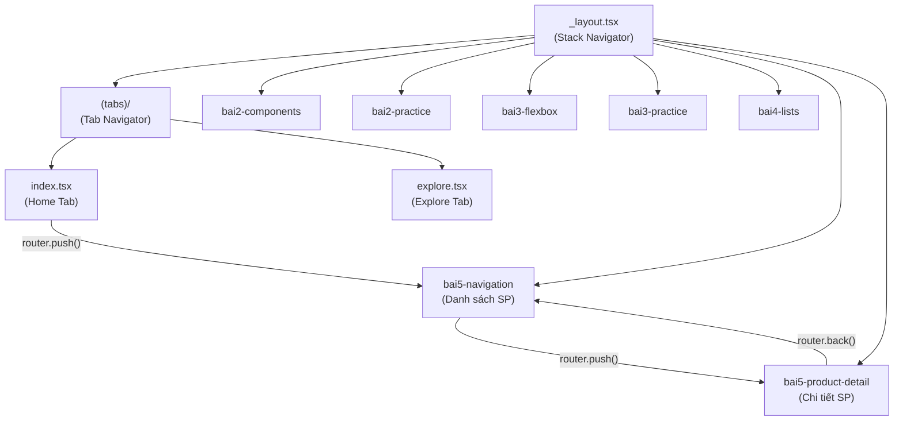
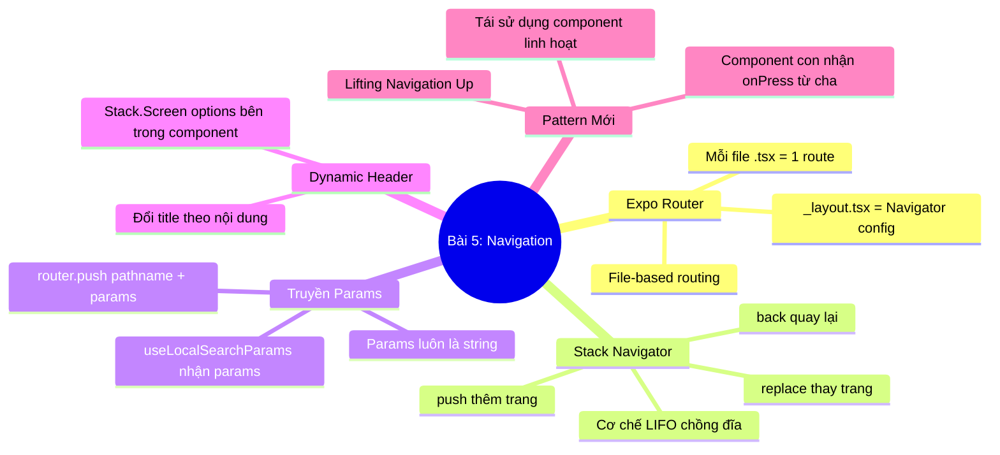

# 📘 BÀI 5: React Navigation & Expo Router — Điều Hướng Giữa Các Màn Hình

> **Thời lượng:** ~3-4 giờ | **Độ khó:** ⭐⭐⭐ Trung bình | **Dự án:** Tái sử dụng `Bai1_HelloReactNative`
> **Phase 2 bắt đầu!** 🔵 Từ bài này trở đi, chúng ta học cách xây dựng app có nhiều màn hình.

---

## 🎯 Mục tiêu bài học

Sau bài này, bạn sẽ:
- [ ] Hiểu tổng quan hệ thống Navigation trong React Native
- [ ] Phân biệt **3 loại Navigator**: Stack, Tab, Drawer
- [ ] Hiểu cơ chế **file-based routing** của Expo Router
- [ ] Sử dụng 3 phương thức: `router.push()`, `router.replace()`, `router.back()`
- [ ] Truyền dữ liệu (params) giữa các màn hình
- [ ] Nắm 1 Hook mới: **`useLocalSearchParams`**
- [ ] Nắm 1 Pattern mới: **Lifting Navigation Up**

---

## Phần 1: Tổng Quan — Hệ Thống Navigation Trong React Native

### 1.1 Tại sao cần Navigation?

Trên Web, bạn chuyển trang bằng URL (`/home`, `/products`, `/products/123`). Trình duyệt tự có thanh địa chỉ, nút Back/Forward.

Trên Mobile App, **KHÔNG CÓ TRÌNH DUYỆT**. App cần tự quản lý:
* Người dùng đang ở màn hình nào?
* Nhấn nút Back thì quay về đâu?
* Hiệu ứng chuyển trang (trượt trái/phải, fade) như thế nào?

👉 Đây là lý do tồn tại của **Navigation Library** (thư viện điều hướng).

### 1.2 Ba loại Navigator chính:



| Loại | Mô tả | Ví dụ thực tế |
|:---|:---|:---|
| **Stack** | Chồng trang lên nhau, nút Back quay lại | Danh sách sản phẩm → Chi tiết → Thanh toán |
| **Tab** | Thanh tab ở đáy để chuyển nhanh | Home / Search / Cart / Profile (Shopee) |
| **Drawer** | Menu hamburger trượt từ cạnh | Gmail, Google Maps |

> [!NOTE]
> Dự án của chúng ta đã sử dụng cả **Stack** (Root Layout) và **Tab** (thư mục `(tabs)/`) từ Bài 1. Bài 5 này sẽ giúp bạn hiểu rõ chúng hoạt động như thế nào!

---

## Phần 2: Expo Router — File-Based Routing

### 2.1 So sánh 2 cách khai báo route:

| Tiêu chí | React Navigation (Code-based) | Expo Router (File-based) |
|:---|:---|:---|
| **Cách tạo route** | Viết code JS khai báo từng screen | Tạo file `.tsx` trong thư mục `app/` |
| **Ví dụ** | `<Stack.Screen name="details" component={DetailsScreen} />` | Tạo file `app/details.tsx` là xong! |
| **Deep linking** | Cấu hình thủ công | ✅ Tự động |
| **Type safety** | Cần setup thêm | ✅ Tự động với TypeScript |

### 2.2 Cấu trúc thư mục dự án hiện tại:

```
src/app/                        URL tương ứng
├── _layout.tsx                 # Root Layout (Stack Navigator)
├── (tabs)/                     # Group: Tab Navigator
│   ├── _layout.tsx             # Tab Layout config
│   ├── index.tsx               # Tab "Home"      → /
│   └── explore.tsx             # Tab "Explore"    → /explore
│
├── bai2-components.tsx         # → /bai2-components
├── bai2-practice.tsx           # → /bai2-practice
├── bai3-flexbox.tsx            # → /bai3-flexbox
├── bai3-practice.tsx           # → /bai3-practice
├── bai4-lists.tsx              # → /bai4-lists
├── bai5-navigation.tsx         # → /bai5-navigation     ← 🆕
└── bai5-product-detail.tsx     # → /bai5-product-detail ← 🆕
```

> [!IMPORTANT]
> **Quy tắc Expo Router:**
> 1. Mỗi file `.tsx` trong thư mục `app/` = 1 route (1 URL).
> 2. File `_layout.tsx` = Cấu hình Navigator cho thư mục đó.
> 3. Thư mục `(tên)` với dấu ngoặc tròn = **Group layout** (không tạo URL segment).
> 4. File `[param].tsx` với dấu ngoặc vuông = **Dynamic route** (nhận param từ URL).

---

### 2.3 Giải Thích Cốt Lõi: Khai Báo Route Trong React Navigation vs Expo Router

> [!IMPORTANT]
> **Câu hỏi hay gặp:** *"Tại sao nói Expo Router là file-based không cần khai báo trong code, nhưng tôi vẫn thấy viết `<Stack.Screen>` trong `_layout.tsx`?"*
> 
> 👉 **Câu trả lời:** Trong Expo Router, việc khai báo `<Stack.Screen>` trong `_layout.tsx` là **HOÀN TOÀN TÙY CHỌN (KHÔNG BẮT BUỘC)**! Route đã tự động hoạt động ngay khi bạn tạo file `.tsx`.

#### 🧪 Thí nghiệm thực tế: Điều gì xảy ra nếu bạn XOÁ `<Stack.Screen>` trong `_layout.tsx`?
Trong dự án của bạn, nếu bạn **xoá hoàn toàn** 2 dòng này trong `_layout.tsx`:
```tsx
// Thử xoá 2 dòng này:
<Stack.Screen name="bai5-navigation" options={{ title: '📘 Bài 5: Navigation' }} />
<Stack.Screen name="bai5-product-detail" options={{ title: '📋 Chi tiết sản phẩm' }} />
```
👉 **Ứng dụng VẪN CHẠY BÌNH THƯỜNG 100%!** Bạn gọi `router.push('/bai5-navigation')` hay `router.push('/bai5-product-detail')` vẫn chuyển trang mượt mà.  
*Điểm khác duy nhất:* Tiêu đề header sẽ hiển thị mặc định theo tên file (chữ `"bai5-navigation"`) thay vì chữ tiếng Việt có dấu (`"📘 Bài 5: Navigation"`).

#### 🔍 Vậy `<Stack.Screen>` trong `_layout.tsx` của Expo Router dùng để làm gì?
Trong Expo Router, `<Stack.Screen>` **chỉ dùng để cấu hình giao diện Header (`options`)**, **KHÔNG PHẢI để tạo route**.

Hãy nhìn kỹ 2 đoạn code để thấy sự khác biệt:

##### ❌ React Navigation truyền thống (Code-based):
```tsx
import DetailsScreen from './screens/DetailsScreen'; // 1. Phải tự import component

<Stack.Navigator>
  {/* 2. BẮT BUỘC phải có dòng này + prop component={DetailsScreen} */}
  {/* Nếu không có dòng này, gọi navigation.navigate('details') SẼ BỊ CRASH LẬP TỨC! */}
  <Stack.Screen name="details" component={DetailsScreen} />
</Stack.Navigator>
```

##### ✅ Expo Router (File-based):
```tsx
// 1. KHÔNG CẦN import component
// 2. Route ĐÃ TỒN TẠI NGAY LẬP TỨC khi bạn tạo file app/bai5-navigation.tsx

<Stack>
  {/* Dòng này là TÙY CHỌN (Optional), chỉ để đổi title hoặc ẩn/hiện header */}
  {/* CHÚ Ý: Không hề có prop `component={...}` ở đây! */}
  <Stack.Screen 
    name="bai5-navigation" 
    options={{ title: '📘 Bài 5: Navigation' }} 
  />
</Stack>
```

#### 📊 Bảng so sánh chi tiết:

| Thao tác | React Navigation (Code-based) | Expo Router (File-based) |
|:---|:---|:---|
| **Cách tạo 1 trang mới** | 1. Tạo file component.<br>2. Vào file Navigation import component.<br>3. Khai báo `<Stack.Screen name="..." component={...} />`. | **Chỉ cần tạo file `.tsx` trong thư mục `app/` là xong 100%!** |
| **Nếu KHÔNG khai báo trong Navigator** | ❌ **Báo lỗi crash app**, không thể điều hướng tới trang đó. | ✅ **Vẫn điều hướng được bình thường** (header lấy tên file). |
| **Mục đích của `<Stack.Screen>`** | **Định nghĩa Route** + Cấu hình giao diện. | **Chỉ cấu hình giao diện** (`options`), route đã có sẵn. |

> 💡 **Quy tắc nhớ nhanh:**
> * Trong Expo Router: **File = Route**. Cứ tạo file là có đường dẫn.
> * Khai báo `<Stack.Screen>` trong `_layout.tsx` chỉ là **"trang điểm"** thêm cho cái Header (đổi tên tiêu đề, đổi màu sắc, ẩn nút back...).

---

### 2.4 Thư Mục Có Dấu Ngoặc Tròn `(tên)` — Route Groups & Group Layout

#### 1️⃣ "URL Segment" là gì?
Mỗi đoạn chữ nằm giữa 2 dấu gạch chéo `/` trên thanh địa chỉ trình duyệt được gọi là một **URL Segment** (đoạn URL):

```
http://localhost:8081 / shop / product / 123
                        └──┬─┘   └──┬──┘   └─┬─┘
                       Seg 1    Seg 2     Seg 3
```

#### 2️⃣ So sánh: Thư mục BÌNH THƯỜNG vs Thư mục có NGOẶC TRÒN `( )`

* 📁 **Trường hợp 1: Thư mục bình thường (Tạo ra URL Segment)**
  * Cấu trúc: `app/auth/login.tsx`
  * 👉 URL: `localhost:8081/auth/login` *(Chữ `auth` xuất hiện trong URL)*

* 📁 **Trường hợp 2: Thư mục có dấu ngoặc tròn `( )` (KHÔNG tạo URL Segment)**
  * Cấu trúc: `app/(auth)/login.tsx`
  * 👉 URL: `localhost:8081/login` *(Chữ `(auth)` hoàn toàn **TÀNG HÌNH**, bị bỏ qua khỏi URL!)*

#### 3️⃣ Nhìn ngay vào dự án thực tế của bạn:
Trong dự án `Bai1_HelloReactNative` đang có cấu trúc:
```
src/app/
├── (tabs)/
│   ├── _layout.tsx      ← File cấu hình thanh Tab bar ở đáy
│   ├── index.tsx        ← Đường dẫn URL là: "/" (Trang chủ)
│   └── explore.tsx      ← Đường dẫn URL là: "/explore" (KHÔNG PHẢI là "/tabs/explore")
│
├── bai4-lists.tsx       ← Đường dẫn URL là: "/bai4-lists"
└── bai5-navigation.tsx  ← Đường dẫn URL là: "/bai5-navigation"
```

#### 4️⃣ Tại sao lại sinh ra tính năng này? (2 Lợi ích lớn)
* 🎯 **Lợi ích 1: Áp dụng Layout riêng mà không làm xấu URL**
  * Tất cả các file nằm trong thư mục `(tabs)/` (`index.tsx`, `explore.tsx`) sẽ **dùng chung thanh Tab Bar ở đáy màn hình** (nhờ file `(tabs)/_layout.tsx`).
  * Các file nằm **ngoài** thư mục `(tabs)/` (như `bai5-navigation.tsx`, `bai5-product-detail.tsx`) sẽ **KHÔNG có thanh Tab Bar**, mà hiển thị toàn màn hình với thanh Header có nút Back.
  * Và quan trọng nhất: URL của tab Explore vẫn là `/explore` cực kỳ ngắn gọn và đẹp, thay vì `/tabs/explore`.
* 🎯 **Lợi ích 2: Gom nhóm code cho gọn gàng (Code Organization)**
  * Trong các dự án lớn, bạn có thể chia:
    * `app/(auth)/login.tsx` $\rightarrow$ URL: `/login` (Layout không có header)
    * `app/(auth)/register.tsx` $\rightarrow$ URL: `/register`
    * `app/(admin)/dashboard.tsx` $\rightarrow$ URL: `/dashboard` (Layout có sidebar quản trị)

> 💡 **Quy tắc nhớ nhanh:**
> Thư mục có ngoặc tròn `(tên)` giống như một chiếc **"áo tàng hình"**: 
> * Nó giúp bạn **gom nhóm các file để dùng chung một giao diện (`_layout.tsx`)**, 
> * Nhưng **tên của nó sẽ biến mất hoàn toàn** trên đường dẫn URL!

---

### 2.5 File / Thư Mục Có Dấu Ngoặc Vuông `[param]` — Dynamic Routes

> ❓ **Vấn đề đặt ra:** Ứng dụng bán hàng có **10.000 sản phẩm** (mỗi sản phẩm có 1 mã ID riêng: `1`, `2`, ..., `10000`). Chẳng lẽ bạn phải tạo 10.000 file tên là `1.tsx`, `2.tsx`, `3.tsx` trong thư mục `app`?  
> 👉 **Không thể nào!** Đó là lý do **Dynamic Route (Dấu ngoặc vuông `[ ]`)** ra đời.

#### 1️⃣ Dấu ngoặc vuông `[ ]` là gì?
Dấu ngoặc vuông `[param].tsx` biến tên file thành một **"Biến số" (Variable / Placeholder)**.

Bất kỳ chữ hay số nào nằm ở vị trí đó trên đường dẫn URL sẽ được **tự động gán vào biến bên trong dấu ngoặc vuông**.

```
Tên file:           app / product / [id].tsx
                                      ▲
                                      │ (Biến số 'id')
URL 1:              /product/42   ───> id = "42"
URL 2:              /product/999  ───> id = "999"
URL 3:              /product/iphone-16 ──> id = "iphone-16"
```

#### 2️⃣ Cách viết code thực tế (Chỉ 2 bước)

##### 🔹 Bước 1: Tạo DUY NHẤT 1 file: `app/product/[id].tsx`
```tsx
// File: app/product/[id].tsx
import { View, Text, StyleSheet } from 'react-native';
import { useLocalSearchParams } from 'expo-router';

export default function ProductDetail() {
  // ⭐ Tên biến 'id' ở đây KHỚP CHÍNH XÁC với tên file [id].tsx
  const { id } = useLocalSearchParams<{ id: string }>();

  return (
    <View style={styles.container}>
      <Text style={styles.title}>Chi Tiết Sản Phẩm</Text>
      <Text style={styles.text}>Mã ID sản phẩm đang xem là: {id}</Text>
    </View>
  );
}

const styles = StyleSheet.create({
  container: { flex: 1, justifyContent: 'center', alignItems: 'center' },
  title: { fontSize: 20, fontWeight: 'bold', marginBottom: 8 },
  text: { fontSize: 16, color: '#666' },
});
```

##### 🔹 Bước 2: Ở trang danh sách, bạn chỉ cần điều hướng:
```tsx
import { router } from 'expo-router';

// Nhấn vào sản phẩm nào thì truyền ID của sản phẩm đó vào URL:
router.push(`/product/${item.id}`);

// Ví dụ:
router.push('/product/101'); // Mở file [id].tsx với id = "101"
router.push('/product/202'); // Mở file [id].tsx với id = "202"
```

#### 3️⃣ So sánh 2 cách truyền tham số trong Expo Router:

| Tiêu chí | Cách 1: Query Params (Bài 5 vừa học) | Cách 2: Dynamic Route `[id].tsx` |
|:---|:---|:---|
| **Tên file** | `bai5-product-detail.tsx` | `product/[id].tsx` |
| **Đường dẫn URL** | `/bai5-product-detail?id=1&name=Sony` | `/product/1` |
| **Cách chuyển trang** | `router.push({ pathname: '/bai5-product-detail', params: { id: '1' } })` | `router.push('/product/1')` |
| **Cách lấy dữ liệu** | `const { id } = useLocalSearchParams()` | `const { id } = useLocalSearchParams()` *(Dùng chung 1 hook!)* |
| **Ứng dụng** | Dùng khi cần truyền nhiều thông tin phụ | Dùng làm đường dẫn chuẩn SEO, trang chi tiết sản phẩm / bài viết |

#### 📌 Tóm lại quy tắc 3 loại file/thư mục trong Expo Router:
1. **File thường `about.tsx`** $\rightarrow$ URL cố định: `/about`
2. **Thư mục `(tabs)` (Ngoặc tròn)** $\rightarrow$ **Áo tàng hình** gom layout, không tạo URL: `/explore`
3. **File `[id].tsx` (Ngoặc vuông)** $\rightarrow$ **Biến số động**, nhận giá trị từ URL: `/product/123`

---

## Phần 3: Stack Navigator — Cơ Chế "Chồng Đĩa" (LIFO)

### 3.1 Stack hoạt động như thế nào?

Stack Navigator quản lý các trang theo cấu trúc **LIFO (Last In, First Out)** — giống như chồng đĩa:

```
Bước 1: Mở app           Bước 2: push("/list")      Bước 3: push("/detail")
┌─────────────┐           ┌─────────────┐           ┌─────────────┐
│             │           │             │           │  📋 Detail  │ ← Đang xem
│             │           │  📃 List    │ ← Đang xem│─────────────│
│  🏠 Home   │ ← Đang xem│─────────────│           │  📃 List    │
└─────────────┘           │  🏠 Home   │           │─────────────│
                          └─────────────┘           │  🏠 Home   │
                                                    └─────────────┘

Bước 4: back()            Bước 5: back()
┌─────────────┐           ┌─────────────┐
│  📃 List    │ ← Quay lại│  🏠 Home   │ ← Quay lại
│─────────────│           └─────────────┘
│  🏠 Home   │
└─────────────┘
```

---

## Phần 4: Ba Phương Thức Điều Hướng

### 4.1 `router.push(path)` — Đẩy thêm trang mới vào stack

```tsx
import { router } from 'expo-router';

// Cách 1: Đơn giản — chỉ truyền đường dẫn
router.push("/bai5-product-detail");

// Cách 2: Truyền kèm params (dữ liệu)
router.push({
  pathname: "/bai5-product-detail",
  params: { name: "iPhone 15", price: "999.000₫" },
});
```

### 4.2 `router.replace(path)` — Thay thế trang hiện tại

```tsx
// Trang hiện tại bị XOÁ khỏi stack, trang mới chiếm chỗ
router.replace("/bai5-product-detail");
```

**Khi nào dùng `replace`?**
* Sau khi đăng nhập thành công → `replace("/home")` → Người dùng không thể Back về trang Login!
* Sau khi hoàn tất thanh toán → `replace("/order-success")` → Không cho quay lại trang thanh toán!

### 4.3 `router.back()` — Quay lại trang trước

```tsx
// Lấy trang hiện tại ra khỏi stack, quay về trang phía dưới
router.back();
```

### 📊 So sánh 3 phương thức:

| Phương thức | Hành vi | Khi nào dùng |
|:---|:---|:---|
| `router.push()` | **Thêm** trang mới lên đỉnh stack | Mở trang chi tiết, mở form |
| `router.replace()` | **Thay thế** trang hiện tại (không Back được) | Sau đăng nhập, sau thanh toán |
| `router.back()` | **Gỡ** trang hiện tại, quay về trang trước | Nút Back, nút Huỷ |

---

## Phần 5: Truyền Dữ Liệu Giữa Các Trang (Params)

### 5.1 Trang GỬI — Đặt params vào `router.push()`:
```tsx
router.push({
  pathname: "/bai5-product-detail",
  params: {
    id: "1",
    name: "Tai nghe Sony WH-1000XM5",
    price: "7.990.000₫",
    rating: "4.8",
  },
});
```

### 5.2 Trang NHẬN — Dùng hook `useLocalSearchParams()`:
```tsx
import { useLocalSearchParams } from 'expo-router';

export default function ProductDetailScreen() {
  // 🆕 HOOK: useLocalSearchParams — Lấy params từ trang trước
  const { name, price, rating } = useLocalSearchParams<{
    name: string;
    price: string;
    rating: string;
  }>();

  return (
    <View>
      <Text>{name}</Text>    {/* "Tai nghe Sony WH-1000XM5" */}
      <Text>{price}</Text>   {/* "7.990.000₫" */}
    </View>
  );
}
```

> [!WARNING]
> **Lưu ý quan trọng:** Params truyền qua URL luôn là **string**! Nếu bạn truyền số `rating: 4.8`, bên nhận sẽ nhận được chuỗi `"4.8"`. Cần dùng `Number(rating)` nếu muốn tính toán.

---

### 5.3 Trong Thực Tế: Dynamic Route `[id]` vs Query Params `?a=b`

> 💡 **Câu hỏi tư duy:** *"Nếu sau này có Backend API, trang chi tiết chỉ cần nhận đúng `id` rồi tự gọi API lấy dữ liệu, vậy tại sao lại cần Query Params (`?key=value`)?"*

#### 1️⃣ Cách làm chuẩn 100% khi có Backend API:
* Bạn **CHỈ truyền đúng `id`** qua Dynamic Route: `router.push('/product/123')`.
* Trang chi tiết mở ra, lấy `id = 123` và gọi API: `fetch(`/api/products/${id}`)` để lấy toàn bộ thông tin mới nhất từ cơ sở dữ liệu.
* *(Ở Bài 5 này, do chưa học Backend nên ta truyền tạm nhiều params để vẽ giao diện ngay)*.

#### 2️⃣ Bốn trường hợp BẮT BUỘC phải dùng Query Params (`?key=value`):

* 🔍 **Trường hợp 1: Bộ Lọc & Tìm Kiếm (Filter, Search & Sort) — *Phổ biến nhất!***
  * Người dùng lọc sản phẩm với nhiều tiêu chí tùy chọn:
    ```
    /products?category=giay&brand=nike&sort=price_asc&minPrice=500000
    ```
  * Không thể tạo cấu trúc thư mục `[category]/[brand]/[sort].tsx` vì các bộ lọc này là tùy chọn. Query Params là giải pháp linh hoạt duy nhất!

* 🎟️ **Trường hợp 2: Mã Giảm Giá & Nguồn Giới Thiệu (Deep Link / Marketing)**
  * Người dùng bấm vào link quảng cáo từ Facebook hoặc quét mã QR:
    ```
    /product/123?coupon=GIAM50K&ref=facebook_ad
    ```
  * `123`: ID sản phẩm (Dynamic Route) — `coupon` & `ref`: Mã giảm giá và nguồn theo dõi (Query Params).

* 📦 **Trường hợp 3: Điều hướng các Bước hoặc Tab (Steps / Tabs)**
  * Trang thanh toán nhiều bước dùng chung 1 file `checkout.tsx`:
    ```
    /checkout?step=address    (Bước 1: Chọn địa chỉ)
    /checkout?step=shipping   (Bước 2: Chọn đơn vị vận chuyển)
    /checkout?step=payment    (Bước 3: Thanh toán)
    ```

* ⚡ **Trường hợp 4: Hiển thị giao diện tức thì (Instant Preview)**
  * Khi mạng chậm, truyền tạm `name` và `image` qua URL để trang chi tiết **vẽ ngay ảnh và tiêu đề trong 0.01 giây**, trong lúc đó ngầm gọi API tải mô tả dài và đánh giá.

#### 📊 Bảng phân vai chuẩn trong thực tế:

| Thành phần | Vai trò thực tế | Ví dụ URL |
|:---|:---|:---|
| **Dynamic Route `[id]`** | Định danh **thực thể chính** (Bắt buộc) | `/product/123`, `/user/tu-vu` |
| **Query Params `?a=b`** | Các **tùy chọn phụ, bộ lọc, trạng thái** (Không bắt buộc) | `?color=red&size=XL&coupon=VIP` |

👉 Trong app chuyên nghiệp, thường kết hợp cả hai: `router.push('/product/123?color=blue&coupon=SALE')`.

---

### 5.4 Tại Sao Dùng URL Query Params Cho Multi-step / Tabs Thay Vì `useState`?

> ❓ **Thắc mắc:** *"Tại sao các bước thanh toán `step=address`, `step=payment` không dùng `const [step, setStep] = useState('address')` cho tiện mà phải đưa lên URL?"*

Dùng `useState` hoàn toàn chạy được, nhưng các ứng dụng lớn (Shopee, Grab, Tiki...) **chọn đưa lên URL vì 4 lý do chí mạng**:

#### 1. 📱 Xử lý Nút Back của điện thoại (Android Hardware Back & Header Back)
* **Nếu dùng `useState`:** Đang ở **Bước 3 (Thanh toán)**, bấm nút Back điện thoại $\rightarrow$ Vì `useState` không lưu vào Navigation Stack, app sẽ **VĂNG THẲNG RA KHỎI TRANG THANH TOÁN (về lại Giỏ hàng)**, gây ức chế cho người dùng.
* **Nếu dùng URL / Navigation (`router.push('/checkout?step=payment')`):** Bấm Back $\rightarrow$ Hệ thống tự động lùi từ **Bước 3 về lại Bước 2** đúng kỳ vọng!

#### 2. 💳 Tích hợp Cổng Thanh Toán (Momo, VNPay, ZaloPay, Ngân hàng)
* App chuyển sang App Momo để thanh toán. Thanh toán xong, Momo gọi Deep Link mở lại app:
  ```
  myapp://checkout?step=payment_success&orderId=123
  ```
* **Nếu dùng `useState`:** Khi App mở lại từ Momo, state bị reset về Bước 1 (Address)!
* **Nếu dùng URL Params:** App đọc được `step=payment_success` và hiển thị ngay màn hình *"Thanh toán thành công"*.

#### 3. 🔔 Mở trực tiếp từ Thông báo (Push Notification / Deep Link)
* Giả sử có link: `shopee://profile?tab=voucher`
* Bấm vào thông báo $\rightarrow$ App mở ra và nhảy thẳng vào đúng **Tab Voucher** nhờ đọc được param `tab=voucher` trên URL.

#### 4. 🔄 Không bị mất trạng thái khi F5 hoặc hệ điều hành reload App
* `useState` bị xóa sạch khi F5 web hoặc điện thoại giải phóng RAM.
* URL Params giữ nguyên `?step=payment`, người dùng tiếp tục thao tác không bị gián đoạn.

#### 📊 Bảng tổng kết: Khi nào dùng `useState` vs Khi nào đưa lên URL?

| Tình huống | Dùng `useState` | Đưa lên URL / Navigation Params |
|:---|:---:|:---:|
| Ẩn / Hiện popup modal, dropdown menu | ✅ Chuẩn | ❌ Không cần thiết |
| Lưu chữ người dùng đang gõ vào ô text input | ✅ Chuẩn | ❌ Không nên |
| Chuyển đổi các bước mà **cần bấm nút Back quay lại được** | ❌ Dễ gây lỗi trải nghiệm | ✅ **Bắt buộc** |
| Cần nhảy vào đúng trang từ **link thông báo / link chia sẻ** | ❌ Không làm được | ✅ **Bắt buộc** |
| Nhận kết quả trả về từ **App bên ngoài (Momo, VNPay)** | ❌ Bị mất state | ✅ **Bắt buộc** |

> 💡 **Quy tắc vàng:**
> * Trạng thái **cục bộ, tạm thời** (mở modal, toggle switch) $\rightarrow$ Dùng **`useState`**.
> * Trạng thái **ảnh hưởng nút Back** hoặc **cần mở từ link bên ngoài** $\rightarrow$ Đưa lên **URL / Navigation Params**!

---

## Phần 6: 🆕 Dynamic Header — Đổi Tiêu Đề Header Theo Nội Dung

Thông thường, tiêu đề header được đặt cố định trong `_layout.tsx`. Nhưng khi vào trang chi tiết sản phẩm, bạn muốn hiển thị **tên sản phẩm** làm tiêu đề:

```tsx
import { Stack } from 'expo-router';

export default function ProductDetailScreen() {
  const { name } = useLocalSearchParams<{ name: string }>();

  return (
    <>
      {/* ⭐ Ghi đè options của Stack.Screen ngay từ bên trong component */}
      <Stack.Screen
        options={{
          title: name || "Chi tiết sản phẩm",
          headerStyle: { backgroundColor: "#8e44ad" },
          headerTintColor: "#fff",
        }}
      />
      <View>...</View>
    </>
  );
}
```

---

## Phần 7: 🆕 Pattern — Lifting Navigation Up

### Vấn đề:
Nên đặt logic `router.push()` ở đâu? Trong component con (ProductCard) hay component cha (ProductListScreen)?

### Đáp án: **Đặt ở component cha và truyền xuống qua props**

```tsx
// ❌ CÁCH TỆ: Component con biết quá nhiều về navigation
function ProductCard({ product }) {
  return (
    <Pressable onPress={() => router.push(`/detail/${product.id}`)}>
      <Text>{product.name}</Text>
    </Pressable>
  );
}

// ✅ CÁCH TỐT: Component con chỉ nhận hàm onPress, không biết gì về navigation
function ProductCard({ product, onPress }) {
  return (
    <Pressable onPress={onPress}>
      <Text>{product.name}</Text>
    </Pressable>
  );
}

// Cha quyết định điều hướng đi đâu
<ProductCard
  product={item}
  onPress={() => router.push({ pathname: "/detail", params: { ... } })}
/>
```

**Tại sao?**
* `ProductCard` có thể tái sử dụng ở nhiều nơi khác nhau: có chỗ nhấn vào để xem chi tiết, có chỗ nhấn vào để thêm vào giỏ hàng, có chỗ nhấn vào để chỉnh sửa.
* Nếu `ProductCard` tự chứa `router.push()`, nó sẽ bị gắn chặt vào đúng 1 hành vi duy nhất!

---

## Phần 8: Phân Tích Cấu Trúc Dự Án Hiện Tại



---

## Phần 9: Thực Hành Trên Dự Án

File tạo mới:

### Màn hình 1: [bai5-navigation.tsx](file:///Users/vovantu/HTML_CSS/ReactNative/Bai1_HelloReactNative/src/app/bai5-navigation.tsx)
* Danh sách 8 sản phẩm công nghệ (FlatList)
* Nhấn vào bất kỳ sản phẩm → `router.push()` với params sang trang chi tiết

### Màn hình 2: [bai5-product-detail.tsx](file:///Users/vovantu/HTML_CSS/ReactNative/Bai1_HelloReactNative/src/app/bai5-product-detail.tsx)
* Nhận params bằng `useLocalSearchParams()`
* Hiển thị ảnh lớn + thông tin chi tiết
* Dynamic Header: Tiêu đề header = tên sản phẩm
* **3 nút demo trực tiếp:** `router.back()`, `router.replace()`, `router.push()` để bạn trải nghiệm sự khác biệt

### Cách truy cập:
Trên Home screen → nhấn nút **"📘 Bài 5: Navigation (Điều hướng)"**

---

## Phần 10: Tổng Kết Bài 5



---

## 📝 Bài Tập Tự Làm

### BT1: Chạy và tương tác
- Mở Bài 5, nhấn vào các sản phẩm để xem chi tiết
- Trên trang chi tiết, thử cả 3 nút: `back()`, `replace()`, `push()`
- Quan sát tiêu đề header thay đổi theo tên sản phẩm

### BT2: Đọc hiểu code
- Mở [bai5-navigation.tsx](file:///Users/vovantu/HTML_CSS/ReactNative/Bai1_HelloReactNative/src/app/bai5-navigation.tsx): Cách truyền params qua `router.push()`
- Mở [bai5-product-detail.tsx](file:///Users/vovantu/HTML_CSS/ReactNative/Bai1_HelloReactNative/src/app/bai5-product-detail.tsx): Cách nhận params bằng `useLocalSearchParams()`

### BT3: Quan sát Stack
- Ở trang chi tiết, nhấn nút "📄 router.push()" 3-4 lần liên tiếp
- Rồi nhấn nút Back trên header → Bạn phải Back nhiều lần mới về được trang danh sách
- → Đây chính là bằng chứng trực quan của cơ chế Stack (chồng đĩa)!

---

> **Bài tiếp theo:** Bài 6 — Tab Navigation & Drawer Navigation
>
> *Khi hoàn thành, hãy báo cho tôi để tiếp tục!* 🚀
