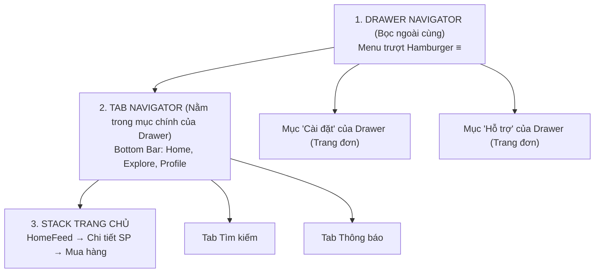
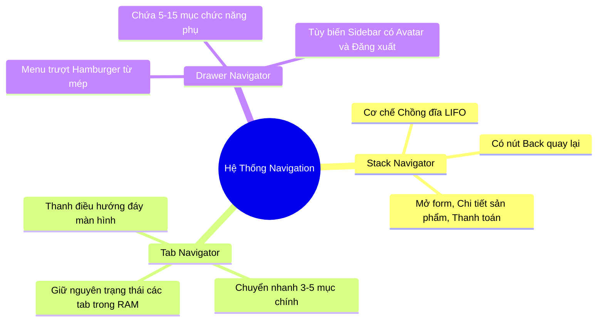

# 📱 BÀI 6 (Phần Bổ Sung): Drawer Navigation — Menu Trượt Hamburger (≡)

> **Thời lượng:** ~2-3 giờ | **Độ khó:** ⭐⭐⭐ Trung bình | **Chủ đề:** Menu trượt cạnh (Drawer/Sidebar)
> **Mục tiêu:** Nắm vững Drawer Navigation, cách tùy biến Sidebar riêng và phối hợp 3 tầng điều hướng (Drawer + Tab + Stack).

---

## 🎯 Mục tiêu bài học

Sau tài liệu này, bạn sẽ:
- [ ] Hiểu rõ **Drawer Navigation** là gì và khi nào nên dùng thay vì Tab Navigation.
- [ ] Nắm được các thư viện cốt lõi cấu thành Drawer (`react-native-gesture-handler`, `reanimated`, `@react-navigation/drawer`).
- [ ] Khai báo và cấu hình Drawer trong **Expo Router** bằng file layout `(drawer)/_layout.tsx`.
- [ ] Điều khiển đóng/mở Drawer bằng code (`openDrawer`, `closeDrawer`, `toggleDrawer`).
- [ ] Tự thiết kế giao diện Sidebar tùy chỉnh (**Custom Drawer Content** với Avatar, thông tin cá nhân, nút Logout).
- [ ] Hiểu kiến trúc phối hợp kinh điển **3 tầng Navigator: Drawer bọc Tab, Tab bọc Stack**.

---

## Phần 1: Tổng Quan — Drawer Navigation Là Gì?

### 1.1 Khái niệm
**Drawer Navigation** (thường gọi là Menu Hamburger `≡` hoặc Sidebar) là thanh menu trượt ẩn ở cạnh màn hình (thường là cạnh trái). 

Khi người dùng:
1. Vuốt nhẹ từ mép màn hình sang phải, hoặc
2. Nhấn vào biểu tượng **3 dấu gạch ngang (`≡`)** ở góc trên thanh Header.

👉 Một thanh menu sẽ trượt ra, đè lên hoặc đẩy nội dung chính sang một bên.

```
┌──────────────────────────────────────┐
│  ≡  Ứng Dụng                 🔍  🔔 │ ← Header với nút ≡ (Hamburger)
├─────────────┬────────────────────────┤
│ 👤 User Info│                        │
│ ─────────── │                        │
│ 🏠 Trang chủ│                        │
│ 📦 Đơn hàng │       NỘI DUNG         │
│ ⚙️ Cài đặt  │       MÀN HÌNH         │
│ ❓ Trợ giúp │        CHÍNH           │
│ 🚪 Đăng xuất│                        │
│             │                        │
│  [DRAWER]   │                        │
└─────────────┴────────────────────────┘
```

### 1.2 Ví dụ thực tế
* **Gmail:** Danh sách Hộp thư đến, Thư đã gửi, Thùng rác, Cài đặt nằm trong Drawer.
* **Google Maps / Grab:** Menu trượt chứa Lịch sử chuyến đi, Phương thức thanh toán, Ưu đãi, Trợ giúp.
* **Discord / Slack:** Drawer bên trái chứa danh sách Server / Kênh chat.

---

## Phần 2: So Sánh — Khi Nào Dùng Tab? Khi Nào Dùng Drawer?

Một câu hỏi kiến trúc cực kỳ quan trọng: *"Khi nào nên đặt menu ở đáy (Tab), khi nào nên giấu vào menu trượt (Drawer)?"*

| Tiêu chí | Tab Navigation (Bottom Bar) | Drawer Navigation (Sidebar ≡) |
|:---|:---|:---|
| **Vị trí** | Cố định ở đáy màn hình | Ẩn ở cạnh trái (hoặc phải), vuốt mới ra |
| **Số lượng mục** | **Ít** (tối đa 3 - 5 mục) | **Nhiều** (từ 5 - 15+ mục tùy ý) |
| **Tần suất sử dụng** | Rất cao (thao tác liên tục: Home, Search, Thông báo) | Thấp hơn (thao tác phụ: Cài đặt, Lịch sử, Điều khoản, Đăng xuất) |
| **Diện tích màn hình** | Chiếm một phần cố định ở đáy | Không chiếm diện tích khi đóng |
| **Thuận tiện ngón tay** | Cực kỳ thuận tay (chạm 1 lần là đổi) | Cần 2 thao tác (nhấn `≡` rồi mới chọn mục) |

> 💡 **Quy tắc vàng của UI/UX Mobile:**
> * **Tính năng chính (Core Features)** dùng hàng ngày $\rightarrow$ Đặt ở **Bottom Tab**.
> * **Tính năng phụ / Cài đặt hệ thống (Secondary Features)** thỉnh thoảng mới dùng $\rightarrow$ Đặt vào **Drawer**.

---

## Phần 3: Cài Đặt & Cấu Hình Drawer Trong Expo Router

### 3.1 Các thư viện bắt buộc
Drawer Navigation yêu cầu xử lý vuốt chạm cử chỉ (Gestures) và hiệu ứng chuyển động mượt mà 60/120fps (Reanimated), nên bạn cần cài đặt:

```bash
npx expo install @react-navigation/drawer react-native-gesture-handler react-native-reanimated
```

### 3.2 Cấu hình Babel (cho Reanimated)
Trong file `babel.config.js` của dự án, plugin của reanimated phải luôn nằm ở dòng **cuối cùng**:
```js
module.exports = function (api) {
  api.cache(true);
  return {
    presets: ['babel-preset-expo'],
    plugins: [
      'react-native-reanimated/plugin', // ⭐ Luôn để ở cuối danh sách plugin
    ],
  };
};
```

---

## Phần 4: Cấu Trúc File & Khai Báo Trong Expo Router

Tương tự như `(tabs)`, ta tạo một nhóm thư mục có dấu ngoặc tròn `(drawer)` để gom layout menu trượt:

### 4.1 Cấu trúc thư mục
```
src/app/
└── (drawer)/
    ├── _layout.tsx       ← 📑 ĐỊNH NGHĨA DRAWER NAVIGATOR
    ├── index.tsx         ← 🏠 Màn hình Trang chủ
    ├── orders.tsx        ← 📦 Màn hình Đơn hàng
    ├── settings.tsx      ← ⚙️ Màn hình Cài đặt
    └── help.tsx          ← ❓ Màn hình Trợ giúp
```

### 4.2 File `src/app/(drawer)/_layout.tsx` chuẩn:
```tsx
import { Drawer } from 'expo-router/drawer';
import { Ionicons } from '@expo/vector-icons';

export default function DrawerLayout() {
  return (
    <Drawer
      screenOptions={{
        // 🎨 Màu sắc và kiểu dáng chung
        drawerActiveTintColor: '#3498db',     // Màu item khi được chọn
        drawerInactiveTintColor: '#555',      // Màu item bình thường
        drawerActiveBackgroundColor: '#ebf5fb',// Nền item khi chọn
        drawerLabelStyle: {
          marginLeft: -16,                     // Đẩy chữ gần lại icon
          fontSize: 15,
          fontWeight: '600',
        },
        headerStyle: { backgroundColor: '#3498db' },
        headerTintColor: '#fff',              // Màu nút hamburger ≡
      }}
    >
      {/* ─── Mục 1: Trang chủ ─── */}
      <Drawer.Screen
        name="index"
        options={{
          drawerLabel: 'Trang chủ',
          title: 'Trang chủ',
          drawerIcon: ({ color, size }) => (
            <Ionicons name="home-outline" size={size} color={color} />
          ),
        }}
      />

      {/* ─── Mục 2: Đơn hàng ─── */}
      <Drawer.Screen
        name="orders"
        options={{
          drawerLabel: 'Đơn hàng của tôi',
          title: 'Quản lý đơn hàng',
          drawerIcon: ({ color, size }) => (
            <Ionicons name="cube-outline" size={size} color={color} />
          ),
        }}
      />

      {/* ─── Mục 3: Cài đặt ─── */}
      <Drawer.Screen
        name="settings"
        options={{
          drawerLabel: 'Cài đặt tài khoản',
          title: 'Cài đặt',
          drawerIcon: ({ color, size }) => (
            <Ionicons name="settings-outline" size={size} color={color} />
          ),
        }}
      />
    </Drawer>
  );
}
```

---

## Phần 5: Điều Khiển Mở / Đóng Drawer Bằng Code

Mặc dù người dùng có thể vuốt từ cạnh màn hình hoặc bấm vào nút `≡` mặc định trên Header, trong nhiều trường hợp bạn muốn tạo một nút riêng giữa trang để mở Drawer:

```tsx
import { View, Text, Pressable, StyleSheet } from 'react-native';
import { useNavigation } from 'expo-router';
import { DrawerActions } from '@react-navigation/native';

export default function HomeScreen() {
  const navigation = useNavigation();

  return (
    <View style={styles.container}>
      <Text style={styles.title}>Nội dung Trang Chủ</Text>

      {/* Nút tuỳ chỉnh để MỞ Drawer */}
      <Pressable
        style={styles.button}
        onPress={() => navigation.dispatch(DrawerActions.openDrawer())}
      >
        <Text style={styles.btnText}>📂 Mở Menu Drawer</Text>
      </Pressable>

      {/* Nút tuỳ chỉnh để ĐÓNG Drawer */}
      <Pressable
        style={[styles.button, { backgroundColor: '#e74c3c' }]}
        onPress={() => navigation.dispatch(DrawerActions.closeDrawer())}
      >
        <Text style={styles.btnText}>❌ Đóng Menu Drawer</Text>
      </Pressable>

      {/* Nút ĐẢO TRẠNG THÁI (Mở thì đóng, Đóng thì mở) */}
      <Pressable
        style={[styles.button, { backgroundColor: '#2ecc71' }]}
        onPress={() => navigation.dispatch(DrawerActions.toggleDrawer())}
      >
        <Text style={styles.btnText}>🔄 Toggle Drawer</Text>
      </Pressable>
    </View>
  );
}

const styles = StyleSheet.create({
  container: { flex: 1, justifyContent: 'center', alignItems: 'center', gap: 12 },
  title: { fontSize: 20, fontWeight: 'bold', marginBottom: 20 },
  button: { backgroundColor: '#3498db', paddingHorizontal: 20, paddingVertical: 12, borderRadius: 8 },
  btnText: { color: '#fff', fontWeight: 'bold', fontSize: 15 },
});
```

---

## Phần 6: Custom Drawer Content — Tự Thiết Kế Sidebar Sang Trọng

Menu mặc định chỉ có danh sách chữ thô sơ. Trong ứng dụng thực tế, Sidebar thường có:
1. **Header:** Ảnh đại diện (Avatar), Tên người dùng, Email, Rank VIP.
2. **Body:** Danh sách các màn hình chuyển hướng.
3. **Footer:** Nút Đăng xuất màu đỏ và số phiên bản app.

### Code mẫu Custom Drawer Content:

```tsx
// File: src/components/custom-drawer-content.tsx
import { View, Text, Image, StyleSheet, Pressable } from 'react-native';
import {
  DrawerContentScrollView,
  DrawerItemList,
} from '@react-navigation/drawer';
import { Ionicons } from '@expo/vector-icons';
import { router } from 'expo-router';

export function CustomDrawerContent(props: any) {
  return (
    <View style={{ flex: 1 }}>
      <DrawerContentScrollView {...props} contentContainerStyle={{ paddingTop: 0 }}>
        {/* ─── 1. Header Profile ─── */}
        <View style={styles.drawerHeader}>
          <Image
            source={{ uri: 'https://i.pravatar.cc/150?img=12' }}
            style={styles.avatar}
          />
          <Text style={styles.userName}>Võ Văn Tú</Text>
          <Text style={styles.userEmail}>vovantu@example.com</Text>
          <View style={styles.badgeVIP}>
            <Text style={styles.badgeText}>⭐ Thành viên Kim Cương</Text>
          </View>
        </View>

        {/* ─── 2. Danh sách các Menu mặc định ─── */}
        <View style={styles.menuList}>
          <DrawerItemList {...props} />
        </View>
      </DrawerContentScrollView>

      {/* ─── 3. Footer Đăng xuất cố định ở đáy ─── */}
      <View style={styles.drawerFooter}>
        <Pressable
          style={styles.logoutBtn}
          onPress={() => {
            // Đăng xuất và đưa người dùng về màn hình login
            router.replace('/bai2-components');
          }}
        >
          <Ionicons name="log-out-outline" size={22} color="#e74c3c" />
          <Text style={styles.logoutText}>Đăng xuất</Text>
        </Pressable>
        <Text style={styles.versionText}>Phiên bản 1.0.0 (Build 2026)</Text>
      </View>
    </View>
  );
}

const styles = StyleSheet.create({
  drawerHeader: {
    backgroundColor: '#3498db',
    padding: 20,
    paddingTop: 48,
    alignItems: 'center',
  },
  avatar: {
    width: 72,
    height: 72,
    borderRadius: 36,
    borderWidth: 3,
    borderColor: '#fff',
    marginBottom: 8,
  },
  userName: { color: '#fff', fontSize: 18, fontWeight: 'bold' },
  userEmail: { color: '#d4e6f1', fontSize: 13, marginTop: 2 },
  badgeVIP: {
    backgroundColor: 'rgba(255,255,255,0.2)',
    paddingHorizontal: 10,
    paddingVertical: 3,
    borderRadius: 12,
    marginTop: 8,
  },
  badgeText: { color: '#fff', fontSize: 11, fontWeight: '600' },
  menuList: { flex: 1, paddingTop: 10 },
  drawerFooter: {
    padding: 16,
    borderTopWidth: 1,
    borderTopColor: '#eee',
    backgroundColor: '#fafafa',
  },
  logoutBtn: { flexDirection: 'row', alignItems: 'center', gap: 10, paddingVertical: 8 },
  logoutText: { color: '#e74c3c', fontSize: 15, fontWeight: 'bold' },
  versionText: { color: '#aaa', fontSize: 11, marginTop: 8, textAlign: 'center' },
});
```

👉 **Cách gắn vào `_layout.tsx`:**
```tsx
import { Drawer } from 'expo-router/drawer';
import { CustomDrawerContent } from '@/components/custom-drawer-content';

export default function DrawerLayout() {
  return (
    <Drawer
      drawerContent={(props) => <CustomDrawerContent {...props} />}
      screenOptions={{ ... }}
    >
      <Drawer.Screen name="index" ... />
    </Drawer>
  );
}
```

---

## Phần 7: Các Thuộc Tính Cấu Hình Quan Trọng Của Drawer

Trong `screenOptions` của `<Drawer>`, bạn có thể tinh chỉnh các thuộc tính sau:

| Thuộc tính | Giá trị phổ biến | Ý nghĩa |
|:---|:---|:---|
| `drawerPosition` | `'left'` *(mặc định)* \| `'right'` | Drawer trượt từ cạnh trái hay cạnh phải sang. |
| `drawerType` | `'front'` *(đè lên)* \| `'slide'` *(đẩy màn hình đi)* \| `'permanent'` *(cố định, hợp với iPad/Tablet)* | Hiệu ứng khi drawer mở ra. |
| `swipeEnabled` | `true` *(mặc định)* \| `false` | Cho phép hoặc cấm người dùng dùng tay vuốt để mở drawer (ví dụ trang vẽ canvas cần đặt `false` để tránh xung đột cử chỉ vuốt). |
| `swipeEdgeWidth` | Số pixel (VD: `50`, `100`) | Khoảng cách tính từ mép màn hình mà ngón tay bắt đầu vuốt để kéo Drawer ra. |
| `overlayColor` | `'rgba(0,0,0,0.5)'` | Màu nền làm mờ nội dung phía sau khi Drawer mở ra. |

---

## Phần 8: Kiến Trúc Kinh Điển 3 Tầng: Drawer + Tab + Stack

Trong các siêu ứng dụng (Super App) hoặc ứng dụng quản lý doanh nghiệp phức tạp, người ta thường kết hợp **cả 3 loại Navigator** lại với nhau theo cấu trúc lồng nhau (Nested Navigation):



### Cách thức hoạt động của mô hình 3 tầng:
1. **Tầng 1 (Drawer - Menu ≡):** Chứa các chức năng hệ thống bao quát: Chuyển đổi công ty, Xem hồ sơ nhân viên, Cài đặt, Trợ giúp, Đăng xuất.
2. **Tầng 2 (Tab Bar ở đáy):** Khi người dùng đang ở giao diện làm việc chính, thanh Tab ở đáy giúp họ luân chuyển nhanh giữa: *Bảng tin (Home)*, *Khám phá (Explore)*, *Hộp thư (Inbox)*.
3. **Tầng 3 (Stack Navigator):** Khi ở trong Tab Bảng tin, người dùng bấm vào 1 bài viết $\rightarrow$ Stack đẩy trang Chi tiết lên màn hình có nút Back mũi tên quay lại.

---

## Phần 9: Bảng Tổng Kết Cả 3 Loại Navigator Trong React Native



| Tiêu chí | Stack Navigator | Tab Navigator | Drawer Navigation |
|:---|:---|:---|:---|
| **Hình thái** | Các màn hình xếp chồng | Thanh thanh tab ở đáy (hoặc trên) | Thanh trượt ẩn cạnh màn hình |
| **Thao tác** | `router.push()`, `router.back()` | Nhấn icon tab ở đáy | Vuốt từ mép hoặc nhấn nút `≡` |
| **Số màn hình** | Không giới hạn (theo luồng) | Tốt nhất từ 3 - 5 tab | Từ 5 - 15+ mục |
| **Mục đích** | Luồng tuyến tính (A $\rightarrow$ B $\rightarrow$ C) | Các khu vực chức năng chính | Danh mục tổng hợp, cài đặt hệ thống |

---

## 📝 Bài Tập Tự Luyện

1. **Hiểu và so sánh:** Hãy giải thích vì sao ứng dụng Shopee lại đặt "Giỏ hàng", "Thông báo" ở Tab/Header thay vì nhét sâu vào trong Drawer?
2. **Tư duy kiến trúc:** Giả sử bạn làm một ứng dụng như Facebook/Discord: Hãy vẽ sơ đồ phân chia màn hình nào nên nằm trong Stack, màn hình nào nằm trong Tab, màn hình nào nên nằm trong Drawer?
3. **Thực hành code:** Đọc hiểu cách viết `CustomDrawerContent` với `DrawerContentScrollView` và `DrawerItemList` để biết cách chèn Avatar vào đầu Sidebar.
