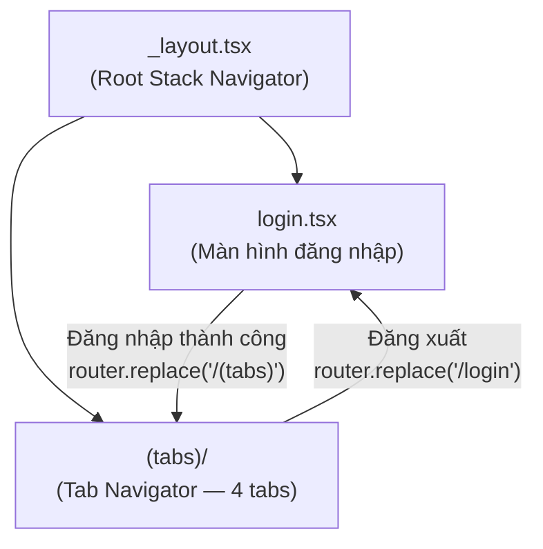
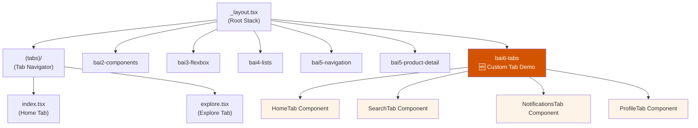
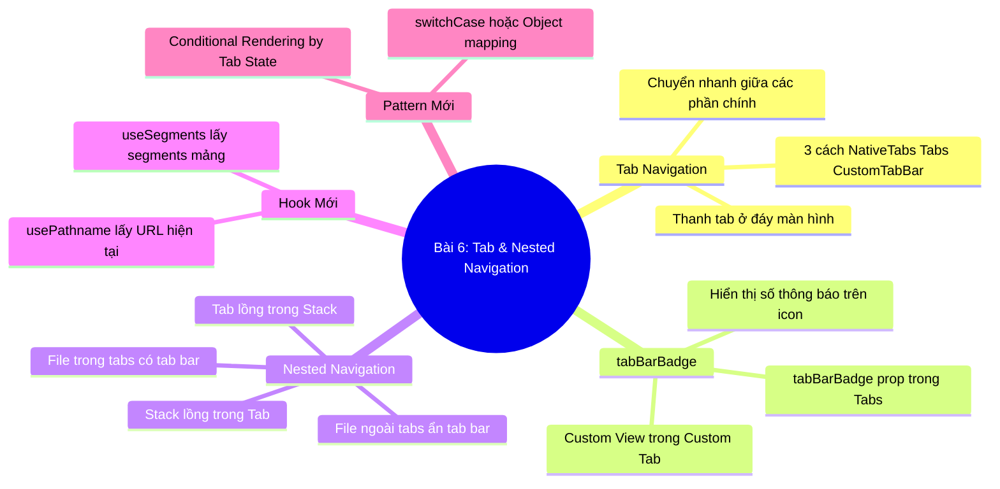

# 📘 BÀI 6: Tab Navigation & Nested Navigation

> **Thời lượng:** ~3-4 giờ | **Độ khó:** ⭐⭐⭐ Trung bình | **Dự án:** Tái sử dụng `Bai1_HelloReactNative`
> **Phase 2 tiếp tục!** 🔵 Xây dựng giao diện app nhiều tab giống Shopee, Tiki, Grab.

---

## 🎯 Mục tiêu bài học

Sau bài này, bạn sẽ:
- [ ] Hiểu cách **Bottom Tab Navigation** hoạt động
- [ ] Phân biệt 3 cách tạo Tab: **NativeTabs**, **Tabs** (Expo Router), **Custom Tab Bar**
- [ ] Hiểu **Nested Navigation** (Tab lồng trong Stack, Stack lồng trong Tab)
- [ ] Biết cách hiển thị **Badge thông báo** trên tab icon
- [ ] Nắm 2 Hook mới: **`usePathname`**, **`useSegments`**
- [ ] Nắm 1 Pattern mới: **Conditional Rendering by Tab State**

---

## Phần 1: Tổng Quan — Bottom Tab Navigation

### 1.1 Tab Navigation là gì?

Tab Navigation là thanh điều hướng ở **đáy màn hình** (Bottom Tab Bar), cho phép người dùng **chuyển nhanh** giữa các phần chính của ứng dụng chỉ bằng **1 lần nhấn**.

```
┌──────────────────────────────┐
│                              │
│      Nội dung trang          │
│      (thay đổi theo tab)     │
│                              │
│                              │
├──────────────────────────────┤
│  🏠     🔍     🔔     👤    │ ← Bottom Tab Bar
│ Home  Search  Notif  Profile │
└──────────────────────────────┘
```

### 1.2 So sánh Stack Navigation vs Tab Navigation:

| Tiêu chí | Stack Navigation (Bài 5) | Tab Navigation (Bài 6) |
|:---|:---|:---|
| **Vị trí** | Header phía trên (có nút Back) | Thanh tab ở đáy |
| **Cơ chế** | Chồng trang lên nhau (LIFO) | Chuyển ngang giữa các tab |
| **Nút Back** | Quay lại trang trước | Chuyển sang tab khác (không có khái niệm "quay lại") |
| **Ví dụ** | Danh sách → Chi tiết → Thanh toán | Home / Search / Cart / Profile |
| **Khi nào dùng** | Luồng tuyến tính (A → B → C) | Các phần CHÍNH song song |

---

## Phần 2: Tab Navigation Trong Expo Router

### 2.1 Dự án hiện tại đang dùng cách nào?

Dự án `Bai1_HelloReactNative` hiện tại sử dụng **`NativeTabs`** — một API **mới** của Expo SDK:

```tsx
// File: src/components/app-tabs.tsx
import { NativeTabs } from 'expo-router/unstable-native-tabs';

export default function AppTabs() {
  return (
    <NativeTabs>
      <NativeTabs.Trigger name="index">
        <NativeTabs.Trigger.Label>Home</NativeTabs.Trigger.Label>
        <NativeTabs.Trigger.Icon src={require('@/assets/images/tabIcons/home.png')} />
      </NativeTabs.Trigger>
      <NativeTabs.Trigger name="explore">
        <NativeTabs.Trigger.Label>Explore</NativeTabs.Trigger.Label>
        <NativeTabs.Trigger.Icon src={require('@/assets/images/tabIcons/explore.png')} />
      </NativeTabs.Trigger>
    </NativeTabs>
  );
}
```

### 2.2 Cách chuẩn phổ biến: Dùng `<Tabs>` từ Expo Router

Trong phần lớn tài liệu và dự án, bạn sẽ gặp cách dùng component **`<Tabs>`** (ổn định hơn `NativeTabs`):

```tsx
// File: app/(tabs)/_layout.tsx
import { Tabs } from 'expo-router';
import { Ionicons } from '@expo/vector-icons';

export default function TabLayout() {
  return (
    <Tabs
      screenOptions={{
        // ⭐ Cấu hình CHUNG cho tất cả các tab
        tabBarActiveTintColor: '#d35400',     // Màu icon khi tab đang active
        tabBarInactiveTintColor: '#999',       // Màu icon khi tab không active
        tabBarStyle: {                         // Style cho thanh tab bar
          backgroundColor: '#fff',
          borderTopWidth: 0,
          elevation: 10,
          height: 60,
          paddingBottom: 8,
        },
        tabBarLabelStyle: { fontSize: 12, fontWeight: '600' },
      }}
    >
      {/* ═══ Tab 1: Trang chủ ═══ */}
      <Tabs.Screen
        name="index"
        options={{
          title: 'Trang chủ',
          tabBarIcon: ({ color, size }) => (
            <Ionicons name="home" size={size} color={color} />
          ),
        }}
      />

      {/* ═══ Tab 2: Tìm kiếm ═══ */}
      <Tabs.Screen
        name="search"
        options={{
          title: 'Tìm kiếm',
          tabBarIcon: ({ color, size }) => (
            <Ionicons name="search" size={size} color={color} />
          ),
        }}
      />

      {/* ═══ Tab 3: Thông báo (CÓ BADGE!) ═══ */}
      <Tabs.Screen
        name="notifications"
        options={{
          title: 'Thông báo',
          tabBarIcon: ({ color, size }) => (
            <Ionicons name="notifications" size={size} color={color} />
          ),
          tabBarBadge: 3,  // 🆕 Hiển thị số 3 trên icon thông báo!
        }}
      />

      {/* ═══ Tab 4: Cá nhân ═══ */}
      <Tabs.Screen
        name="profile"
        options={{
          title: 'Cá nhân',
          tabBarIcon: ({ color, size }) => (
            <Ionicons name="person" size={size} color={color} />
          ),
        }}
      />
    </Tabs>
  );
}
```

### 2.3 So sánh 3 cách tạo Tab:

| Tiêu chí | `NativeTabs` (Dự án hiện tại) | `<Tabs>` (Expo Router chuẩn) | Custom Tab Bar (Bài 6 demo) |
|:---|:---|:---|:---|
| **Cách import** | `expo-router/unstable-native-tabs` | `expo-router` | Tự viết bằng `useState` |
| **Độ ổn định** | ⚠️ Unstable (đang thử nghiệm) | ✅ Ổn định, phổ biến | ✅ Tự kiểm soát 100% |
| **Badge thông báo** | ❌ Chưa hỗ trợ sẵn | ✅ `tabBarBadge={3}` | ✅ Tự code |
| **Tuỳ biến giao diện** | Hạn chế | Trung bình | ✅ Toàn quyền |
| **Cần cấu trúc thư mục** | Có `(tabs)/` | Có `(tabs)/` | Không cần |

> [!NOTE]
> Trong Bài 6 demo, chúng ta dùng **Custom Tab Bar** (cách 3) để bạn hiểu **bản chất** Tab hoạt động như thế nào. Trong thực tế, hầu hết dự án sẽ dùng `<Tabs>` từ Expo Router.

---

### 2.4 Hỏi - Đáp Chuyên Sâu: 5 Câu Hỏi Cốt Lõi Về Tab Navigation

#### ❓ Câu 1: Vị trí thanh Tab có thể thay đổi không? (Top / Bottom / Side)
**ĐÚNG!** Vị trí thanh tab hoàn toàn do bạn cài đặt qua cấu hình.

| Vị trí | Cách cấu hình | Khi nào dùng |
|:---|:---|:---|
| **Đáy màn hình (Bottom)** | Mặc định, không cần cấu hình gì | 📱 Mobile app (99% dùng cách này vì thuận tay ngón cái) |
| **Trên cùng (Top)** | `tabBarPosition: 'top'` trong `screenOptions` | Web app, Android Material Design (Youtube Top Tabs) |
| **Trái / Phải (Side)** | Tự custom hoặc dùng Drawer Navigator | Tablet, iPad, Desktop web |

```tsx
<Tabs
  screenOptions={{
    tabBarPosition: 'top', // 🆕 Đặt thanh tab lên trên cùng!
  }}
>
```

---

#### ❓ Câu 2: File `_layout.tsx` trong thư mục `(tabs)` có bắt buộc không?
**✅ BẮT BUỘC nếu bạn muốn có Tab Navigator!** 🔴

* **Các file screen thông thường** (như `bai5-navigation.tsx`): `<Stack.Screen>` trong `_layout.tsx` là **tùy chọn** (chỉ để chỉnh sửa header/options, route đã tự có).
* **Thư mục `(tabs)/_layout.tsx`**: **Bắt buộc phải có**, vì file này dùng để **định nghĩa loại Navigator** (`<Tabs>` hoặc `<NativeTabs>`). Nếu không có file này, Expo Router sẽ không biết thư mục `(tabs)` là Tab Bar, dẫn đến app bị lỗi hoặc hiển thị như Stack thông thường.

---

#### ❓ Câu 3: Tab không có cơ chế "Back" — Vậy render component như thế nào?

##### 🔹 Cách 1: Dùng `<Tabs>` từ Expo Router — TỰ ĐỘNG 100%
Khi bạn dùng `<Tabs>` trong `(tabs)/_layout.tsx`, Expo Router tự động map từng file `.tsx` thành 1 màn hình tab:
```tsx
// (tabs)/_layout.tsx
<Tabs>
  <Tabs.Screen name="index" />         {/* Tab 1 → Tự render index.tsx */}
  <Tabs.Screen name="search" />        {/* Tab 2 → Tự render search.tsx */}
  <Tabs.Screen name="notifications" /> {/* Tab 3 → Tự render notifications.tsx */}
  <Tabs.Screen name="profile" />       {/* Tab 4 → Tự render profile.tsx */}
</Tabs>
```
👉 Bạn **KHÔNG cần viết bất kỳ hàm render nào**! Expo Router tự động quản lý tab active và chuyển đổi component dựa theo tên file.

##### 🔹 Cách 2: Custom Tab Bar — BẠN TỰ QUẢN LÝ VÀ RENDER
Khi tự tạo Tab Bar bằng `useState`, bạn phải tự viết hàm điều kiện để render component tương ứng:
```tsx
const [activeTab, setActiveTab] = useState('home');

// BẠN TỰ VIẾT hàm render theo tab
const renderTabContent = () => {
  switch (activeTab) {
    case 'home':          return <HomeTab />;
    case 'search':        return <SearchTab />;
    case 'notifications': return <NotificationsTab />;
    case 'profile':       return <ProfileTab />;
  }
};

return (
  <View style={{ flex: 1 }}>
    {renderTabContent()}
    <View style={styles.tabBar}>
      <Pressable onPress={() => setActiveTab('home')}><Text>🏠</Text></Pressable>
      <Pressable onPress={() => setActiveTab('search')}><Text>🔍</Text></Pressable>
    </View>
  </View>
);
```

---

#### ❓ Câu 4: Luồng thực tế: Từ Login $\rightarrow$ Vào Tab Screen $\rightarrow$ Logout quay lại Login thế nào?
**Chuẩn kiến trúc:** Dùng **Root Stack** bọc bên ngoài, và **Tab Navigator** nằm bên trong:



```tsx
// 1. Tại trang Login: Khi đăng nhập thành công
const handleLogin = () => {
  // ⭐ Dùng replace() để xoá trang Login khỏi Stack (không cho Back về Login)
  router.replace('/(tabs)');
};

// 2. Tại trang Profile (trong tabs): Khi đăng xuất
const handleLogout = () => {
  // ⭐ Dùng replace() để xoá toàn bộ Tab khỏi Stack và quay về Login
  router.replace('/login');
};
```

> [!IMPORTANT]
> **Tại sao dùng `router.replace()` thay vì `router.push()`?**
> * `router.push()`: Trang Login vẫn lưu trong Stack $\rightarrow$ Người dùng bấm nút Back điện thoại sẽ **văng ngược về Login** (trong khi đã đăng nhập).
> * `router.replace()`: Xóa sạch trang cũ khỏi Stack $\rightarrow$ Người dùng không thể Back về trang Login hoặc trang Tab sau khi đã thao tác.

---

#### ❓ Câu 5: Các file bên trong `(tabs)/` có URL không? Có thể truy cập trực tiếp qua URL không?
**✅ ĐÚNG 100%!** Mỗi file trong `(tabs)/` đều có URL riêng và có thể truy cập trực tiếp bằng URL / Deep link:

```
src/app/
├── (tabs)/
│   ├── _layout.tsx     ← Cấu hình Tab Bar
│   ├── index.tsx       ← URL: "/"
│   └── explore.tsx     ← URL: "/explore"
```

* **2 cách vào Tab Explore cho kết quả y hệt nhau:**
  1. *Cách 1:* Bấm vào icon "Explore" trên thanh Tab Bar ở đáy.
  2. *Cách 2:* Gọi code `router.push('/explore')` hoặc mở link `myapp://explore`.
* 👉 Cả 2 cách đều hiển thị nội dung `explore.tsx`, thanh Tab Bar ở đáy vẫn hiện và icon Explore sáng lên!

> 💡 **Ứng dụng cực lớn cho Deep Link & Push Notification:**
> Khi Shopee gửi thông báo: *"Đơn hàng đang giao"*, họ chỉ cần gắn link `shopee://notifications`. Người dùng bấm vào thông báo $\rightarrow$ App mở ra và nhảy thẳng vào tab Thông báo với thanh Tab Bar đầy đủ.

---

## Phần 3: `tabBarBadge` — Hiển Thị Số Thông Báo Trên Icon

### 3.1 Badge là gì?

Badge là ô số nhỏ hiển thị trên icon tab (giống số tin nhắn chưa đọc trên Messenger):

```
  🔔
 ┌──┐
 │3 │  ← Badge hiển thị số 3
 └──┘
Thông báo
```

### 3.2 Cách dùng trong Expo Router `<Tabs>`:

```tsx
<Tabs.Screen
  name="notifications"
  options={{
    tabBarBadge: 3,                        // Hiển thị số 3
    tabBarBadgeStyle: { backgroundColor: '#e74c3c' },  // Màu nền badge
  }}
/>
```

### 3.3 Cách dùng trong Custom Tab Bar (Bài 6 demo):

```tsx
{tab.name === 'notifications' && unreadCount > 0 && (
  <View style={styles.tabBadge}>
    <Text style={styles.tabBadgeText}>{unreadCount}</Text>
  </View>
)}
```

> [!TIP]
> **Kinh nghiệm thực tế:** Badge số nên có `minWidth` và `paddingHorizontal` để khi số có 2 chữ số (ví dụ `99`) thì ô không bị méo. Nếu số > 99, hiển thị `99+`.

---

## Phần 4: Nested Navigation — Kết Hợp Stack + Tab

### 4.1 Mô hình trực quan: "Mỗi Tab sở hữu một Stack riêng" (Hộp trong Hộp)

Trong các ứng dụng như Shopee, khi bạn đang ở tab **Home** và nhấn vào 1 sản phẩm → mở trang **Chi tiết** → nhấn "Mua ngay" → mở trang **Thanh toán**. Trong suốt quá trình duyệt sâu đó, **thanh Tab Bar ở đáy vẫn giữ nguyên và icon tab Home vẫn sáng**!

👉 Đây chính là **Nested Navigation (Điều hướng lồng nhau)**: Mỗi tab chứa một **Stack Navigator riêng** bên trong:

```
┌────────────────────────────────────────────────────────────┐
│ 📱 MÀN HÌNH ĐIỆN THOẠI                                     │
│                                                            │
│ ┌────────────────────────────────────────────────────────┐ │
│ │ 📚 STACK CỦA RIÊNG TAB HOME                            │ │
│ │                                                        │ │
│ │   Lớp 3: 💳 Trang Thanh Toán                           │ │
│ │   ────────────────────────────                         │ │
│ │   Lớp 2: 📋 Trang Chi Tiết Sản Phẩm                    │ │
│ │   ────────────────────────────                         │ │
│ │   Lớp 1: 🏠 Trang Chủ (Danh sách sản phẩm)             │ │
│ │                                                        │ │
│ │ (Nội dung thay đổi ở đây, có nút Back lùi từng lớp)   │ │
│ └────────────────────────────────────────────────────────┘ │
│                                                            │
│ ────────────────────────────────────────────────────────── │
│  [🏠 Home]       [🔍 Tìm kiếm]      [🔔 Thông báo]     [👤 Tôi]  │ ← Bottom Tab Bar
│  (Đang sáng)                                               │   (CỐ ĐỊNH Ở ĐÁY)
└────────────────────────────────────────────────────────────┘
```

> 💡 Toàn bộ thao tác `push()` và `back()` chỉ diễn ra ở **khung hiển thị bên trên**, còn **thanh Tab Bar ở đáy vẫn đứng yên và tab Home vẫn sáng**.

---

### 4.2 Điều kỳ diệu của kiến trúc này: "Độc lập trạng thái giữa các Tab"

Vì mỗi Tab quản lý một Navigation Stack độc lập, nên trạng thái duyệt của bạn sẽ không bao giờ bị mất:

1. Bạn đang ở Tab **Home** $\rightarrow$ bấm vào xem **Chi tiết đôi giày Nike** (đang ở Lớp 2 của Home Stack).
2. Đột nhiên có thông báo tin nhắn, bạn bấm chuyển sang Tab **Thông báo** $\rightarrow$ Xem danh sách thông báo.
3. Sau khi đọc xong, bạn bấm quay lại Tab **Home** $\rightarrow$ **Bạn vẫn đang đứng ở trang Chi tiết đôi giày Nike!** Trang không hề bị reset về đầu!

---

### 4.3 Cấu trúc thư mục trong Expo Router để tạo Stack trong Tab:

Để xây dựng một Stack nằm trọn bên trong một Tab, ta lồng group thư mục `(home)/` có `_layout.tsx` riêng bên trong `(tabs)/`:

```
src/app/
└── (tabs)/
    ├── _layout.tsx            ← 📑 ĐỊNH NGHĨA TAB NAVIGATOR (Thanh tab đáy)
    │
    ├── (home)/                ← 🏠 NHÓM TAB HOME
    │   ├── _layout.tsx        ← 📚 ĐỊNH NGHĨA STACK RIÊNG CỦA TAB HOME
    │   ├── index.tsx          ← Lớp 1: Trang chủ
    │   ├── [id].tsx           ← Lớp 2: Chi tiết sản phẩm
    │   └── checkout.tsx       ← Lớp 3: Thanh toán
    │
    ├── search.tsx             ← 🔍 Tab Tìm kiếm (1 màn hình đơn)
    └── profile.tsx            ← 👤 Tab Cá nhân (1 màn hình đơn)
```

---

### 4.4 Mở rộng: 2 Pattern điều hướng kinh điển trên Mobile

Trong thực tế xây dựng ứng dụng, các lập trình viên thường chọn 1 trong 2 trường phái thiết kế:

| Pattern | Cách hiển thị Tab Bar | Trải nghiệm người dùng | Ví dụ thực tế |
|:---|:---|:---|:---|
| **Pattern A: Stack trong Tab** | **Luôn hiện** thanh Tab Bar ở đáy | Tiện chuyển tab mọi lúc, nhưng màn hình bị chiếm bớt một phần diện tích ở đáy | **Instagram, YouTube** (vừa xem video/bình luận vừa bấm chuyển tab khác được) |
| **Pattern B: Tab trong Stack** | **Ẩn** thanh Tab Bar khi vào xem chi tiết | Màn hình rộng 100%, người dùng tập trung hoàn toàn vào việc đọc chi tiết / mua hàng | **Shopee, TikTok, Lazada** (bấm vào mua hàng là tab bar biến mất) |

> [!IMPORTANT]
> **Quy tắc nhớ nhanh trong Expo Router:**
> * File nào nằm **bên trong** thư mục `(tabs)/` $\rightarrow$ **Có thanh Tab Bar ở đáy**.
> * File nào nằm **bên ngoài** thư mục `(tabs)/` (như `bai5-navigation.tsx`, `bai6-tabs.tsx`) $\rightarrow$ **KHÔNG CÓ Tab Bar**, hiển thị toàn màn hình (Full screen).
> * Khi bạn gọi `router.push()` từ bên trong tab đến một file nằm ngoài `(tabs)/`, Tab Bar sẽ tự động ẩn!

---

## Phần 5: 🆕 Hook Mới — `usePathname` & `useSegments`

### 5.1 `usePathname()` — Lấy đường dẫn URL hiện tại

```tsx
import { usePathname } from 'expo-router';

export default function MyComponent() {
  const pathname = usePathname();
  // Nếu đang ở tab Home: pathname = "/"
  // Nếu đang ở trang chi tiết: pathname = "/bai5-product-detail"
  
  console.log('Đang ở trang:', pathname);
}
```

**Ứng dụng thực tế:**
* Theo dõi hành vi người dùng (Analytics): *"Người dùng đang xem trang nào?"*
* Highlight tab đang active trong Custom Tab Bar.

### 5.2 `useSegments()` — Lấy các segment URL dạng mảng

```tsx
import { useSegments } from 'expo-router';

export default function MyComponent() {
  const segments = useSegments();
  // URL: /product/123 → segments = ["product", "123"]
  // URL: / → segments = ["(tabs)"]
  
  // 🆕 PATTERN: Kiểm tra người dùng có đang trong nhóm (auth) không
  const isInAuthGroup = segments[0] === '(auth)';
}
```

**Ứng dụng thực tế:**
* Kiểm tra người dùng có đang ở nhóm route nào (ví dụ: `(auth)`, `(admin)`, `(tabs)`).
* Tự động redirect nếu người dùng chưa đăng nhập mà cố vào trang admin.

---

## Phần 6: 🆕 Pattern — Conditional Rendering by Tab State

### Vấn đề:
Trong Custom Tab Bar, bạn cần render **component khác nhau** tùy thuộc vào tab nào đang được chọn.

### Giải pháp: Dùng `useState` + `switch`:

```tsx
const [activeTab, setActiveTab] = useState<TabName>('home');

// Render nội dung tab tương ứng
const renderTabContent = () => {
  switch (activeTab) {
    case 'home': return <HomeTab />;
    case 'search': return <SearchTab />;
    case 'notifications': return <NotificationsTab />;
    case 'profile': return <ProfileTab />;
  }
};

return (
  <View style={{ flex: 1 }}>
    {renderTabContent()}
    <CustomTabBar activeTab={activeTab} onChangeTab={setActiveTab} />
  </View>
);
```

> [!TIP]
> **So sánh 2 cách render theo state:**
> * **`switch/case` (như trên):** Dễ đọc, phù hợp khi có ít tab (3-5 tab).
> * **Object mapping (nâng cao):** Dùng khi nhiều tab hoặc cần code ngắn gọn hơn:
> ```tsx
> const TAB_COMPONENTS: Record<TabName, React.FC> = {
>   home: HomeTab,
>   search: SearchTab,
>   notifications: NotificationsTab,
>   profile: ProfileTab,
> };
> const ActiveComponent = TAB_COMPONENTS[activeTab];
> return <ActiveComponent />;
> ```

---

## Phần 7: Phân Tích Kiến Trúc Dự Án Hiện Tại



---

## Phần 8: Thực Hành Trên Dự Án

### Màn hình: [bai6-tabs.tsx](file:///Users/vovantu/HTML_CSS/ReactNative/Bai1_HelloReactNative/src/app/bai6-tabs.tsx)

Mini-app giả lập Shopee với 4 tabs:

| Tab | Nội dung | Điểm đáng chú ý |
|:---|:---|:---|
| 🏠 **Trang chủ** | Banner Flash Sale + 6 danh mục sản phẩm | Grid layout `flexWrap` |
| 🔍 **Tìm kiếm** | Thanh search + Từ khoá phổ biến dạng tag | Tag chips UI pattern |
| 🔔 **Thông báo** | 5 thông báo (2 chưa đọc) + Badge số trên icon tab | Badge, unread indicator |
| 👤 **Cá nhân** | Avatar, thống kê, menu danh sách | Profile UI layout chuẩn |

### Cách truy cập:
Trên Home screen → nhấn nút **"📘 Bài 6: Tab & Nested Navigation"**

---

## Phần 9: Tổng Kết Bài 6



---

## 📝 Bài Tập Tự Làm

### BT1: Chạy và tương tác
- Mở Bài 6, nhấn vào từng tab: Home, Tìm kiếm, Thông báo, Cá nhân
- Quan sát Badge số `2` trên icon Thông báo
- Quan sát icon tab thay đổi giữa outline (không active) và filled (active)

### BT2: Đọc hiểu code
- Mở [bai6-tabs.tsx](file:///Users/vovantu/HTML_CSS/ReactNative/Bai1_HelloReactNative/src/app/bai6-tabs.tsx): Cách tạo Custom Tab Bar bằng `useState`
- Quan sát cách dùng `Ionicons` cho icon tab (outline vs filled)
- Đọc phần Badge thông báo: Conditional rendering `{unreadCount > 0 && <View>...</View>}`

### BT3: Quan sát Nested Navigation
- Ở Home screen (tab ban đầu), nhấn nút Bài 6 → Tab Bar của tab gốc **biến mất** (vì `bai6-tabs.tsx` nằm ngoài thư mục `(tabs)/`)
- Bên trong Bài 6, Custom Tab Bar hoạt động **độc lập** với Tab Bar gốc

---

> **Bài tiếp theo:** Bài 7 — Quản Lý State (Context API & useReducer)
>
> *Khi hoàn thành, hãy báo cho tôi để tiếp tục!* 🚀
