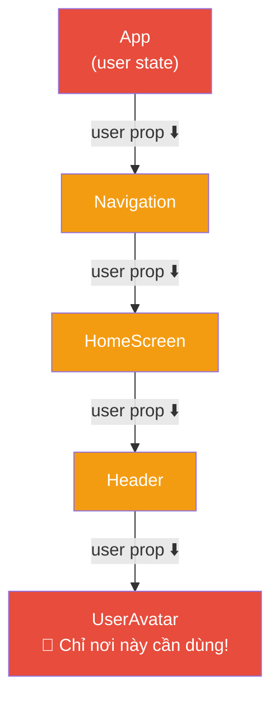
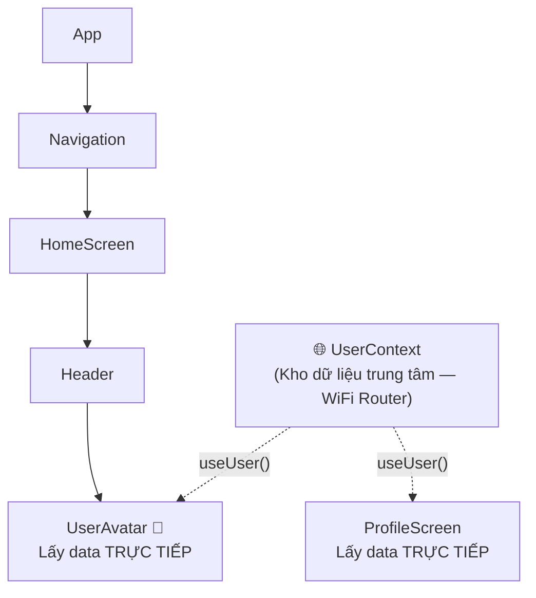
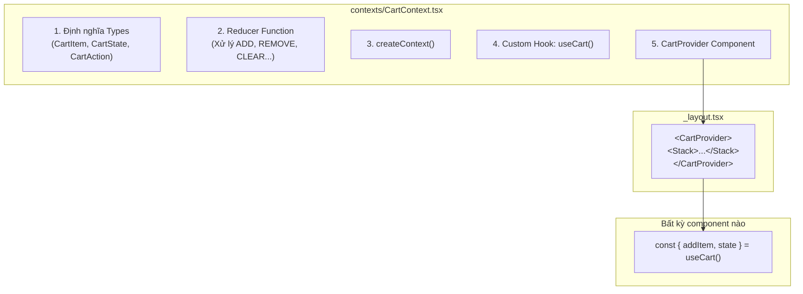
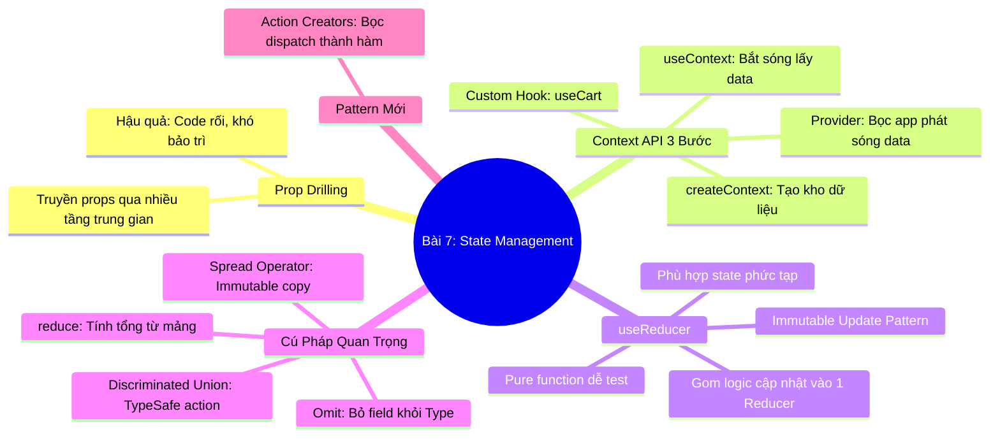

# 📘 BÀI 7: Quản Lý State — Context API & useReducer

> **Thời lượng:** ~4-5 giờ | **Độ khó:** ⭐⭐⭐⭐ Khó | **Dự án:** Tái sử dụng `Bai1_HelloReactNative`
> **Phase 3 bắt đầu!** 🟣 Quản lý trạng thái toàn cục — Kỹ năng bắt buộc cho mọi dự án thực tế.

---

## 🎯 Mục tiêu bài học

Sau bài này, bạn sẽ:
- [ ] Hiểu rõ vấn đề **Prop Drilling** và tại sao cần State Management
- [ ] Nắm vững **Context API**: `createContext`, `Provider`, `useContext`
- [ ] Nắm vững **useReducer** cho state phức tạp
- [ ] Kết hợp **Context + useReducer** (Pattern chuẩn công nghiệp)
- [ ] Nắm 2 Pattern mới: **Action Creators**, **Discriminated Union**
- [ ] Biết khi nào dùng `useState` và khi nào dùng `useReducer`

---

## Phần 1: Vấn Đề — Prop Drilling

### 1.1 Prop Drilling là gì?

Tưởng tượng bạn có ứng dụng với cấu trúc component lồng nhau 5 tầng:



Chỉ `UserAvatar` cần data `user`, nhưng phải truyền qua **4 tầng trung gian** (Navigation → HomeScreen → Header). Các tầng trung gian này **KHÔNG HỀ dùng đến** `user`, chỉ làm nhiệm vụ "chuyển phát".

### 1.2 Code minh hoạ Prop Drilling (SAI):

```tsx
// ❌ PROP DRILLING: Truyền user qua 4 tầng chỉ để dùng ở UserAvatar
function App() {
  const [user, setUser] = useState({ name: 'Tú', avatar: '...' });
  return <Navigation user={user} />;  // Tầng 1: truyền xuống
}

function Navigation({ user }) {
  // ⚠️ Navigation KHÔNG dùng user, chỉ chuyển tiếp!
  return <HomeScreen user={user} />;  // Tầng 2: chuyển tiếp
}

function HomeScreen({ user }) {
  // ⚠️ HomeScreen cũng KHÔNG dùng user!
  return <Header user={user} />;      // Tầng 3: chuyển tiếp
}

function Header({ user }) {
  // ⚠️ Header cũng KHÔNG dùng user!
  return <UserAvatar user={user} />;  // Tầng 4: chuyển tiếp
}

function UserAvatar({ user }) {
  // ✅ CHỈ NƠI NÀY mới thực sự dùng user!
  return <Image source={{ uri: user.avatar }} />;
}
```

### 1.3 Hậu quả của Prop Drilling:
1. **Code rối:** Mỗi component trung gian phải khai báo thêm prop mà nó không dùng.
2. **Khó bảo trì:** Thêm 1 field mới vào `user` → Phải sửa ở TẤT CẢ các tầng.
3. **Khó tái sử dụng:** Component `Header` bị buộc phải nhận prop `user` dù có nơi không cần.

---

## Phần 2: Context API — Giải Pháp Cho Prop Drilling

### 2.1 Ý tưởng cốt lõi

Context API tạo ra một **"Kho dữ liệu trung tâm"** (giống WiFi router). Bất kỳ component nào muốn lấy data chỉ cần **"kết nối"** (gọi `useContext`), không cần dây cáp (props) chạy qua từng tầng:



> 💡 Component **UserAvatar** lấy data **trực tiếp** từ Context. Không cần bất kỳ component cha nào truyền props nữa!

### 2.2 Quy trình 3 bước tạo Context (có code minh hoạ)

---

#### 🔵 Bước 1: `createContext()` — Tạo "Kho dữ liệu"

```tsx
import { createContext } from 'react';

// Bước 1A: Định nghĩa KIỂU DỮ LIỆU mà Context sẽ chứa
interface UserContextType {
  name: string;
  email: string;
  logout: () => void;   // Hàm đăng xuất
}

// Bước 1B: Tạo Context với giá trị mặc định = undefined
// 🆕 CÚ PHÁP: createContext<Type | undefined>(undefined)
// → Giá trị mặc định = undefined (chưa có Provider nào cung cấp data)
// → Khi có Provider bọc bên ngoài, undefined sẽ được thay bằng data thật
const UserContext = createContext<UserContextType | undefined>(undefined);
```

> 💡 **Tại sao giá trị mặc định là `undefined`?**
> Vì lúc `createContext()` chạy, chúng ta chưa biết user là ai. Data thật sẽ được cung cấp bởi `<Provider>` ở Bước 2. Giá trị `undefined` giúp ta phát hiện lỗi nếu quên bọc Provider (xem Bước 3).

---

#### 🔵 Bước 2: `<Provider>` — Bọc app để "phát sóng" dữ liệu

```tsx
import { useState, ReactNode } from 'react';

// 🆕 CÚ PHÁP: { children }: { children: ReactNode }
// → children là tất cả component con nằm bên trong <UserProvider>...</UserProvider>
// → ReactNode = kiểu tổng quát cho mọi thứ React có thể render
//   (JSX, string, number, null, undefined, array...)

export function UserProvider({ children }: { children: ReactNode }) {
  const [name, setName] = useState('Nguyễn Văn Tú');
  const [email, setEmail] = useState('tu@email.com');

  const logout = () => {
    setName('');
    setEmail('');
    // router.replace('/login');
  };

  // 🆕 CÚ PHÁP: <Context.Provider value={...}>
  // → value = Dữ liệu muốn "phát sóng" cho toàn bộ component con
  // → Bất kỳ component nào bên trong <UserProvider> đều nhận được data này
  return (
    <UserContext.Provider value={{ name, email, logout }}>
      {children}
    </UserContext.Provider>
  );
}
```

**Cách bọc Provider vào app (trong `_layout.tsx`):**

```tsx
// File: _layout.tsx
export default function RootLayout() {
  return (
    <UserProvider>        {/* ← Bọc bên ngoài để "phát sóng" */}
      <Stack>
        <Stack.Screen name="(tabs)" />
        <Stack.Screen name="profile" />
      </Stack>
    </UserProvider>
  );
}
```

> [!IMPORTANT]
> **Provider phải bọc ở tầng CAO NHẤT** (thường là `_layout.tsx`). Nếu bọc quá thấp (ví dụ chỉ bọc ở 1 tab), thì các tab khác sẽ **KHÔNG** nhận được data!

---

#### 🔵 Bước 3: `useContext()` — Component "bắt sóng" lấy dữ liệu

```tsx
import { useContext } from 'react';

// Cách 1: Dùng useContext trực tiếp (KHÔNG khuyến khích)
function UserAvatar() {
  const context = useContext(UserContext);
  // ⚠️ context có thể là undefined nếu quên bọc Provider!
  // → Phải tự kiểm tra null/undefined mỗi lần dùng → Phiền phức
  return <Text>{context?.name}</Text>;
}

// ✅ Cách 2: Tạo Custom Hook (KHUYẾN KHÍCH — Best Practice!)
export function useUser() {
  const context = useContext(UserContext);
  
  // Tự động kiểm tra lỗi: Nếu quên bọc Provider → Ném lỗi rõ ràng
  if (!context) {
    throw new Error(
      'useUser() phải được dùng bên trong <UserProvider>!'
    );
  }
  
  return context;
  // → Từ đây context chắc chắn KHÔNG phải undefined nữa
  // → TypeScript tự hiểu context có kiểu UserContextType (không cần ?.)
}
```

**Sử dụng trong component — KHÔNG cần props!**

```tsx
function UserAvatar() {
  // ✅ Lấy data TRỰC TIẾP từ Context, không cần props!
  const { name, email } = useUser();
  
  return (
    <View>
      <Text>{name}</Text>
      <Text>{email}</Text>
    </View>
  );
}

function SettingsScreen() {
  // ✅ Ở đâu cũng gọi được, dù lồng sâu bao nhiêu tầng!
  const { logout } = useUser();
  
  return (
    <Pressable onPress={logout}>
      <Text>Đăng xuất</Text>
    </Pressable>
  );
}
```

> 💡 **Tại sao nên tạo Custom Hook (`useUser`) thay vì dùng `useContext` trực tiếp?**
> 1. **Tự động kiểm tra lỗi:** Nếu quên bọc `<UserProvider>`, app sẽ crash với thông báo rõ ràng thay vì hiện `undefined`.
> 2. **Import gọn:** `useUser()` thay vì `useContext(UserContext)`.
> 3. **Encapsulation:** Giấu implementation detail — sau này đổi sang Zustand/Redux, component vẫn gọi `useUser()` mà không cần sửa gì.

---

## Phần 3: useReducer — Quản Lý State Phức Tạp

### 3.1 Vấn đề với useState khi state phức tạp

```tsx
// ❌ Giỏ hàng với useState = DỄ BỊ LỖI!
const [items, setItems] = useState([]);
const [totalItems, setTotalItems] = useState(0);
const [totalPrice, setTotalPrice] = useState(0);

// Khi thêm sản phẩm → Phải cập nhật CẢ 3 biến cùng lúc!
function addProduct(product) {
  setItems(prev => [...prev, product]);       // Cập nhật items
  setTotalItems(prev => prev + 1);            // Cập nhật tổng số
  setTotalPrice(prev => prev + product.price); // Cập nhật tổng tiền
  // ⚠️ Nếu quên 1 trong 3 → Dữ liệu bị lệch → BUG!
}
```

### 3.2 useReducer giải quyết thế nào?

`useReducer` gom **TẤT CẢ logic cập nhật** vào **MỘT HÀM DUY NHẤT** gọi là **Reducer**:

```
┌─────────────┐     dispatch(action)     ┌──────────────┐
│  Component  │ ──────────────────────>  │   Reducer    │
│             │                          │ (Bộ xử lý)  │
│  gọi:      │                          │              │
│  dispatch({ │     state MỚI           │  switch      │
│    type:    │ <──────────────────────  │    ADD_ITEM  │
│   'ADD_ITEM'│                          │    REMOVE    │
│  })         │                          │    CLEAR     │
└─────────────┘                          └──────────────┘
```

### 3.3 Giải thích từng khái niệm

#### 🔹 **Reducer** — "Bộ xử lý trung tâm"
Là một hàm **thuần (Pure Function)** — cùng input luôn cho cùng output:
```tsx
// 🆕 CÚ PHÁP: function reducer(stateHiệnTại, actionMuốnThựcHiện): stateKếtQuả
function cartReducer(state: CartState, action: CartAction): CartState {
  switch (action.type) {
    case 'ADD_ITEM':
      // Tính toán state mới dựa trên state cũ + action
      // → KHÔNG thay đổi state cũ, mà TRẢ VỀ object mới!
      return { ...state, items: [...state.items, action.payload] };
      
    case 'CLEAR_CART':
      return { items: [], totalItems: 0, totalPrice: 0 };
      
    default:
      return state; // Action không nhận ra → Trả về state cũ nguyên vẹn
  }
}
```

#### 🔹 **Action** — "Mệnh lệnh" gửi đến Reducer
Là object mô tả **muốn làm gì** và **với dữ liệu nào**:
```tsx
// Action = { type: 'TÊN_HÀNH_ĐỘNG', payload: 'dữ liệu kèm theo' }

{ type: 'ADD_ITEM', payload: { id: 'p1', name: 'iPhone', price: 34990000 } }
{ type: 'REMOVE_ITEM', payload: 'p1' }   // payload = id sản phẩm cần xoá
{ type: 'CLEAR_CART' }                    // Không cần payload
```

#### 🔹 **Dispatch** — "Người gửi mệnh lệnh"
Là hàm để component gửi action đến reducer:
```tsx
// 🆕 CÚ PHÁP: useReducer(reducerFunction, initialState)
// → Trả về [state, dispatch]
const [state, dispatch] = useReducer(cartReducer, { items: [], totalItems: 0, totalPrice: 0 });

// Component gọi dispatch để gửi action:
dispatch({ type: 'ADD_ITEM', payload: { id: 'p1', name: 'iPhone', price: 34990000 } });
//         ↑ action object
// → cartReducer nhận action này, xử lý, trả về state mới
// → React tự re-render component với state mới
```

### 3.4 So sánh useState vs useReducer

| Tiêu chí | `useState` | `useReducer` |
|:---|:---|:---|
| **Số biến state** | 1-2 biến đơn giản | Nhiều biến liên quan nhau |
| **Số cách thay đổi** | 1-2 cách (set trực tiếp) | Nhiều cách (thêm, xoá, sửa, xoá hết...) |
| **Logic cập nhật** | Đơn giản, inline | Phức tạp, phụ thuộc nhiều điều kiện |
| **Nơi chứa logic** | Rải rác trong component | **Tập trung 1 nơi** trong reducer |
| **Dễ test** | Bình thường | ✅ Dễ test vì reducer là pure function |
| **Ví dụ** | `isLoading`, `searchQuery`, `selectedTab` | Giỏ hàng, Form nhiều field, Todo list |

---

## Phần 4: Kết Hợp Context + useReducer — Ví Dụ Đầy Đủ: Giỏ Hàng

### 4.1 Kiến trúc tổng thể



### 4.2 Code đầy đủ (7 phần)

#### 📌 Phần 1 & 2: Định nghĩa Types

```tsx
/** Một sản phẩm trong giỏ hàng */
interface CartItem {
  id: string;
  name: string;
  price: number;
  image: string;
  quantity: number;
}

/** Trạng thái toàn bộ giỏ hàng */
interface CartState {
  items: CartItem[];
  totalItems: number;
  totalPrice: number;
}
```

#### 📌 Phần 3: Định nghĩa Actions (Discriminated Union)

```tsx
// 🆕 CÚ PHÁP: Discriminated Union
// TypeScript tự biết payload của từng action dựa vào giá trị 'type'.
//
// Ví dụ: Nếu type === 'ADD_ITEM', TS tự hiểu payload sẽ có dạng
// { id, name, price, image } (không có quantity).
//
// 🆕 CÚ PHÁP: Omit<CartItem, 'quantity'>
// → "Lấy CartItem nhưng BỎ field quantity"
// → Khi thêm mới, quantity luôn = 1, không cần truyền vào.

type CartAction =
  | { type: 'ADD_ITEM'; payload: Omit<CartItem, 'quantity'> }
  | { type: 'REMOVE_ITEM'; payload: string }   // payload = id
  | { type: 'INCREMENT'; payload: string }      // payload = id
  | { type: 'DECREMENT'; payload: string }      // payload = id
  | { type: 'CLEAR_CART' };                     // Không cần payload
```

> 💡 **Lợi ích Discriminated Union:** Khi viết `dispatch({ type: 'ADD_ITEM', payload: ... })`, TypeScript **tự động kiểm tra** payload phải có đúng các field `id, name, price, image`. Nếu thiếu → **báo lỗi ngay khi code, không cần chạy app!**

#### 📌 Phần 4: Reducer Function

```tsx
function cartReducer(state: CartState, action: CartAction): CartState {
  switch (action.type) {
    // ─── Thêm sản phẩm vào giỏ ───
    case 'ADD_ITEM': {
      // Kiểm tra sản phẩm đã có trong giỏ chưa
      const existingItem = state.items.find(item => item.id === action.payload.id);

      let newItems: CartItem[];

      if (existingItem) {
        // Đã có → Tăng quantity lên 1
        newItems = state.items.map(item =>
          item.id === action.payload.id
            ? { ...item, quantity: item.quantity + 1 }
            //  ^^^^^^^^ Spread operator: Tạo bản sao rồi ghi đè quantity
            //  → ĐẢM BẢO IMMUTABLE (không thay đổi item gốc)
            : item  // Sản phẩm khác → giữ nguyên
        );
      } else {
        // Chưa có → Thêm mới với quantity = 1
        newItems = [...state.items, { ...action.payload, quantity: 1 }];
        //         ^^^^^^^^^^^^^^^^ Giữ nguyên các item cũ
        //                          ^^^^^^^^^^^^^^^^^^^^^^^^ Thêm item mới
      }

      // Tính lại tổng
      const totalItems = newItems.reduce((sum, item) => sum + item.quantity, 0);
      const totalPrice = newItems.reduce((sum, item) => sum + item.price * item.quantity, 0);

      return { items: newItems, totalItems, totalPrice };
    }

    // ─── Xoá sản phẩm khỏi giỏ (xoá hoàn toàn) ───
    case 'REMOVE_ITEM': {
      const newItems = state.items.filter(item => item.id !== action.payload);
      //                          ^^^^^^ filter: Giữ lại tất cả item có id KHÁC với id cần xoá
      const totalItems = newItems.reduce((sum, item) => sum + item.quantity, 0);
      const totalPrice = newItems.reduce((sum, item) => sum + item.price * item.quantity, 0);
      return { items: newItems, totalItems, totalPrice };
    }

    // ─── Xoá toàn bộ giỏ hàng ───
    case 'CLEAR_CART':
      return { items: [], totalItems: 0, totalPrice: 0 };

    // ─── Mặc định: Trả về state cũ nếu action không khớp ───
    default:
      return state;
  }
}
```

> [!IMPORTANT]
> **Quy tắc vàng của Reducer — Immutable Update:**
> ```tsx
> // ❌ SAI: Thay đổi trực tiếp state cũ (Mutable)
> item.quantity = item.quantity + 1;  // KHÔNG ĐƯỢC!
> state.items.push(newItem);          // KHÔNG ĐƯỢC!
>
> // ✅ ĐÚNG: Tạo bản sao mới rồi ghi đè (Immutable)
> const newItem = { ...item, quantity: item.quantity + 1 };
> const newItems = [...state.items, newItem];
> ```
> React dùng phép so sánh tham chiếu (`===`) để biết state có thay đổi không. Nếu bạn thay đổi trực tiếp → tham chiếu không đổi → React **KHÔNG re-render** → UI không cập nhật → Bug!

#### 📌 Phần 5: createContext + Custom Hook

```tsx
// Tạo Context
const CartContext = createContext<CartContextType | undefined>(undefined);

// Custom Hook (Best Practice)
export function useCart() {
  const context = useContext(CartContext);
  if (!context) {
    throw new Error(
      'useCart() phải được dùng bên trong <CartProvider>! '
      + 'Hãy kiểm tra _layout.tsx đã bọc <CartProvider> chưa.'
    );
  }
  return context;
}
```

#### 📌 Phần 6: Provider + Action Creators

```tsx
export function CartProvider({ children }: { children: ReactNode }) {
  // Khởi tạo state + dispatch từ useReducer
  const [state, dispatch] = useReducer(cartReducer, {
    items: [],
    totalItems: 0,
    totalPrice: 0,
  });

  // 🆕 PATTERN: Action Creators — Bọc dispatch cho gọn
  // Thay vì component gọi: dispatch({ type: 'ADD_ITEM', payload: ... })
  // → Component chỉ cần gọi: addItem(product)
  const addItem = (product: Omit<CartItem, 'quantity'>) => {
    dispatch({ type: 'ADD_ITEM', payload: product });
  };
  const removeItem = (id: string) => {
    dispatch({ type: 'REMOVE_ITEM', payload: id });
  };
  const clearCart = () => {
    dispatch({ type: 'CLEAR_CART' });
  };

  return (
    <CartContext.Provider value={{ state, dispatch, addItem, removeItem, clearCart }}>
      {children}
    </CartContext.Provider>
  );
}
```

#### 📌 Phần 7: Sử dụng trong component

```tsx
// ✅ Bất kỳ component nào cũng dùng được — KHÔNG cần props!
function ProductCard({ product }) {
  const { addItem } = useCart();

  return (
    <Pressable onPress={() => addItem(product)}>
      <Text>Thêm vào giỏ</Text>
    </Pressable>
  );
}

function CartBadge() {
  const { state } = useCart();

  return (
    <View>
      <Ionicons name="cart" size={24} />
      {state.totalItems > 0 && (
        <Text style={styles.badge}>{state.totalItems}</Text>
      )}
    </View>
  );
}

function CheckoutScreen() {
  const { state, clearCart } = useCart();

  return (
    <View>
      <Text>Tổng: {state.totalPrice.toLocaleString()}₫</Text>
      <Pressable onPress={clearCart}>
        <Text>Thanh toán & Xoá giỏ</Text>
      </Pressable>
    </View>
  );
}
```

---

## Phần 5: 🆕 Cú Pháp Quan Trọng (Tổng Hợp)

### 5.1 `Omit<Type, Keys>` — Bỏ field khỏi Type

```tsx
interface CartItem {
  id: string;
  name: string;
  price: number;
  quantity: number;
}

type NewProductInput = Omit<CartItem, 'quantity'>;
// Kết quả: { id: string; name: string; price: number }
// → Bỏ đi field 'quantity' vì khi thêm mới, ta luôn gán quantity = 1
```

### 5.2 Spread Operator `{ ...obj }` — Sao chép và ghi đè

```tsx
const item = { id: 'p1', name: 'iPhone', price: 1000, quantity: 2 };

// Tạo bản sao và ghi đè quantity:
const updated = { ...item, quantity: 3 };
// Kết quả: { id: 'p1', name: 'iPhone', price: 1000, quantity: 3 }
//          ^^^^^^^^ Giữ nguyên id, name, price
//                                                    ^^^^^^^^ Ghi đè quantity

// Tạo bản sao mảng và thêm phần tử mới:
const items = [item1, item2];
const newItems = [...items, item3];
// Kết quả: [item1, item2, item3]
```

### 5.3 `reduce()` — Tính tổng từ mảng

```tsx
const items = [
  { name: 'iPhone', price: 1000, quantity: 2 },  // 1000 × 2 = 2000
  { name: 'AirPods', price: 200, quantity: 1 },  // 200 × 1 = 200
];

// reduce(callback, giá_trị_khởi_tạo)
const total = items.reduce(
  (sum, item) => sum + item.price * item.quantity,
  0  // ← Giá trị khởi tạo của sum
);
// Lần 1: sum = 0     + 1000 × 2 = 2000
// Lần 2: sum = 2000  + 200 × 1  = 2200
// Kết quả: total = 2200
```

---

## Phần 6: 🆕 Pattern — Action Creators

### Vấn đề:
Component phải nhớ chính xác cấu trúc action, dễ gõ sai:
```tsx
// ❌ Dài dòng, dễ typo ở type hoặc thiếu field payload
dispatch({ type: 'ADD_ITEM', payload: { id: 'p1', name: 'iPhone', price: 34990000, image: '...' } });
dispatch({ type: 'RMOVE_ITEM', payload: 'p1' }); // ⚠️ Gõ sai 'RMOVE' → Bug runtime!
```

### Giải pháp: Bọc dispatch thành hàm có tên rõ ràng
```tsx
// ✅ Gọn, rõ ràng, IDE tự gợi ý (autocomplete), không sợ typo
addItem({ id: 'p1', name: 'iPhone', price: 34990000, image: '...' });
removeItem('p1');
clearCart();
```

> 💡 **Action Creator = Hàm trả về (hoặc thực hiện) dispatch với action đúng cấu trúc.** Nó giống như một "lối tắt an toàn" — component chỉ cần gọi hàm, không cần biết bên trong dispatch thế nào.

---

## Phần 7: Thực Hành Trên Dự Án

### Các file đã tạo:

| File | Vai trò |
|:---|:---|
| [CartContext.tsx](file:///Users/vovantu/HTML_CSS/ReactNative/Bai1_HelloReactNative/src/contexts/CartContext.tsx) | **Context + Reducer** — Kho giỏ hàng toàn cục (có comment chi tiết) |
| [bai7-state.tsx](file:///Users/vovantu/HTML_CSS/ReactNative/Bai1_HelloReactNative/src/app/bai7-state.tsx) | **Demo screen** — Cửa hàng + Giỏ hàng tương tác |
| [_layout.tsx](file:///Users/vovantu/HTML_CSS/ReactNative/Bai1_HelloReactNative/src/app/_layout.tsx) | Bọc `<CartProvider>` bên ngoài toàn bộ app |

### Giao diện demo:

| Khu vực | Nội dung | Điểm đáng chú ý |
|:---|:---|:---|
| 🏪 **Cửa hàng** | 6 sản phẩm Apple | Nút "+" đổi màu xanh và hiện số lượng khi đã thêm vào giỏ |
| 🛒 **Giỏ hàng** | Danh sách sản phẩm đã thêm | Nút +/− để tăng giảm, nút ✕ xoá, nút "Xoá hết" với confirm |
| 💰 **Tổng tiền** | Tính tự động | Cập nhật realtime khi thêm/xoá/tăng/giảm |
| 🛒 **Badge Header** | Số trên icon giỏ hàng ở góc phải header | Cập nhật realtime, hiện `99+` nếu quá 99 |

### Cách truy cập:
Home screen → nhấn nút **"📘 Bài 7: State Management"**

---

## 🔥 Chuyên Mục Hỏi-Đáp: Hiểu Sâu useReducer

### ❓ Câu 1: Hàm Reducer viết riêng hay viết trong component?

**Viết RIÊNG, BÊN NGOÀI component!** Và trong hàm reducer, bạn **KHÔNG viết `useState`** — Reducer hoạt động theo cơ chế hoàn toàn khác.

```tsx
// ✅ ĐÚNG: Viết BÊN NGOÀI component
// Reducer chỉ là hàm JavaScript thuần — nó KHÔNG dùng useState bên trong!
function cartReducer(state: CartState, action: CartAction): CartState {
  switch (action.type) {
    case 'ADD_ITEM':
      return { ...state, items: [...state.items, action.payload] };
    default:
      return state;
  }
}

// Component sử dụng reducer:
function MyComponent() {
  const [state, dispatch] = useReducer(cartReducer, initialState);
  //                                   ^^^^^^^^^^^
  //                                   Truyền hàm reducer vào đây
}
```

```tsx
// ❌ SAI: KHÔNG viết reducer bên trong component
function MyComponent() {
  // Nếu viết ở đây → Mỗi lần render, hàm bị tạo lại → Lãng phí!
  function cartReducer(state, action) { ... }
  const [state, dispatch] = useReducer(cartReducer, initialState);
}
```

> 💡 **Tại sao viết bên ngoài?**
> - Reducer là **hàm thuần** (pure function) — nó không cần truy cập bất kỳ biến nào của component (không cần props, không cần state, không cần hooks).
> - Nó chỉ nhận `(state, action)` → trả về `state mới`. Xong!
> - Viết bên ngoài giúp: **dễ test riêng**, **không bị tạo lại mỗi lần render**, **dễ tái sử dụng**.

---

### ❓ Câu 2: Hàm reducer tự viết và hook `useReducer` là riêng biệt?

**ĐÚNG! Hoàn toàn riêng biệt.** Hãy hình dung:

```
Bạn tự viết:     cartReducer()    ← "Công thức nấu ăn" (bạn viết)
React cung cấp:  useReducer()     ← "Cái bếp" (React cung cấp sẵn)
```

**Quy trình 2 bước:**

```tsx
// ═══════════════════════════════════════════════════════════════
// BƯỚC 1: BẠN tự viết hàm reducer (công thức nấu ăn)
// ═══════════════════════════════════════════════════════════════
// Bạn quyết định: Khi nhận action 'ADD_ITEM' thì xử lý thế nào?
//                 Khi nhận action 'REMOVE' thì xử lý thế nào?

function cartReducer(state: CartState, action: CartAction): CartState {
  switch (action.type) {
    case 'ADD_ITEM':
      return { ...state, items: [...state.items, action.payload] };
    case 'REMOVE_ITEM':
      return { ...state, items: state.items.filter(i => i.id !== action.payload) };
    default:
      return state;
  }
}

// ═══════════════════════════════════════════════════════════════
// BƯỚC 2: Dùng hook useReducer của React (cái bếp)
// ═══════════════════════════════════════════════════════════════
// Bạn đưa "công thức" (cartReducer) + "nguyên liệu ban đầu" (initialState)
// → React trả cho bạn: state hiện tại + hàm dispatch

function MyComponent() {
  const [state, dispatch] = useReducer(cartReducer, { items: [], total: 0 });
  //     ^^^^^  ^^^^^^^^               ^^^^^^^^^^^   ^^^^^^^^^^^^^^^^^^^^
  //     │      │                      │             │
  //     │      │                      │             └─ Giá trị state ban đầu
  //     │      │                      └─ Hàm reducer BẠN tự viết
  //     │      └─ Hàm gửi action (React tạo cho bạn)
  //     └─ State hiện tại (React quản lý cho bạn)
}
```

> **Tóm lại:** `cartReducer` là **logic xử lý** do bạn viết. `useReducer` là **hook của React** giúp kết nối logic đó với state của component. Hai thứ riêng biệt, nhưng cần nhau.

---

### ❓ Câu 3: State trả về object mới thì lưu ở đâu? Ai giữ state?

**React giữ state, KHÔNG PHẢI reducer!**

Hàm reducer **KHÔNG LƯU** state. Nó chỉ là **máy tính toán** — nhận state cũ + action → trả về state mới. **React** là người nhận kết quả đó và lưu lại.

```
Lần 1: dispatch({ type: 'ADD_ITEM', payload: 'iPhone' })

   React gọi: cartReducer(stateHiệnTại, action)
                           ▲
                           │
              React truyền state HIỆN TẠI vào đây!
              (lần đầu = initialState = { items: [] })
   
   Reducer trả về: { items: ['iPhone'] }
                     ▲
                     │
   React NHẬN kết quả này → LƯU LẠI → Re-render component
   
   
Lần 2: dispatch({ type: 'ADD_ITEM', payload: 'AirPods' })

   React gọi: cartReducer(stateHiệnTại, action)
                           ▲
                           │
              React truyền state ĐÃ CẬP NHẬT = { items: ['iPhone'] }
   
   Reducer trả về: { items: ['iPhone', 'AirPods'] }
                     ▲
                     │
   React NHẬN kết quả này → LƯU LẠI → Re-render component
```

**Code minh hoạ cụ thể:**

```tsx
function cartReducer(state: CartState, action: CartAction): CartState {
  // ⚠️ `state` ở đây KHÔNG phải bạn khai báo!
  // → React TỰ ĐỘNG truyền state hiện tại vào tham số này!
  // → Lần 1: state = { items: [] }                         (initialState)
  // → Lần 2: state = { items: ['iPhone'] }                  (sau khi đã add iPhone)
  // → Lần 3: state = { items: ['iPhone', 'AirPods'] }       (sau khi add AirPods)
  
  switch (action.type) {
    case 'ADD_ITEM':
      // { ...state } → copy toàn bộ state cũ
      // items: [...state.items, action.payload] → giữ items cũ + thêm item mới
      return { ...state, items: [...state.items, action.payload] };
      //       ^^^^^^^^^
      //       state cũ có gì → giữ nguyên hết
      //                  ^^^^^^^^^^^^^^^^^^^^^^^^^^^^^^^^^^^^^
      //                  chỉ GHI ĐÈ field items bằng mảng mới
  }
}

// Trong component:
const [state, dispatch] = useReducer(cartReducer, { items: [] });
//                                                 ^^^^^^^^^^^^
//                                   Giá trị BAN ĐẦU (chỉ dùng 1 lần lúc init)

dispatch({ type: 'ADD_ITEM', payload: 'iPhone' });
// → React gọi: cartReducer({ items: [] }, { type: 'ADD_ITEM', payload: 'iPhone' })
// → Reducer trả về: { items: ['iPhone'] }
// → React LƯU state mới = { items: ['iPhone'] }

dispatch({ type: 'ADD_ITEM', payload: 'AirPods' });
// → React gọi: cartReducer({ items: ['iPhone'] }, { type: 'ADD_ITEM', payload: 'AirPods' })
//                           ^^^^^^^^^^^^^^^^^^^^
//                           React truyền state ĐÃ CẬP NHẬT vào!
// → Reducer trả về: { items: ['iPhone', 'AirPods'] }
// → React LƯU state mới = { items: ['iPhone', 'AirPods'] }
```

> [!IMPORTANT]
> **Quy trình cốt lõi:**
> 1. Bạn gọi `dispatch(action)`
> 2. **React** lấy state hiện tại (React đang giữ) + action → truyền vào hàm reducer
> 3. Reducer **tính toán** và trả về state mới (object mới)
> 4. **React** nhận object mới → so sánh với object cũ → nếu khác → lưu lại + re-render
>
> **Reducer KHÔNG giữ state. Reducer chỉ tính toán. React giữ state!**

---

### ❓ Câu 4: Mục đích chính của useReducer — dispatch hoạt động thế nào?

Bạn hiểu đúng phần "xử lý nhiều biến liên quan", nhưng có 1 điểm cần lưu ý:

**KHÔNG PHẢI** "chạy xong function add rồi gọi dispatch". Mà **dispatch CHÍNH LÀ cách duy nhất** để thay đổi state:

```tsx
// ❌ SAI: Viết hàm add riêng rồi gọi dispatch sau
function addItem(product) {
  state.items.push(product);         // ❌ Thay đổi trực tiếp state
  state.totalItems += 1;             // ❌ Thay đổi trực tiếp state
  dispatch({ type: 'UPDATE' });      // ❌ Quá muộn, state đã bị sửa sai cách
}

// ✅ ĐÚNG: dispatch LÀ hành động thêm — toàn bộ logic nằm trong reducer
function addItem(product) {
  dispatch({ type: 'ADD_ITEM', payload: product });
  // → Chỉ cần 1 dòng này!
  // → Reducer tự xử lý: thêm vào items, tính lại totalItems, tính lại totalPrice
  // → TẤT CẢ biến được cập nhật ĐỒNG THỜI, không sợ quên biến nào!
}
```

**Luồng hoạt động đầy đủ:**
```
User nhấn "Thêm iPhone"
  → Component gọi: dispatch({ type: 'ADD_ITEM', payload: iPhone })
    → React truyền (stateCũ, action) vào Reducer
      → Reducer tính toán:
          ✓ items: thêm iPhone vào mảng
          ✓ totalItems: + 1
          ✓ totalPrice: + giá iPhone
      → Trả về object MỚI chứa CẢ 3 field đã cập nhật
    → React lưu state mới
  → Component re-render với data mới
```

> 💡 **Lợi ích cốt lõi:** Với `useState`, bạn phải gọi `setItems()`, `setTotalItems()`, `setTotalPrice()` riêng lẻ → dễ quên 1 cái → BUG. Với `useReducer`, bạn chỉ gọi `dispatch()` **1 lần**, reducer tự xử lý **TẤT CẢ** cùng lúc → **Đảm bảo tính nhất quán!**

---

### ❓ Câu 5: Cơ chế re-render giống useState?

**ĐÚNG 100%!** Cơ chế re-render của `useReducer` **HOÀN TOÀN GIỐNG** `useState`:

```tsx
// useState:
const [count, setCount] = useState(0);
setCount(1);  // → state thay đổi (0 → 1) → Re-render!

// useReducer:
const [state, dispatch] = useReducer(reducer, { items: [], total: 0 });
dispatch({ type: 'ADD_ITEM', payload: iPhone });
// → reducer trả về state MỚI (object mới) → state thay đổi → Re-render!
```

**Cơ chế bên trong React:**
```
dispatch(action)
  → React gọi reducer(stateCũ, action)
  → Reducer trả về stateMới
  → React so sánh: stateCũ === stateMới ?
      → KHÁC (object mới) → ✅ RE-RENDER component!
      → GIỐNG (cùng object) → ❌ KHÔNG re-render (tối ưu)
```

> [!TIP]
> **Đây chính là lý do phải trả về object MỚI (Immutable):**
> ```tsx
> // ❌ SAI: Thay đổi trực tiếp → React KHÔNG phát hiện thay đổi!
> state.items.push(newItem);
> return state;  // Cùng tham chiếu → React tưởng không đổi → KHÔNG re-render!
>
> // ✅ ĐÚNG: Trả về object mới → React phát hiện thay đổi!
> return { ...state, items: [...state.items, newItem] };
> // Object mới → tham chiếu khác → React biết state đã đổi → RE-RENDER!
> ```

---

### 📌 Bảng tóm tắt 5 câu hỏi:

| # | Câu hỏi | Trả lời |
|:---|:---|:---|
| 1 | Reducer viết ở đâu? | **Bên ngoài component**, là hàm thuần, không dùng useState bên trong |
| 2 | Reducer vs useReducer? | **Riêng biệt**: bạn viết reducer (logic) → React cung cấp useReducer (hook kết nối) |
| 3 | Ai giữ state? | **React giữ state!** Reducer chỉ tính toán, React tự truyền state hiện tại vào tham số |
| 4 | Mục đích dispatch? | dispatch **LÀ** hành động thay đổi, không phải "gọi sau khi xử lý xong" |
| 5 | Re-render? | **Giống hệt useState** — state mới (object mới) → re-render |

---

### ❓ Câu 6: Khi 1 component dispatch → TẤT CẢ component dùng Context đều re-render?

**ĐÚNG!** Đây là cơ chế mặc định của Context API.

**Mục đích kết hợp Context + useReducer:**
```
Context  → Giải quyết vấn đề "Ở ĐÂU cũng dùng được" (không prop drilling)
Reducer  → Giải quyết vấn đề "Cập nhật NHIỀU biến liên quan an toàn"
```

**Hình dung kiến trúc:**

```
┌───────────────────────────────────────────────────┐
│ CartProvider  (giữ state + dispatch qua Context)  │
│                                                   │
│   state = { items: ['iPhone'], totalItems: 1 }    │
│                                                   │
│  ┌──────────────┐  ┌──────────────┐  ┌──────────┐│
│  │ ProductCard  │  │  CartBadge   │  │ Checkout ││
│  │ useCart()    │  │  useCart()   │  │ useCart() ││
│  │             │  │              │  │          ││
│  │ gọi:       │  │ đọc:        │  │ đọc:     ││
│  │ addItem()  │  │ totalItems  │  │ totalPrice││
│  └──────────────┘  └──────────────┘  └──────────┘│
└───────────────────────────────────────────────────┘
```

**Khi ProductCard gọi `addItem('AirPods')`:**

```
Bước 1: ProductCard gọi → dispatch({ type: 'ADD_ITEM', payload: 'AirPods' })

Bước 2: Reducer tính toán → state mới = { items: ['iPhone', 'AirPods'], totalItems: 2 }

Bước 3: CartProvider nhận state mới → truyền vào <Context.Provider value={...}>

Bước 4: React phát hiện value thay đổi → THÔNG BÁO cho TẤT CẢ consumer:
         ✅ ProductCard  → RE-RENDER (vì dùng useCart())
         ✅ CartBadge    → RE-RENDER (vì dùng useCart()) → badge hiện "2"
         ✅ Checkout     → RE-RENDER (vì dùng useCart()) → tổng tiền cập nhật
         ❌ Component KHÔNG dùng useCart() → KHÔNG re-render
```

**✅ Ưu điểm:** Tất cả UI đồng bộ tự động — badge, tổng tiền, danh sách giỏ hàng đều cập nhật cùng lúc.

**⚠️ Nhược điểm (với app lớn):**
```tsx
// Component này CHỈ cần totalItems để hiện badge
function CartBadge() {
  const { state } = useCart();  // Lấy TOÀN BỘ context
  return <Text>{state.totalItems}</Text>;
}

// Khi bất kỳ field nào trong context thay đổi
// (kể cả thay đổi field mà CartBadge KHÔNG dùng)
// → CartBadge vẫn bị RE-RENDER → Lãng phí!
```

**💡 Giải pháp cho app lớn:**

| Giải pháp | Mô tả |
|:---|:---|
| **Tách Context nhỏ** | Mỗi Context chỉ chứa data liên quan. VD: `CartContext` riêng, `ThemeContext` riêng |
| **`React.memo`** | Bọc component con để chỉ re-render khi props thực sự thay đổi |
| **Dùng Zustand** (Bài 8) | Cho phép component **chỉ subscribe 1 field** → chỉ re-render khi field đó đổi |

```tsx
// ✅ Zustand (Bài 8) - Giải quyết triệt để:
function CartBadge() {
  // Chỉ subscribe field totalItems — KHÔNG subscribe cả store!
  const totalItems = useCartStore(state => state.totalItems);
  // → Khi totalPrice thay đổi mà totalItems không đổi → KHÔNG re-render!
  return <Text>{totalItems}</Text>;
}
```

> [!TIP]
> **Quy tắc thực tế:**
> - **App nhỏ-trung bình** (< 20 màn hình): Context API + useReducer **đủ dùng**. Việc re-render thừa không đáng lo vì React Native rất nhanh.
> - **App lớn** (> 20 màn hình, data phức tạp): Nên dùng **Zustand** (sẽ học ở Bài 8) để kiểm soát re-render chính xác hơn.

---

## Phần 8: Tổng Kết Bài 7



---

## 📝 Bài Tập Tự Làm

### BT1: Chạy và tương tác
- Mở Bài 7, nhấn "+" để thêm sản phẩm vào giỏ hàng
- Quan sát badge số trên icon 🛒 ở header cập nhật realtime
- Tăng/giảm số lượng, xoá sản phẩm, xoá toàn bộ giỏ hàng
- Quan sát tổng tiền tự động tính lại

### BT2: Đọc hiểu code
- Mở [CartContext.tsx](file:///Users/vovantu/HTML_CSS/ReactNative/Bai1_HelloReactNative/src/contexts/CartContext.tsx): Đọc comment 7 phần
- Theo dõi luồng: `addItem()` → `dispatch()` → `cartReducer()` → state mới → UI cập nhật

### BT3: Thử nghiệm Provider
- Trong `_layout.tsx`, thử di chuyển `<CartProvider>` vào **bên trong** `<Stack>` thay vì bọc bên ngoài
- Quan sát: Khi chuyển trang, giỏ hàng có bị mất dữ liệu không?
- Trả lời: *Tại sao Provider phải bọc ở tầng cao nhất?*

---

> **Bài tiếp theo:** Bài 8 — State Management Nâng Cao (Zustand)
>
> *Khi hoàn thành, hãy báo cho tôi để tiếp tục!* 🚀
