# 📱 Lộ Trình Học React Native — Từ Cơ Bản Đến Nâng Cao

> **Đối tượng:** Sinh viên IT năm 4, đã biết JavaScript/TypeScript và React cơ bản (props, state, hooks).
> **Mục tiêu cuối cùng:** Có thể tự xây dựng một ứng dụng mobile hoàn chỉnh từ A đến Z.
> **Công cụ:** React Native CLI + Expo (sử dụng Expo cho giai đoạn đầu, chuyển sang bare workflow khi cần).

---

## Tổng Quan Lộ Trình

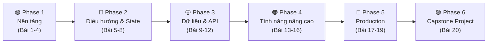

| Phase | Giai đoạn | Bài học | Thời lượng đề xuất | Mô tả |
|:---:|:---|:---:|:---:|:---|
| 1 | 🟢 **Nền tảng** | Bài 1–4 | 2 tuần | Cài đặt, cấu trúc, core components, styling, layout |
| 2 | 🔵 **Điều hướng & Quản lý State** | Bài 5–8 | 2 tuần | React Navigation, Context API, Zustand |
| 3 | 🟡 **Dữ liệu & API** | Bài 9–12 | 2 tuần | Networking, AsyncStorage, Forms, Authentication |
| 4 | 🟠 **Tính năng nâng cao** | Bài 13–16 | 3 tuần | Animations, Device APIs, Push Notifications, Maps |
| 5 | 🔴 **Production & Deployment** | Bài 17–19 | 2 tuần | Performance, Testing, Build & Publish |
| 6 | 🟣 **Capstone Project** | Bài 20 | 3 tuần | Xây dựng app hoàn chỉnh từ A đến Z |

---

## ⚠️ Yêu cầu trước khi bắt đầu

| Yêu cầu | Mức độ | Ghi chú |
|:---|:---:|:---|
| JavaScript ES6+ | ✅ Bắt buộc | Arrow functions, destructuring, async/await, modules |
| TypeScript cơ bản | ✅ Bắt buộc | Types, interfaces, generics cơ bản |
| React cơ bản | ✅ Bắt buộc | Components, props, state, hooks (`useState`, `useEffect`) |
| Git cơ bản | ⚡ Nên có | Clone, commit, push, branch |
| Kiến thức REST API | ⚡ Nên có | HTTP methods, JSON, status codes |

---

# 🟢 PHASE 1: NỀN TẢNG (Bài 1–4)

---

## 📘 Bài 1: Giới Thiệu React Native — Cài Đặt & Khởi Chạy Dự Án Đầu Tiên

### 🎯 Mục tiêu bài học
- [ ] Hiểu React Native là gì và hoạt động như thế nào
- [ ] Phân biệt React Native CLI vs Expo
- [ ] Cài đặt môi trường phát triển hoàn chỉnh
- [ ] Tạo và chạy thành công dự án đầu tiên
- [ ] Hiểu cấu trúc thư mục dự án và luồng khởi động

### 1.1 React Native là gì?

**React Native** là framework mã nguồn mở do Meta (Facebook) phát triển, cho phép xây dựng ứng dụng mobile **native** cho cả iOS và Android bằng JavaScript/TypeScript và React.

#### So sánh các phương pháp phát triển mobile

| Tiêu chí | Native (Swift/Kotlin) | React Native | Flutter | PWA |
|:---|:---:|:---:|:---:|:---:|
| Ngôn ngữ | Swift / Kotlin | JavaScript / TypeScript | Dart | HTML/CSS/JS |
| Hiệu năng | ⭐⭐⭐⭐⭐ | ⭐⭐⭐⭐ | ⭐⭐⭐⭐ | ⭐⭐⭐ |
| Code sharing | ❌ Không | ✅ ~90% | ✅ ~95% | ✅ 100% |
| UI/UX Native | ✅ 100% | ✅ Native components | ⚠️ Custom widgets | ❌ Web-based |
| Hệ sinh thái | Lớn | Rất lớn | Đang phát triển | Hạn chế |
| Học dễ (đã biết JS) | ❌ Khó | ✅ Dễ nhất | ⚠️ Học Dart | ✅ Dễ |

#### Kiến trúc React Native (New Architecture)

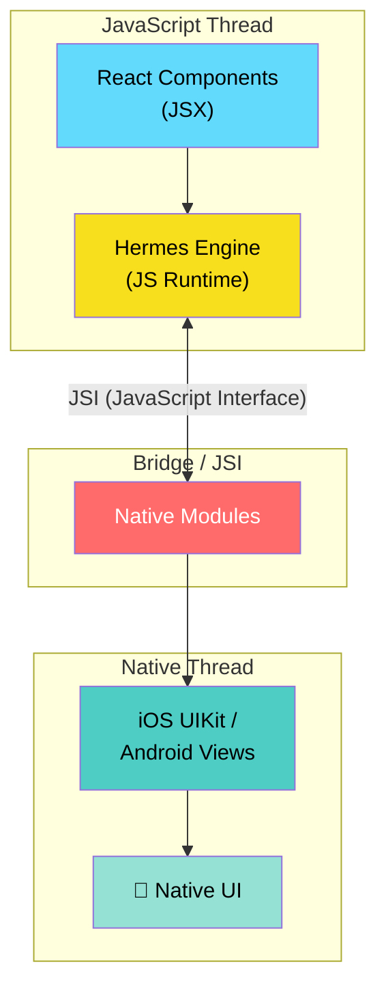

> [!NOTE]
> **New Architecture (Fabric + TurboModules):** Từ RN 0.73+, React Native sử dụng JSI (JavaScript Interface) thay thế Bridge cũ, giúp giao tiếp đồng bộ giữa JS và Native, cải thiện hiệu năng đáng kể.

### 1.2 React Native CLI vs Expo

| Tiêu chí | Expo (Managed) | Expo (Bare) | React Native CLI |
|:---|:---:|:---:|:---:|
| Cài đặt | ✅ Rất dễ | ⚠️ Trung bình | ❌ Phức tạp |
| Native code tùy chỉnh | ❌ Không | ✅ Có | ✅ Có |
| Build trên cloud | ✅ EAS Build | ✅ EAS Build | ❌ Tự build |
| OTA Updates | ✅ EAS Update | ✅ EAS Update | ⚠️ CodePush |
| Kích thước app | Lớn hơn | Trung bình | Nhỏ nhất |
| Phù hợp cho | Học tập, MVP | Production | Production phức tạp |

> [!TIP]
> **Khuyến nghị:** Bắt đầu với **Expo** để học nhanh. Khi cần native modules tùy chỉnh, chuyển sang **Expo bare workflow** hoặc **React Native CLI**.

### 1.3 Cài đặt môi trường phát triển

#### Bước 1: Cài đặt Node.js & npm
```bash
# Kiểm tra phiên bản (yêu cầu Node >= 18)
node -v
npm -v

# Nếu chưa có, cài qua Homebrew (macOS)
brew install node

# Hoặc dùng nvm để quản lý nhiều phiên bản Node
brew install nvm
nvm install 20
nvm use 20
```

#### Bước 2: Cài đặt Expo CLI
```bash
# Cài đặt Expo CLI global
npm install -g expo-cli

# Hoặc sử dụng npx (không cần cài global)
npx create-expo-app@latest
```

#### Bước 3: Cài đặt cho iOS (macOS only)
```bash
# Cài Xcode từ App Store
# Sau đó cài Command Line Tools
xcode-select --install

# Cài CocoaPods
sudo gem install cocoapods
# hoặc
brew install cocoapods
```

#### Bước 4: Cài đặt cho Android
```bash
# 1. Tải Android Studio: https://developer.android.com/studio
# 2. Cài đặt SDK Tools qua Android Studio:
#    - Android SDK Platform 34
#    - Intel x86 Atom_64 System Image (hoặc ARM cho Apple Silicon)
#    - Android SDK Build-Tools 34

# 3. Cấu hình biến môi trường (~/.zshrc hoặc ~/.bashrc)
export ANDROID_HOME=$HOME/Library/Android/sdk
export PATH=$PATH:$ANDROID_HOME/emulator
export PATH=$PATH:$ANDROID_HOME/platform-tools
```

#### Bước 5: Cài đặt Watchman & JDK
```bash
# Watchman (theo dõi thay đổi file)
brew install watchman

# JDK 17 (yêu cầu cho Android)
brew install --cask zulu@17
```

### 1.4 Tạo và chạy dự án đầu tiên

```bash
# Tạo dự án mới với Expo
npx create-expo-app@latest MyFirstApp
cd MyFirstApp

# Chạy dự án
npx expo start

# Các tùy chọn chạy:
# Nhấn 'i' → chạy trên iOS Simulator
# Nhấn 'a' → chạy trên Android Emulator
# Quét QR code → chạy trên điện thoại thật (cần cài Expo Go)
```

### 1.5 Cấu trúc thư mục dự án

```
MyFirstApp/
├── app/                    # 📁 Thư mục chính (Expo Router)
│   ├── (tabs)/             #   Layout dạng tab
│   │   ├── index.tsx       #   Tab Home
│   │   ├── explore.tsx     #   Tab Explore
│   │   └── _layout.tsx     #   Tab layout config
│   ├── +not-found.tsx      #   Trang 404
│   └── _layout.tsx         #   Root layout
├── assets/                 # 📁 Tài nguyên tĩnh (ảnh, fonts, ...)
│   ├── images/
│   └── fonts/
├── components/             # 📁 Components tái sử dụng
├── constants/              # 📁 Hằng số (Colors, Sizes, ...)
├── hooks/                  # 📁 Custom hooks
├── app.json                # ⚙️ Cấu hình Expo app
├── package.json            # 📦 Dependencies & scripts
├── tsconfig.json           # ⚙️ Cấu hình TypeScript
└── babel.config.js         # ⚙️ Cấu hình Babel
```

### 1.6 Luồng khởi động ứng dụng

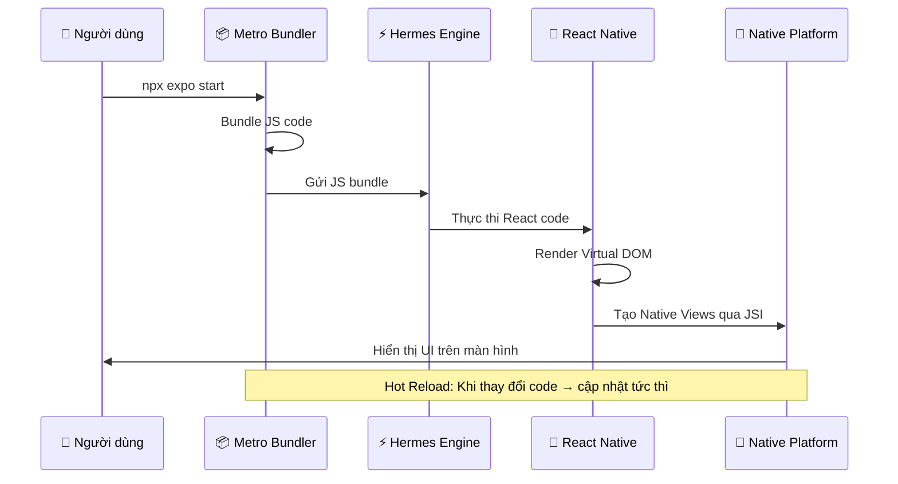

### 1.7 Khái niệm quan trọng cần nắm

| Khái niệm | Mô tả | So sánh với Web |
|:---|:---|:---|
| **Component** | Đơn vị UI cơ bản, viết bằng JSX | Giống React web |
| **Native Component** | Component ánh xạ tới view native thực sự | Không có trên web |
| **Bridge / JSI** | Cầu nối giữa JS và Native code | Không có trên web |
| **Metro Bundler** | Bundler chuyên dụng cho RN | Tương tự Webpack/Vite |
| **Hermes** | JS engine tối ưu cho mobile | Tương tự V8 trên Chrome |
| **Hot Reload** | Cập nhật UI ngay khi thay đổi code | Tương tự HMR trên web |
| **Expo** | Bộ công cụ & dịch vụ cho RN | Tương tự CRA/Next.js |

### 📝 Thực hành Bài 1
- **BT1:** Cài đặt môi trường và tạo dự án Expo thành công
- **BT2:** Thay đổi nội dung `app/(tabs)/index.tsx`, quan sát Hot Reload
- **BT3:** Thử chạy app trên cả iOS Simulator và Android Emulator
- **BT4:** Tìm hiểu file `app.json` — thay đổi tên app, icon

---

## 📘 Bài 2: Core Components & Cú Pháp JSX Trong React Native

### 🎯 Mục tiêu bài học
- [ ] Nắm vững các Core Components cơ bản
- [ ] Hiểu sự khác biệt giữa JSX trên web và React Native
- [ ] Sử dụng thành thạo `View`, `Text`, `Image`, `TextInput`, `ScrollView`
- [ ] Hiểu cách hoạt động của `TouchableOpacity`, `Pressable`, `Button`
- [ ] Xử lý sự kiện (event handling) trong React Native

### 2.1 Bảng ánh xạ React Web → React Native

| React Web (HTML) | React Native | Mô tả |
|:---|:---|:---|
| `<div>` | `<View>` | Container không cuộn |
| `<p>`, `<span>`, `<h1>` | `<Text>` | Hiển thị văn bản (BẮT BUỘC bọc text trong `<Text>`) |
| `` | `<Image>` | Hiển thị hình ảnh |
| `<input>` | `<TextInput>` | Trường nhập liệu |
| `<button>` | `<Button>` / `<Pressable>` | Nút bấm |
| `<div style="overflow:scroll">` | `<ScrollView>` | Container cuộn được |
| `<ul>` / `<ol>` | `<FlatList>` / `<SectionList>` | Danh sách hiệu suất cao |
| `<a href>` | `<Link>` (Expo Router) | Điều hướng |

> [!IMPORTANT]
> **Quy tắc vàng:** Trong React Native, **mọi text** phải nằm trong component `<Text>`. Nếu không, app sẽ crash ngay lập tức!

### 2.2 View — Container cơ bản

```tsx
import { View, Text } from 'react-native';

export default function ViewExample() {
  return (
    <View style={{ flex: 1, padding: 20, backgroundColor: '#f5f5f5' }}>
      {/* View lồng nhau */}
      <View style={{ 
        backgroundColor: '#3498db', 
        padding: 15, 
        borderRadius: 10,
        marginBottom: 10 
      }}>
        <Text style={{ color: '#fff', fontSize: 18 }}>
          Đây là một View với nền xanh
        </Text>
      </View>

      <View style={{ 
        backgroundColor: '#e74c3c', 
        padding: 15, 
        borderRadius: 10 
      }}>
        <Text style={{ color: '#fff', fontSize: 18 }}>
          Đây là một View với nền đỏ
        </Text>
      </View>
    </View>
  );
}
```

### 2.3 Text — Hiển thị văn bản

```tsx
import { View, Text } from 'react-native';

export default function TextExample() {
  return (
    <View style={{ padding: 20 }}>
      {/* Text cơ bản */}
      <Text style={{ fontSize: 24, fontWeight: 'bold', marginBottom: 10 }}>
        Tiêu đề lớn
      </Text>

      {/* Text lồng nhau — kế thừa style */}
      <Text style={{ fontSize: 16, color: '#333' }}>
        Đây là đoạn văn bản bình thường.{' '}
        <Text style={{ fontWeight: 'bold', color: '#e74c3c' }}>
          Phần này in đậm và đỏ.
        </Text>
      </Text>

      {/* Text với numberOfLines (cắt bớt) */}
      <Text numberOfLines={2} ellipsizeMode="tail" style={{ marginTop: 10 }}>
        Đoạn văn bản rất dài sẽ bị cắt bớt sau 2 dòng. Lorem ipsum dolor sit
        amet, consectetur adipiscing elit. Sed do eiusmod tempor incididunt ut
        labore et dolore magna aliqua.
      </Text>

      {/* Text có thể chọn (selectable) */}
      <Text selectable style={{ marginTop: 10, color: '#2980b9' }}>
        Bạn có thể chọn và copy đoạn text này
      </Text>
    </View>
  );
}
```

### 2.4 Image — Hiển thị hình ảnh

```tsx
import { View, Image, StyleSheet } from 'react-native';

export default function ImageExample() {
  return (
    <View style={styles.container}>
      {/* Ảnh từ local (require) */}
      <Image
        source={require('@/assets/images/logo.png')}
        style={styles.localImage}
      />

      {/* Ảnh từ URL (PHẢI chỉ định width & height) */}
      <Image
        source={{ uri: 'https://picsum.photos/200/200' }}
        style={styles.networkImage}
        resizeMode="cover" // cover | contain | stretch | center
      />

      {/* Ảnh nền */}
      <Image
        source={{ uri: 'https://picsum.photos/400/200' }}
        style={styles.backgroundImage}
      >
        {/* Không dùng được children cho Image, dùng ImageBackground */}
      </Image>
    </View>
  );
}

const styles = StyleSheet.create({
  container: { flex: 1, alignItems: 'center', padding: 20 },
  localImage: { width: 100, height: 100, marginBottom: 20 },
  networkImage: { width: 200, height: 200, borderRadius: 100, marginBottom: 20 },
  backgroundImage: { width: '100%', height: 200 },
});
```

> [!NOTE]
> **`resizeMode` options:**
> - `cover`: Ảnh lấp đầy khung, có thể bị cắt (phổ biến nhất)
> - `contain`: Ảnh nằm gọn trong khung, có thể có khoảng trống
> - `stretch`: Kéo giãn ảnh theo khung
> - `center`: Giữ nguyên kích thước, căn giữa

### 2.5 TextInput — Trường nhập liệu

```tsx
import { useState } from 'react';
import { View, Text, TextInput, StyleSheet } from 'react-native';

export default function TextInputExample() {
  const [name, setName] = useState('');
  const [password, setPassword] = useState('');

  return (
    <View style={styles.container}>
      {/* Input cơ bản */}
      <TextInput
        style={styles.input}
        placeholder="Nhập tên của bạn"
        placeholderTextColor="#999"
        value={name}
        onChangeText={setName} // Tương tự onChange trên web
      />

      {/* Input mật khẩu */}
      <TextInput
        style={styles.input}
        placeholder="Nhập mật khẩu"
        secureTextEntry={true} // Ẩn ký tự
        value={password}
        onChangeText={setPassword}
      />

      {/* Input số điện thoại */}
      <TextInput
        style={styles.input}
        placeholder="Số điện thoại"
        keyboardType="phone-pad" // Hiện bàn phím số
        maxLength={10}
      />

      {/* Multiline (textarea) */}
      <TextInput
        style={[styles.input, styles.multiline]}
        placeholder="Ghi chú..."
        multiline={true}
        numberOfLines={4}
        textAlignVertical="top"
      />

      <Text style={styles.preview}>Xin chào, {name || '...'} 👋</Text>
    </View>
  );
}

const styles = StyleSheet.create({
  container: { flex: 1, padding: 20 },
  input: {
    borderWidth: 1, borderColor: '#ddd', borderRadius: 8,
    padding: 12, fontSize: 16, marginBottom: 12,
    backgroundColor: '#fff',
  },
  multiline: { height: 100, textAlignVertical: 'top' },
  preview: { fontSize: 20, marginTop: 20, textAlign: 'center' },
});
```

#### Bảng các `keyboardType` phổ biến

| Giá trị | Mô tả | Platform |
|:---|:---|:---:|
| `default` | Bàn phím mặc định | Both |
| `email-address` | Có ký tự `@` và `.` | Both |
| `numeric` | Chỉ số | Both |
| `phone-pad` | Bàn phím điện thoại | Both |
| `decimal-pad` | Số và dấu thập phân | Both |
| `url` | Có `.com` và `/` | iOS |

### 2.6 Button, TouchableOpacity & Pressable

```tsx
import { View, Text, Button, TouchableOpacity, Pressable, Alert, StyleSheet } from 'react-native';

export default function ButtonExample() {
  return (
    <View style={styles.container}>
      {/* Button cơ bản (không tùy chỉnh style được nhiều) */}
      <Button
        title="Button mặc định"
        onPress={() => Alert.alert('Thông báo', 'Bạn đã nhấn button!')}
        color="#3498db"
      />

      {/* TouchableOpacity — phổ biến, có hiệu ứng mờ khi nhấn */}
      <TouchableOpacity
        style={styles.customButton}
        activeOpacity={0.7}
        onPress={() => Alert.alert('TouchableOpacity')}
      >
        <Text style={styles.buttonText}>TouchableOpacity</Text>
      </TouchableOpacity>

      {/* Pressable — mới hơn, linh hoạt hơn (KHUYÊN DÙNG) */}
      <Pressable
        style={({ pressed }) => [
          styles.customButton,
          styles.pressableButton,
          pressed && styles.pressed,
        ]}
        onPress={() => Alert.alert('Pressable')}
        onLongPress={() => Alert.alert('Long Press!')}
      >
        {({ pressed }) => (
          <Text style={styles.buttonText}>
            {pressed ? 'Đang nhấn...' : 'Pressable (Khuyên dùng)'}
          </Text>
        )}
      </Pressable>
    </View>
  );
}

const styles = StyleSheet.create({
  container: { flex: 1, padding: 20, gap: 15 },
  customButton: {
    backgroundColor: '#3498db', padding: 15,
    borderRadius: 10, alignItems: 'center',
  },
  pressableButton: { backgroundColor: '#9b59b6' },
  pressed: { opacity: 0.7, transform: [{ scale: 0.98 }] },
  buttonText: { color: '#fff', fontSize: 16, fontWeight: 'bold' },
});
```

#### So sánh các Touchable Components

| Component | Hiệu ứng | Tùy chỉnh | Khuyên dùng? |
|:---|:---|:---:|:---:|
| `Button` | Mặc định platform | ❌ Ít | Chỉ cho prototype |
| `TouchableOpacity` | Giảm opacity | ✅ Tốt | ✅ Phổ biến |
| `TouchableHighlight` | Highlight nền | ✅ Tốt | ⚠️ Ít dùng |
| `Pressable` | Tùy chỉnh hoàn toàn | ✅✅ Tốt nhất | ✅✅ Khuyên dùng |

### 📝 Thực hành Bài 2
- **BT1:** Tạo màn hình "Profile Card" gồm: avatar (Image), tên (Text), mô tả, và nút "Follow" (Pressable)
- **BT2:** Tạo form nhập thông tin cá nhân (tên, email, SĐT, mô tả) với TextInput
- **BT3:** Hiển thị kết quả form bên dưới khi nhấn nút "Gửi"

---

## 📘 Bài 3: StyleSheet & Flexbox — Xây Dựng Giao Diện

### 🎯 Mục tiêu bài học
- [ ] Thành thạo `StyleSheet.create()` và các cách styling trong RN
- [ ] Nắm vững Flexbox layout (khác biệt so với web)
- [ ] Biết cách tạo responsive layout cho nhiều kích thước màn hình
- [ ] Sử dụng `Dimensions` và `useWindowDimensions`

### 3.1 Các cách Styling trong React Native

```tsx
import { View, Text, StyleSheet } from 'react-native';

export default function StylingWays() {
  return (
    <View style={styles.container}>
      {/* Cách 1: Inline style (KHÔNG khuyến khích cho production) */}
      <Text style={{ color: 'red', fontSize: 18 }}>Inline Style</Text>

      {/* Cách 2: StyleSheet.create() (KHUYÊN DÙNG) */}
      <Text style={styles.title}>StyleSheet Style</Text>

      {/* Cách 3: Kết hợp nhiều style (dùng mảng) */}
      <Text style={[styles.title, styles.highlighted]}>Combined Styles</Text>

      {/* Cách 4: Conditional styling */}
      <Text style={[styles.title, true && styles.active]}>
        Conditional Style
      </Text>
    </View>
  );
}

const styles = StyleSheet.create({
  container: { flex: 1, padding: 20 },
  title: { fontSize: 20, fontWeight: 'bold', marginBottom: 10 },
  highlighted: { backgroundColor: '#fff3cd', padding: 5 },
  active: { color: '#27ae60' },
});
```

> [!IMPORTANT]
> **Không có CSS bình thường trong React Native!** Không có `className`, không có CSS file, không có cascade, không có pseudo-class (`:hover`, `:focus`). Mọi style đều viết dưới dạng JavaScript object với camelCase.

#### Bảng khác biệt CSS Web vs React Native Style

| CSS Web | React Native | Ghi chú |
|:---|:---|:---|
| `background-color` | `backgroundColor` | camelCase |
| `font-size: 16px` | `fontSize: 16` | Không có đơn vị (mặc định dp) |
| `border: 1px solid red` | `borderWidth: 1, borderColor: 'red'` | Tách riêng từng property |
| `box-shadow` | `shadowColor, shadowOffset, ...` | iOS only; Android dùng `elevation` |
| `display: block/inline` | `display: 'flex'` (mặc định) | Chỉ có `flex` và `none` |
| `position: fixed` | ❌ Không có | Dùng `absolute` |
| `class="btn active"` | `style={[styles.btn, styles.active]}` | Dùng mảng |

### 3.2 Flexbox trong React Native

> [!NOTE]
> React Native sử dụng Flexbox giống web **NHƯNG** có 2 khác biệt quan trọng:
> 1. `flexDirection` mặc định là `'column'` (web là `row`)
> 2. Mặc định mọi View đều là flex container

#### Bảng thuộc tính Flexbox

| Thuộc tính | Giá trị | Mô tả |
|:---|:---|:---|
| `flexDirection` | `'column'` (mặc định) / `'row'` / `'column-reverse'` / `'row-reverse'` | Hướng sắp xếp items |
| `justifyContent` | `'flex-start'` / `'center'` / `'flex-end'` / `'space-between'` / `'space-around'` / `'space-evenly'` | Căn chỉnh theo trục chính |
| `alignItems` | `'stretch'` (mặc định) / `'flex-start'` / `'center'` / `'flex-end'` | Căn chỉnh theo trục phụ |
| `flex` | Số (vd: `1`, `2`) | Tỷ lệ chiếm không gian |
| `flexWrap` | `'nowrap'` (mặc định) / `'wrap'` | Xuống dòng khi hết chỗ |
| `gap` | Số (vd: `10`) | Khoảng cách giữa items |
| `alignSelf` | Giống `alignItems` | Override alignItems cho 1 item |

```tsx
import { View, Text, StyleSheet } from 'react-native';

export default function FlexboxExample() {
  return (
    <View style={styles.container}>
      {/* Row layout với space-between */}
      <View style={styles.row}>
        <View style={[styles.box, { backgroundColor: '#e74c3c' }]}>
          <Text style={styles.boxText}>1</Text>
        </View>
        <View style={[styles.box, { backgroundColor: '#3498db' }]}>
          <Text style={styles.boxText}>2</Text>
        </View>
        <View style={[styles.box, { backgroundColor: '#2ecc71' }]}>
          <Text style={styles.boxText}>3</Text>
        </View>
      </View>

      {/* Flex ratio: 1:2:1 */}
      <View style={styles.flexRow}>
        <View style={[styles.flexItem, { flex: 1, backgroundColor: '#9b59b6' }]}>
          <Text style={styles.boxText}>flex: 1</Text>
        </View>
        <View style={[styles.flexItem, { flex: 2, backgroundColor: '#e67e22' }]}>
          <Text style={styles.boxText}>flex: 2</Text>
        </View>
        <View style={[styles.flexItem, { flex: 1, backgroundColor: '#1abc9c' }]}>
          <Text style={styles.boxText}>flex: 1</Text>
        </View>
      </View>

      {/* Căn giữa hoàn hảo */}
      <View style={styles.centered}>
        <Text style={styles.centeredText}>Căn giữa hoàn hảo ✨</Text>
      </View>
    </View>
  );
}

const styles = StyleSheet.create({
  container: { flex: 1, padding: 20, gap: 20 },
  row: {
    flexDirection: 'row',
    justifyContent: 'space-between',
  },
  box: {
    width: 80, height: 80, borderRadius: 10,
    justifyContent: 'center', alignItems: 'center',
  },
  boxText: { color: '#fff', fontWeight: 'bold', fontSize: 16 },
  flexRow: { flexDirection: 'row', gap: 10, height: 60 },
  flexItem: {
    justifyContent: 'center', alignItems: 'center', borderRadius: 8,
  },
  centered: {
    flex: 1, justifyContent: 'center', alignItems: 'center',
    backgroundColor: '#ecf0f1', borderRadius: 10,
  },
  centeredText: { fontSize: 18, fontWeight: 'bold' },
});
```

### 3.3 Responsive Design

```tsx
import { View, Text, useWindowDimensions, StyleSheet } from 'react-native';

export default function ResponsiveExample() {
  const { width, height } = useWindowDimensions();
  const isLandscape = width > height;
  const isTablet = width >= 768;

  return (
    <View style={[
      styles.container,
      { flexDirection: isLandscape ? 'row' : 'column' }
    ]}>
      <View style={[
        styles.sidebar,
        { width: isTablet ? 300 : '100%', height: isTablet ? '100%' : 200 }
      ]}>
        <Text style={styles.text}>Sidebar</Text>
        <Text style={styles.info}>
          {width}x{height} | {isLandscape ? 'Landscape' : 'Portrait'}
        </Text>
      </View>
      <View style={styles.content}>
        <Text style={styles.text}>Content</Text>
      </View>
    </View>
  );
}

const styles = StyleSheet.create({
  container: { flex: 1 },
  sidebar: { backgroundColor: '#2c3e50', justifyContent: 'center', alignItems: 'center' },
  content: { flex: 1, backgroundColor: '#ecf0f1', justifyContent: 'center', alignItems: 'center' },
  text: { color: '#fff', fontSize: 20, fontWeight: 'bold' },
  info: { color: '#bdc3c7', marginTop: 5 },
});
```

### 📝 Thực hành Bài 3
- **BT1:** Tạo layout "Header - Content - Footer" sử dụng flex
- **BT2:** Tạo grid sản phẩm 2 cột (dùng `flexWrap`)
- **BT3:** Tạo giao diện responsive: Portrait hiển thị 2 cột, Landscape hiển thị 3 cột

---

## 📘 Bài 4: Lists — FlatList, SectionList & ScrollView

### 🎯 Mục tiêu bài học
- [ ] Hiểu khi nào dùng `ScrollView` vs `FlatList`
- [ ] Sử dụng `FlatList` với hiệu suất cao
- [ ] Sử dụng `SectionList` cho danh sách phân nhóm
- [ ] Implement Pull-to-Refresh và Infinite Scroll
- [ ] Tối ưu hiệu suất render list

### 4.1 ScrollView vs FlatList

| Tiêu chí | ScrollView | FlatList |
|:---|:---:|:---:|
| Render | **Tất cả** items cùng lúc | Chỉ items **trên màn hình** |
| Hiệu suất | ❌ Chậm với nhiều items | ✅ Tốt với hàng ngàn items |
| Phù hợp | < 50 items, nội dung hỗn hợp | > 50 items, danh sách đồng nhất |
| Pull to refresh | ❌ Cần tự implement | ✅ Có sẵn prop |
| Infinite scroll | ❌ Cần tự implement | ✅ `onEndReached` |

### 4.2 FlatList — Danh sách hiệu suất cao

```tsx
import { useState, useCallback } from 'react';
import { View, Text, FlatList, Image, StyleSheet, RefreshControl } from 'react-native';

interface User {
  id: string;
  name: string;
  email: string;
  avatar: string;
}

const USERS: User[] = Array.from({ length: 100 }, (_, i) => ({
  id: String(i + 1),
  name: `Người dùng ${i + 1}`,
  email: `user${i + 1}@example.com`,
  avatar: `https://i.pravatar.cc/100?img=${(i % 70) + 1}`,
}));

export default function FlatListExample() {
  const [refreshing, setRefreshing] = useState(false);

  // useCallback để tránh re-render không cần thiết
  const renderItem = useCallback(({ item }: { item: User }) => (
    <View style={styles.card}>
      <Image source={{ uri: item.avatar }} style={styles.avatar} />
      <View style={styles.info}>
        <Text style={styles.name}>{item.name}</Text>
        <Text style={styles.email}>{item.email}</Text>
      </View>
    </View>
  ), []);

  // Key extractor
  const keyExtractor = useCallback((item: User) => item.id, []);

  // Pull to refresh
  const onRefresh = useCallback(async () => {
    setRefreshing(true);
    // Giả lập fetch data
    await new Promise(resolve => setTimeout(resolve, 2000));
    setRefreshing(false);
  }, []);

  // Header & Footer
  const ListHeader = () => (
    <Text style={styles.header}>Danh sách người dùng ({USERS.length})</Text>
  );

  const ListEmpty = () => (
    <Text style={styles.empty}>Không có dữ liệu</Text>
  );

  const ItemSeparator = () => <View style={styles.separator} />;

  return (
    <FlatList
      data={USERS}
      renderItem={renderItem}
      keyExtractor={keyExtractor}
      ListHeaderComponent={ListHeader}
      ListEmptyComponent={ListEmpty}
      ItemSeparatorComponent={ItemSeparator}
      refreshControl={
        <RefreshControl refreshing={refreshing} onRefresh={onRefresh} />
      }
      onEndReached={() => console.log('Load more...')} // Infinite scroll
      onEndReachedThreshold={0.5} // Trigger khi còn 50% cuối
      initialNumToRender={15} // Render ban đầu
      maxToRenderPerBatch={10} // Render mỗi batch
      windowSize={5} // Số "window" giữ trong memory
    />
  );
}

const styles = StyleSheet.create({
  card: {
    flexDirection: 'row', alignItems: 'center',
    padding: 15, backgroundColor: '#fff',
  },
  avatar: { width: 50, height: 50, borderRadius: 25 },
  info: { marginLeft: 15, flex: 1 },
  name: { fontSize: 16, fontWeight: '600' },
  email: { fontSize: 14, color: '#666', marginTop: 2 },
  header: {
    fontSize: 20, fontWeight: 'bold', padding: 15,
    backgroundColor: '#f8f9fa',
  },
  empty: { textAlign: 'center', padding: 50, color: '#999' },
  separator: { height: 1, backgroundColor: '#eee' },
});
```

### 4.3 SectionList — Danh sách phân nhóm

```tsx
import { View, Text, SectionList, StyleSheet } from 'react-native';

const CONTACTS = [
  {
    title: 'A',
    data: ['An', 'Anh', 'Ánh'],
  },
  {
    title: 'B',
    data: ['Bình', 'Bảo', 'Bích'],
  },
  {
    title: 'C',
    data: ['Cường', 'Chi', 'Châu'],
  },
];

export default function SectionListExample() {
  return (
    <SectionList
      sections={CONTACTS}
      keyExtractor={(item, index) => item + index}
      renderItem={({ item }) => (
        <View style={styles.item}>
          <Text style={styles.itemText}>{item}</Text>
        </View>
      )}
      renderSectionHeader={({ section: { title } }) => (
        <View style={styles.sectionHeader}>
          <Text style={styles.sectionTitle}>{title}</Text>
        </View>
      )}
      stickySectionHeadersEnabled={true}
    />
  );
}

const styles = StyleSheet.create({
  sectionHeader: { backgroundColor: '#f0f0f0', padding: 10 },
  sectionTitle: { fontSize: 18, fontWeight: 'bold', color: '#333' },
  item: { padding: 15, borderBottomWidth: 1, borderBottomColor: '#eee' },
  itemText: { fontSize: 16 },
});
```

### 4.4 Bảng tối ưu hiệu suất FlatList

| Kỹ thuật | Prop / Cách làm | Tác dụng |
|:---|:---|:---|
| Memo renderItem | `useCallback` + `React.memo` | Tránh re-render item không thay đổi |
| getItemLayout | `getItemLayout={(data, index) => ({...})}` | Bỏ qua tính toán layout (cần fixed height) |
| windowSize | `windowSize={5}` | Giảm số items giữ trong memory |
| removeClippedSubviews | `removeClippedSubviews={true}` | Unmount items ngoài viewport (Android) |
| initialNumToRender | `initialNumToRender={10}` | Render ít items ban đầu |
| maxToRenderPerBatch | `maxToRenderPerBatch={5}` | Giới hạn render mỗi batch |

### 📝 Thực hành Bài 4
- **BT1:** Tạo danh sách liên hệ (contacts) với `SectionList`, nhóm theo chữ cái đầu
- **BT2:** Tạo newsfeed với `FlatList`, hỗ trợ Pull-to-Refresh và load thêm khi cuộn đến cuối
- **BT3:** Tạo FlatList hiển thị dạng grid 2 cột (`numColumns={2}`)

---

# 🔵 PHASE 2: ĐIỀU HƯỚNG & QUẢN LÝ STATE (Bài 5–8)

---

## 📘 Bài 5: React Navigation — Điều Hướng Cơ Bản

### 🎯 Mục tiêu bài học
- [ ] Hiểu hệ thống navigation trong React Native
- [ ] Cài đặt và cấu hình React Navigation / Expo Router
- [ ] Sử dụng Stack Navigator (điều hướng stack)
- [ ] Truyền params giữa các màn hình
- [ ] Tùy chỉnh header và transition

### 5.1 Tổng quan hệ thống Navigation

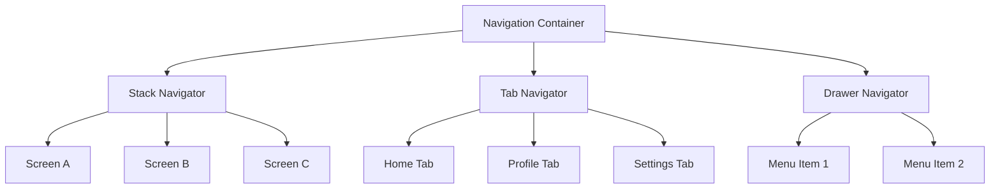

#### So sánh React Navigation vs Expo Router

| Tiêu chí | React Navigation | Expo Router |
|:---|:---:|:---:|
| Cách khai báo route | Code-based | File-based (giống Next.js) |
| Deep linking | Cấu hình thủ công | Tự động |
| Type safety | Cần setup thêm | Tự động với TypeScript |
| Phù hợp cho | Mọi dự án RN | Dự án Expo |

### 5.2 Stack Navigator với Expo Router

```
app/
├── _layout.tsx          # Root layout (Stack)
├── index.tsx            # Trang chủ (/)
├── details.tsx          # Chi tiết (/details)
└── [id].tsx             # Dynamic route (/123, /abc)
```

```tsx
// app/_layout.tsx
import { Stack } from 'expo-router';

export default function RootLayout() {
  return (
    <Stack
      screenOptions={{
        headerStyle: { backgroundColor: '#2c3e50' },
        headerTintColor: '#fff',
        headerTitleStyle: { fontWeight: 'bold' },
        animation: 'slide_from_right', // Hiệu ứng chuyển trang
      }}
    >
      <Stack.Screen name="index" options={{ title: 'Trang chủ' }} />
      <Stack.Screen name="details" options={{ title: 'Chi tiết' }} />
      <Stack.Screen name="[id]" options={{ title: 'Sản phẩm' }} />
    </Stack>
  );
}
```

```tsx
// app/index.tsx — Trang chủ
import { View, Text, Pressable, StyleSheet } from 'react-native';
import { router } from 'expo-router';

export default function HomeScreen() {
  return (
    <View style={styles.container}>
      <Text style={styles.title}>🏠 Trang Chủ</Text>

      {/* Điều hướng cơ bản */}
      <Pressable
        style={styles.button}
        onPress={() => router.push('/details')}
      >
        <Text style={styles.buttonText}>Đi tới trang Chi tiết →</Text>
      </Pressable>

      {/* Truyền params */}
      <Pressable
        style={[styles.button, { backgroundColor: '#27ae60' }]}
        onPress={() => router.push({
          pathname: '/details',
          params: { name: 'iPhone 15', price: '999' }
        })}
      >
        <Text style={styles.buttonText}>Chi tiết + Params →</Text>
      </Pressable>

      {/* Dynamic route */}
      <Pressable
        style={[styles.button, { backgroundColor: '#e67e22' }]}
        onPress={() => router.push('/42')}
      >
        <Text style={styles.buttonText}>Sản phẩm #42 →</Text>
      </Pressable>
    </View>
  );
}

const styles = StyleSheet.create({
  container: { flex: 1, justifyContent: 'center', padding: 20, gap: 15 },
  title: { fontSize: 28, fontWeight: 'bold', textAlign: 'center', marginBottom: 20 },
  button: {
    backgroundColor: '#3498db', padding: 15, borderRadius: 10, alignItems: 'center',
  },
  buttonText: { color: '#fff', fontSize: 16, fontWeight: '600' },
});
```

```tsx
// app/details.tsx — Nhận params
import { View, Text, StyleSheet } from 'react-native';
import { useLocalSearchParams, router } from 'expo-router';

export default function DetailsScreen() {
  const { name, price } = useLocalSearchParams<{ name?: string; price?: string }>();

  return (
    <View style={styles.container}>
      <Text style={styles.title}>📋 Chi Tiết</Text>
      {name && <Text style={styles.info}>Sản phẩm: {name}</Text>}
      {price && <Text style={styles.info}>Giá: ${price}</Text>}

      <Pressable style={styles.button} onPress={() => router.back()}>
        <Text style={styles.buttonText}>← Quay lại</Text>
      </Pressable>
    </View>
  );
}
```

### 📝 Thực hành Bài 5
- **BT1:** Tạo app 3 màn hình (Home → List → Detail) với Stack Navigator
- **BT2:** Truyền data từ List sang Detail (tên, hình, giá sản phẩm)
- **BT3:** Tùy chỉnh header với icon, màu sắc, và nút back tùy chỉnh

---

## 📘 Bài 6: Tab Navigation & Drawer Navigation

### 🎯 Mục tiêu bài học
- [ ] Tạo Bottom Tab Navigation
- [ ] Tạo Drawer (menu hamburger) Navigation
- [ ] Kết hợp nhiều loại Navigator (Nested Navigation)
- [ ] Tùy chỉnh Tab Bar và Drawer

### 6.1 Bottom Tab Navigation

```
app/
├── (tabs)/              # Group layout dạng Tab
│   ├── _layout.tsx      # Tab configuration
│   ├── index.tsx        # Tab Home
│   ├── search.tsx       # Tab Search
│   ├── notifications.tsx # Tab Notifications
│   └── profile.tsx      # Tab Profile
└── _layout.tsx          # Root layout
```

```tsx
// app/(tabs)/_layout.tsx
import { Tabs } from 'expo-router';
import { Ionicons } from '@expo/vector-icons';

export default function TabLayout() {
  return (
    <Tabs
      screenOptions={{
        tabBarActiveTintColor: '#3498db',
        tabBarInactiveTintColor: '#95a5a6',
        tabBarStyle: {
          backgroundColor: '#fff',
          borderTopWidth: 0,
          elevation: 10,
          shadowColor: '#000',
          shadowOpacity: 0.1,
          shadowRadius: 10,
          height: 60,
          paddingBottom: 8,
        },
        tabBarLabelStyle: { fontSize: 12, fontWeight: '600' },
      }}
    >
      <Tabs.Screen
        name="index"
        options={{
          title: 'Trang chủ',
          tabBarIcon: ({ color, size }) => (
            <Ionicons name="home" size={size} color={color} />
          ),
        }}
      />
      <Tabs.Screen
        name="search"
        options={{
          title: 'Tìm kiếm',
          tabBarIcon: ({ color, size }) => (
            <Ionicons name="search" size={size} color={color} />
          ),
        }}
      />
      <Tabs.Screen
        name="notifications"
        options={{
          title: 'Thông báo',
          tabBarIcon: ({ color, size }) => (
            <Ionicons name="notifications" size={size} color={color} />
          ),
          tabBarBadge: 3, // Badge notification
        }}
      />
      <Tabs.Screen
        name="profile"
        options={{
          title: 'Cá nhân',
          tabBarIcon: ({ color, size }) => (
            <Ionicons name="person" size={size} color={color} />
          ),
        }}
      />
    </Tabs>
  );
}
```

### 6.2 Nested Navigation (Kết hợp Tab + Stack)

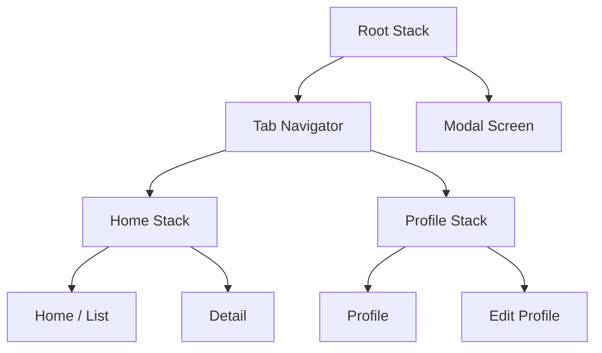

### 📝 Thực hành Bài 6
- **BT1:** Tạo app với 4 tabs: Home, Explore, Notifications (có badge), Profile
- **BT2:** Trong tab Home, tạo Stack navigation (List → Detail)
- **BT3:** Thêm Drawer navigation bọc ngoài Tab navigation

---

## 📘 Bài 7: Quản Lý State — Context API & useReducer

### 🎯 Mục tiêu bài học
- [ ] Hiểu vấn đề "prop drilling" và tại sao cần state management
- [ ] Sử dụng Context API để chia sẻ state toàn cục
- [ ] Sử dụng `useReducer` cho state phức tạp
- [ ] Kết hợp Context + useReducer (pattern phổ biến)
- [ ] Biết khi nào cần thư viện state management bên ngoài

### 7.1 Vấn đề Prop Drilling

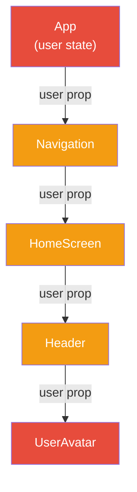

> Truyền `user` qua 4 cấp component chỉ để dùng ở `UserAvatar` → **Prop Drilling!**

### 7.2 Context API — Giải quyết Prop Drilling

```tsx
// contexts/ThemeContext.tsx
import { createContext, useContext, useState, ReactNode } from 'react';

type Theme = 'light' | 'dark';

interface ThemeContextType {
  theme: Theme;
  toggleTheme: () => void;
  colors: {
    background: string;
    text: string;
    card: string;
    primary: string;
  };
}

const ThemeContext = createContext<ThemeContextType | undefined>(undefined);

// Custom hook (best practice)
export function useTheme() {
  const context = useContext(ThemeContext);
  if (!context) {
    throw new Error('useTheme must be used within a ThemeProvider');
  }
  return context;
}

// Provider
export function ThemeProvider({ children }: { children: ReactNode }) {
  const [theme, setTheme] = useState<Theme>('light');

  const toggleTheme = () => setTheme(prev => prev === 'light' ? 'dark' : 'light');

  const colors = theme === 'light'
    ? { background: '#ffffff', text: '#333333', card: '#f8f9fa', primary: '#3498db' }
    : { background: '#1a1a2e', text: '#eaeaea', card: '#16213e', primary: '#e94560' };

  return (
    <ThemeContext.Provider value={{ theme, toggleTheme, colors }}>
      {children}
    </ThemeContext.Provider>
  );
}
```

```tsx
// Sử dụng trong component — KHÔNG cần prop drilling!
import { View, Text, Pressable } from 'react-native';
import { useTheme } from '@/contexts/ThemeContext';

export default function SettingsScreen() {
  const { theme, toggleTheme, colors } = useTheme();

  return (
    <View style={{ flex: 1, backgroundColor: colors.background, padding: 20 }}>
      <Text style={{ color: colors.text, fontSize: 24 }}>
        Theme hiện tại: {theme}
      </Text>
      <Pressable
        onPress={toggleTheme}
        style={{ backgroundColor: colors.primary, padding: 15, borderRadius: 10, marginTop: 20 }}
      >
        <Text style={{ color: '#fff', textAlign: 'center' }}>Toggle Theme</Text>
      </Pressable>
    </View>
  );
}
```

### 7.3 useReducer — State phức tạp

```tsx
// contexts/CartContext.tsx
import { createContext, useContext, useReducer, ReactNode } from 'react';

// Types
interface CartItem {
  id: string;
  name: string;
  price: number;
  quantity: number;
}

interface CartState {
  items: CartItem[];
  total: number;
}

type CartAction =
  | { type: 'ADD_ITEM'; payload: Omit<CartItem, 'quantity'> }
  | { type: 'REMOVE_ITEM'; payload: string }
  | { type: 'UPDATE_QUANTITY'; payload: { id: string; quantity: number } }
  | { type: 'CLEAR_CART' };

// Reducer
function cartReducer(state: CartState, action: CartAction): CartState {
  switch (action.type) {
    case 'ADD_ITEM': {
      const existing = state.items.find(i => i.id === action.payload.id);
      const items = existing
        ? state.items.map(i =>
            i.id === action.payload.id
              ? { ...i, quantity: i.quantity + 1 }
              : i
          )
        : [...state.items, { ...action.payload, quantity: 1 }];
      return { items, total: items.reduce((s, i) => s + i.price * i.quantity, 0) };
    }
    case 'REMOVE_ITEM': {
      const items = state.items.filter(i => i.id !== action.payload);
      return { items, total: items.reduce((s, i) => s + i.price * i.quantity, 0) };
    }
    case 'UPDATE_QUANTITY': {
      const items = state.items.map(i =>
        i.id === action.payload.id ? { ...i, quantity: action.payload.quantity } : i
      ).filter(i => i.quantity > 0);
      return { items, total: items.reduce((s, i) => s + i.price * i.quantity, 0) };
    }
    case 'CLEAR_CART':
      return { items: [], total: 0 };
    default:
      return state;
  }
}

// Context
const CartContext = createContext<{
  state: CartState;
  dispatch: React.Dispatch<CartAction>;
} | undefined>(undefined);

export function useCart() {
  const context = useContext(CartContext);
  if (!context) throw new Error('useCart must be used within CartProvider');
  return context;
}

export function CartProvider({ children }: { children: ReactNode }) {
  const [state, dispatch] = useReducer(cartReducer, { items: [], total: 0 });
  return (
    <CartContext.Provider value={{ state, dispatch }}>
      {children}
    </CartContext.Provider>
  );
}
```

### 📝 Thực hành Bài 7
- **BT1:** Tạo ThemeContext (Light/Dark mode) cho toàn bộ app
- **BT2:** Tạo CartContext với useReducer — thêm, xóa, cập nhật sản phẩm
- **BT3:** Hiển thị số lượng items trên tab badge từ CartContext

---

## 📘 Bài 8: State Management Nâng Cao — Zustand

### 🎯 Mục tiêu bài học
- [ ] Hiểu tại sao cần thư viện state management
- [ ] Sử dụng Zustand — thư viện nhẹ, hiện đại
- [ ] So sánh Context API vs Zustand vs Redux
- [ ] Persist state với AsyncStorage
- [ ] Tổ chức store trong dự án lớn

### 8.1 So sánh các giải pháp State Management

| Tiêu chí | Context API | Zustand | Redux Toolkit | Jotai |
|:---|:---:|:---:|:---:|:---:|
| Cài đặt | Không cần | `npm i zustand` | `npm i @reduxjs/toolkit react-redux` | `npm i jotai` |
| Boilerplate | Trung bình | **Ít nhất** | Nhiều | Ít |
| Hiệu suất | ⚠️ Re-render nhiều | ✅ Tốt | ✅ Tốt | ✅ Tốt |
| DevTools | ❌ | ✅ | ✅ | ✅ |
| Middleware | ❌ | ✅ | ✅ | ⚠️ |
| Persist | Tự viết | ✅ Built-in | ✅ redux-persist | ✅ |
| Phù hợp | Nhỏ, đơn giản | Nhỏ → Trung bình | Lớn, phức tạp | Nhỏ → Trung bình |

### 8.2 Zustand — Setup & Sử dụng

```bash
npm install zustand
```

```tsx
// stores/useAuthStore.ts
import { create } from 'zustand';
import { persist, createJSONStorage } from 'zustand/middleware';
import AsyncStorage from '@react-native-async-storage/async-storage';

interface User {
  id: string;
  name: string;
  email: string;
  avatar: string;
}

interface AuthState {
  user: User | null;
  token: string | null;
  isAuthenticated: boolean;
  isLoading: boolean;
  // Actions
  login: (email: string, password: string) => Promise<void>;
  logout: () => void;
  updateProfile: (data: Partial<User>) => void;
}

export const useAuthStore = create<AuthState>()(
  persist(
    (set, get) => ({
      user: null,
      token: null,
      isAuthenticated: false,
      isLoading: false,

      login: async (email, password) => {
        set({ isLoading: true });
        try {
          // Gọi API login
          const response = await fetch('https://api.example.com/login', {
            method: 'POST',
            headers: { 'Content-Type': 'application/json' },
            body: JSON.stringify({ email, password }),
          });
          const data = await response.json();

          set({
            user: data.user,
            token: data.token,
            isAuthenticated: true,
            isLoading: false,
          });
        } catch (error) {
          set({ isLoading: false });
          throw error;
        }
      },

      logout: () => {
        set({ user: null, token: null, isAuthenticated: false });
      },

      updateProfile: (data) => {
        const currentUser = get().user;
        if (currentUser) {
          set({ user: { ...currentUser, ...data } });
        }
      },
    }),
    {
      name: 'auth-storage', // key trong AsyncStorage
      storage: createJSONStorage(() => AsyncStorage),
      partialize: (state) => ({ // Chỉ persist những field cần thiết
        user: state.user,
        token: state.token,
        isAuthenticated: state.isAuthenticated,
      }),
    }
  )
);
```

```tsx
// Sử dụng trong component — CỰC KỲ đơn giản!
import { View, Text, Pressable } from 'react-native';
import { useAuthStore } from '@/stores/useAuthStore';

export default function ProfileScreen() {
  // Chỉ subscribe những field cần dùng → tối ưu re-render
  const user = useAuthStore(state => state.user);
  const logout = useAuthStore(state => state.logout);

  if (!user) return <Text>Chưa đăng nhập</Text>;

  return (
    <View style={{ flex: 1, padding: 20 }}>
      <Text style={{ fontSize: 24 }}>Xin chào, {user.name}!</Text>
      <Pressable onPress={logout}>
        <Text>Đăng xuất</Text>
      </Pressable>
    </View>
  );
}
```

### 📝 Thực hành Bài 8
- **BT1:** Tạo `useCartStore` với Zustand (thay thế CartContext ở bài 7)
- **BT2:** Thêm persist cho cart store (items được lưu khi tắt app)
- **BT3:** Tạo `useAuthStore` hoàn chỉnh với login/logout

---

# 🟡 PHASE 3: DỮ LIỆU & API (Bài 9–12)

---

## 📘 Bài 9: Networking — Gọi API & Xử Lý Dữ Liệu

### 🎯 Mục tiêu bài học
- [ ] Sử dụng `fetch` API và Axios trong React Native
- [ ] Xử lý loading, error, và empty states
- [ ] Sử dụng TanStack Query (React Query) cho data fetching
- [ ] Hiểu caching, refetching, và optimistic updates
- [ ] Xử lý token authentication trong API calls

### 9.1 Fetch API cơ bản

```tsx
import { useState, useEffect } from 'react';
import { View, Text, FlatList, ActivityIndicator, StyleSheet } from 'react-native';

interface Post {
  id: number;
  title: string;
  body: string;
}

export default function PostsScreen() {
  const [posts, setPosts] = useState<Post[]>([]);
  const [loading, setLoading] = useState(true);
  const [error, setError] = useState<string | null>(null);

  useEffect(() => {
    fetchPosts();
  }, []);

  const fetchPosts = async () => {
    try {
      setLoading(true);
      setError(null);
      const response = await fetch('https://jsonplaceholder.typicode.com/posts');

      if (!response.ok) {
        throw new Error(`HTTP Error: ${response.status}`);
      }

      const data: Post[] = await response.json();
      setPosts(data);
    } catch (err) {
      setError(err instanceof Error ? err.message : 'Đã xảy ra lỗi');
    } finally {
      setLoading(false);
    }
  };

  if (loading) {
    return (
      <View style={styles.center}>
        <ActivityIndicator size="large" color="#3498db" />
        <Text style={styles.loadingText}>Đang tải...</Text>
      </View>
    );
  }

  if (error) {
    return (
      <View style={styles.center}>
        <Text style={styles.errorText}>❌ {error}</Text>
        <Pressable onPress={fetchPosts} style={styles.retryButton}>
          <Text style={styles.retryText}>Thử lại</Text>
        </Pressable>
      </View>
    );
  }

  return (
    <FlatList
      data={posts}
      keyExtractor={item => String(item.id)}
      renderItem={({ item }) => (
        <View style={styles.card}>
          <Text style={styles.title}>{item.title}</Text>
          <Text style={styles.body} numberOfLines={2}>{item.body}</Text>
        </View>
      )}
    />
  );
}
```

### 9.2 TanStack Query (React Query) — Best Practice

```bash
npm install @tanstack/react-query
```

```tsx
// hooks/useApi.ts — Custom hooks với React Query
import { useQuery, useMutation, useQueryClient } from '@tanstack/react-query';

const API_BASE = 'https://jsonplaceholder.typicode.com';

// Fetch posts
export function usePosts() {
  return useQuery({
    queryKey: ['posts'],
    queryFn: async () => {
      const res = await fetch(`${API_BASE}/posts`);
      if (!res.ok) throw new Error('Failed to fetch');
      return res.json() as Promise<Post[]>;
    },
    staleTime: 5 * 60 * 1000, // Cache 5 phút
    retry: 3, // Thử lại 3 lần nếu lỗi
  });
}

// Create post (mutation)
export function useCreatePost() {
  const queryClient = useQueryClient();
  
  return useMutation({
    mutationFn: async (newPost: { title: string; body: string }) => {
      const res = await fetch(`${API_BASE}/posts`, {
        method: 'POST',
        headers: { 'Content-Type': 'application/json' },
        body: JSON.stringify(newPost),
      });
      return res.json();
    },
    onSuccess: () => {
      queryClient.invalidateQueries({ queryKey: ['posts'] }); // Refresh danh sách
    },
  });
}
```

### 📝 Thực hành Bài 9
- **BT1:** Fetch danh sách users từ JSONPlaceholder, hiển thị với loading/error states
- **BT2:** Tạo màn hình chi tiết user → fetch posts của user đó
- **BT3:** Implement search/filter trên danh sách đã fetch

---

## 📘 Bài 10: Lưu Trữ Dữ Liệu Cục Bộ

### 🎯 Mục tiêu bài học
- [ ] Sử dụng AsyncStorage cho key-value storage
- [ ] Sử dụng expo-secure-store cho dữ liệu nhạy cảm
- [ ] Sử dụng SQLite cho dữ liệu phức tạp (quan hệ)
- [ ] Biết chọn giải pháp storage phù hợp

### 10.1 So sánh các giải pháp Storage

| Giải pháp | Loại dữ liệu | Bảo mật | Dung lượng | Use case |
|:---|:---|:---:|:---:|:---|
| **AsyncStorage** | Key-value (string) | ❌ | ~6MB | Settings, cache, theme preference |
| **SecureStore** | Key-value (string) | ✅ Encrypted | ~2KB/key | Token, password, API keys |
| **SQLite** | Relational | ❌ | Không giới hạn | Offline data, complex queries |
| **MMKV** | Key-value (binary) | ⚠️ Optional | Không giới hạn | Thay thế AsyncStorage (nhanh hơn 30x) |
| **Realm** | Object-oriented DB | ⚠️ Optional | Không giới hạn | Offline-first apps |

### 10.2 Code ví dụ AsyncStorage & SecureStore

```tsx
import AsyncStorage from '@react-native-async-storage/async-storage';
import * as SecureStore from 'expo-secure-store';

// === AsyncStorage ===
// Lưu settings
await AsyncStorage.setItem('theme', 'dark');
await AsyncStorage.setItem('user_preferences', JSON.stringify({
  language: 'vi',
  notifications: true,
}));

// Đọc
const theme = await AsyncStorage.getItem('theme'); // 'dark'
const prefs = JSON.parse(await AsyncStorage.getItem('user_preferences') || '{}');

// Xóa
await AsyncStorage.removeItem('theme');

// === SecureStore (cho token, password) ===
await SecureStore.setItemAsync('auth_token', 'eyJhbGciOiJIUzI1NiIs...');
const token = await SecureStore.getItemAsync('auth_token');
await SecureStore.deleteItemAsync('auth_token');
```

### 📝 Thực hành Bài 10
- **BT1:** Lưu và khôi phục theme preference (light/dark) khi mở lại app
- **BT2:** Tạo Todo app lưu trữ offline với AsyncStorage
- **BT3:** Lưu auth token an toàn với SecureStore

---

## 📘 Bài 11: Forms & Validation

### 🎯 Mục tiêu bài học
- [ ] Xây dựng form phức tạp với React Hook Form
- [ ] Validation với Zod schema
- [ ] Custom form components tái sử dụng
- [ ] Xử lý keyboard trên mobile (KeyboardAvoidingView)

### 11.1 React Hook Form + Zod

```bash
npm install react-hook-form @hookform/resolvers zod
```

```tsx
import { useForm, Controller } from 'react-hook-form';
import { zodResolver } from '@hookform/resolvers/zod';
import { z } from 'zod';
import { View, Text, TextInput, Pressable, KeyboardAvoidingView, Platform } from 'react-native';

// Schema validation
const registerSchema = z.object({
  name: z.string().min(2, 'Tên phải có ít nhất 2 ký tự'),
  email: z.string().email('Email không hợp lệ'),
  phone: z.string().regex(/^0\d{9}$/, 'SĐT phải có 10 số, bắt đầu bằng 0'),
  password: z.string().min(8, 'Mật khẩu ít nhất 8 ký tự')
    .regex(/[A-Z]/, 'Cần có ít nhất 1 chữ hoa')
    .regex(/[0-9]/, 'Cần có ít nhất 1 số'),
  confirmPassword: z.string(),
}).refine(data => data.password === data.confirmPassword, {
  message: 'Mật khẩu xác nhận không khớp',
  path: ['confirmPassword'],
});

type RegisterForm = z.infer<typeof registerSchema>;

export default function RegisterScreen() {
  const { control, handleSubmit, formState: { errors, isSubmitting } } = useForm<RegisterForm>({
    resolver: zodResolver(registerSchema),
    defaultValues: { name: '', email: '', phone: '', password: '', confirmPassword: '' },
  });

  const onSubmit = async (data: RegisterForm) => {
    console.log('Form data:', data);
    // Call API...
  };

  return (
    <KeyboardAvoidingView
      behavior={Platform.OS === 'ios' ? 'padding' : 'height'}
      style={{ flex: 1 }}
    >
      <View style={{ flex: 1, padding: 20, gap: 12 }}>
        <Controller
          control={control}
          name="name"
          render={({ field: { onChange, value } }) => (
            <View>
              <TextInput
                placeholder="Họ và tên"
                value={value}
                onChangeText={onChange}
                style={[styles.input, errors.name && styles.inputError]}
              />
              {errors.name && <Text style={styles.error}>{errors.name.message}</Text>}
            </View>
          )}
        />
        {/* Tương tự cho các field khác... */}

        <Pressable
          style={[styles.submitBtn, isSubmitting && { opacity: 0.6 }]}
          onPress={handleSubmit(onSubmit)}
          disabled={isSubmitting}
        >
          <Text style={styles.submitText}>
            {isSubmitting ? 'Đang xử lý...' : 'Đăng ký'}
          </Text>
        </Pressable>
      </View>
    </KeyboardAvoidingView>
  );
}
```

### 📝 Thực hành Bài 11
- **BT1:** Tạo form đăng ký với validation đầy đủ
- **BT2:** Tạo form đăng nhập với "Remember me" (lưu email vào AsyncStorage)
- **BT3:** Tạo custom `FormInput` component tái sử dụng

---

## 📘 Bài 12: Authentication Flow

### 🎯 Mục tiêu bài học
- [ ] Hiểu luồng authentication trong mobile app
- [ ] Implement Login / Register / Logout flow
- [ ] Bảo vệ routes (Protected Routes)
- [ ] Auto-login khi mở lại app (token persistence)
- [ ] Refresh token flow

### 12.1 Authentication Flow

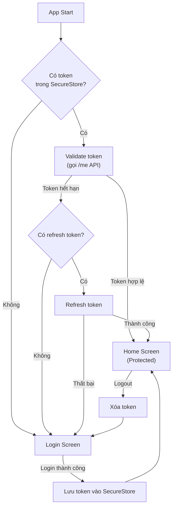

### 12.2 Protected Routes với Expo Router

```tsx
// app/_layout.tsx
import { useEffect } from 'react';
import { Slot, useRouter, useSegments } from 'expo-router';
import { useAuthStore } from '@/stores/useAuthStore';

export default function RootLayout() {
  const { isAuthenticated, isLoading } = useAuthStore();
  const segments = useSegments();
  const router = useRouter();

  useEffect(() => {
    if (isLoading) return;

    const inAuthGroup = segments[0] === '(auth)';

    if (!isAuthenticated && !inAuthGroup) {
      // Chưa đăng nhập → redirect to login
      router.replace('/(auth)/login');
    } else if (isAuthenticated && inAuthGroup) {
      // Đã đăng nhập → redirect to home
      router.replace('/(tabs)');
    }
  }, [isAuthenticated, isLoading, segments]);

  if (isLoading) {
    return <SplashScreen />;
  }

  return <Slot />;
}
```

### 📝 Thực hành Bài 12
- **BT1:** Implement login/register screens hoàn chỉnh
- **BT2:** Tạo protected route system (redirect khi chưa đăng nhập)
- **BT3:** Auto-login khi mở lại app + splash screen

---

# 🟠 PHASE 4: TÍNH NĂNG NÂNG CAO (Bài 13–16)

---

## 📘 Bài 13: Animations — Tạo Giao Diện Sống Động

### 🎯 Mục tiêu bài học
- [ ] Sử dụng Animated API built-in
- [ ] Sử dụng React Native Reanimated (nâng cao)
- [ ] LayoutAnimation cho transitions đơn giản
- [ ] Gesture Handler + Reanimated (swipe, drag, pinch)

### 13.1 Animated API cơ bản

```tsx
import { useRef, useEffect } from 'react';
import { View, Animated, Easing, StyleSheet } from 'react-native';

export default function AnimationExample() {
  const fadeAnim = useRef(new Animated.Value(0)).current;
  const slideAnim = useRef(new Animated.Value(-100)).current;
  const scaleAnim = useRef(new Animated.Value(0.5)).current;

  useEffect(() => {
    // Chạy song song nhiều animation
    Animated.parallel([
      Animated.timing(fadeAnim, {
        toValue: 1,
        duration: 1000,
        useNativeDriver: true, // BẮT BUỘC cho hiệu suất
      }),
      Animated.spring(slideAnim, {
        toValue: 0,
        friction: 5,
        tension: 80,
        useNativeDriver: true,
      }),
      Animated.timing(scaleAnim, {
        toValue: 1,
        duration: 800,
        easing: Easing.elastic(1.5),
        useNativeDriver: true,
      }),
    ]).start();
  }, []);

  return (
    <View style={styles.container}>
      <Animated.View
        style={[
          styles.box,
          {
            opacity: fadeAnim,
            transform: [
              { translateY: slideAnim },
              { scale: scaleAnim },
            ],
          },
        ]}
      >
        {/* Content */}
      </Animated.View>
    </View>
  );
}
```

### 13.2 Bảng các loại Animation

| Loại | API | Use case | Hiệu suất |
|:---|:---|:---|:---:|
| `Animated.timing` | Animated | Di chuyển, fade, scale theo thời gian | ✅ |
| `Animated.spring` | Animated | Hiệu ứng lò xo (bounce) | ✅ |
| `Animated.decay` | Animated | Giảm tốc (fling gesture) | ✅ |
| `LayoutAnimation` | Built-in | Transition khi state thay đổi | ✅ |
| `Reanimated` | `react-native-reanimated` | Complex, gesture-driven animations | ✅✅ |

### 📝 Thực hành Bài 13
- **BT1:** Tạo splash screen với fade-in logo + slide-up text
- **BT2:** Tạo nút "Like" với hiệu ứng heart bounce (scale spring)
- **BT3:** Tạo swipeable card (Tinder-style) với Gesture Handler + Reanimated

---

## 📘 Bài 14: Device APIs — Camera, Location & Permissions

### 🎯 Mục tiêu bài học
- [ ] Xử lý permissions trên mobile
- [ ] Sử dụng Camera (chụp ảnh, quay video)
- [ ] Truy cập vị trí (GPS)
- [ ] Image Picker (chọn ảnh từ thư viện)
- [ ] Share, Clipboard, và các API khác

### 14.1 Bảng các Device APIs phổ biến (Expo)

| API | Package | Mô tả |
|:---|:---|:---|
| Camera | `expo-camera` | Chụp ảnh, quay video |
| Image Picker | `expo-image-picker` | Chọn ảnh từ Gallery |
| Location | `expo-location` | GPS, geocoding |
| Notifications | `expo-notifications` | Push & local notifications |
| Contacts | `expo-contacts` | Đọc danh bạ |
| Media Library | `expo-media-library` | Truy cập thư viện ảnh/video |
| Sensors | `expo-sensors` | Accelerometer, gyroscope |
| Haptics | `expo-haptics` | Rung phản hồi |
| Clipboard | `expo-clipboard` | Copy/paste |
| Sharing | `expo-sharing` | Chia sẻ file/content |

### 📝 Thực hành Bài 14
- **BT1:** Tạo app chụp ảnh với camera, lưu vào gallery
- **BT2:** Hiển thị vị trí hiện tại trên map
- **BT3:** Tạo màn hình update avatar (chọn ảnh từ gallery hoặc chụp mới)

---

## 📘 Bài 15: Push Notifications

### 🎯 Mục tiêu bài học
- [ ] Hiểu cơ chế Push Notification (APNs, FCM)
- [ ] Cấu hình Expo Push Notifications
- [ ] Local Notifications (lên lịch thông báo)
- [ ] Xử lý notification khi app foreground/background/killed
- [ ] Deep linking từ notification

### 15.1 Luồng Push Notification

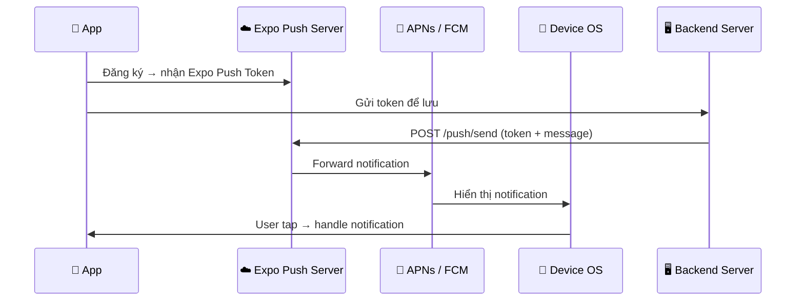

### 📝 Thực hành Bài 15
- **BT1:** Đăng ký và nhận push token
- **BT2:** Gửi local notification (nhắc nhở, hẹn giờ)
- **BT3:** Xử lý navigation khi user tap notification

---

## 📘 Bài 16: Maps & Geolocation

### 🎯 Mục tiêu bài học
- [ ] Tích hợp React Native Maps
- [ ] Hiển thị markers, polylines, polygons
- [ ] Reverse geocoding (tọa độ → địa chỉ)
- [ ] Tracking vị trí realtime
- [ ] Tính khoảng cách và directions

### 📝 Thực hành Bài 16
- **BT1:** Hiển thị bản đồ với marker tại vị trí hiện tại
- **BT2:** Tìm kiếm địa chỉ → hiển thị trên bản đồ
- **BT3:** Vẽ đường đi giữa 2 điểm

---

# 🔴 PHASE 5: PRODUCTION & DEPLOYMENT (Bài 17–19)

---

## 📘 Bài 17: Performance Optimization

### 🎯 Mục tiêu bài học
- [ ] Profiling với React DevTools và Flipper
- [ ] Tối ưu re-renders (memo, useMemo, useCallback)
- [ ] Tối ưu images và assets
- [ ] Tối ưu FlatList và large lists
- [ ] Lazy loading và code splitting
- [ ] Hermes engine optimization

### 17.1 Checklist tối ưu hiệu suất

| Kỹ thuật | Mức độ | Tác dụng |
|:---|:---:|:---|
| `React.memo()` | ⭐⭐⭐ | Tránh re-render component không thay đổi |
| `useMemo` / `useCallback` | ⭐⭐⭐ | Cache giá trị / function tốn kém |
| `useNativeDriver: true` | ⭐⭐⭐⭐ | Animation chạy trên native thread |
| Tối ưu images (resize, cache) | ⭐⭐⭐⭐ | Giảm memory & load time |
| `getItemLayout` cho FlatList | ⭐⭐⭐ | Skip layout calculation |
| Hermes engine | ⭐⭐⭐⭐⭐ | JS engine tối ưu cho mobile |
| Lazy load screens | ⭐⭐⭐ | Giảm thời gian khởi động |
| Remove console.log | ⭐⭐ | Giảm overhead trong production |

### 📝 Thực hành Bài 17
- **BT1:** Profile app với React DevTools — tìm và fix unnecessary re-renders
- **BT2:** Tối ưu FlatList với 1000+ items (mượt 60fps)
- **BT3:** So sánh trước/sau khi áp dụng các kỹ thuật tối ưu

---

## 📘 Bài 18: Testing

### 🎯 Mục tiêu bài học
- [ ] Unit Testing với Jest
- [ ] Component Testing với React Native Testing Library
- [ ] Integration Testing
- [ ] E2E Testing với Detox
- [ ] Viết test hiệu quả (test pyramid, best practices)

### 18.1 Testing Pyramid cho React Native

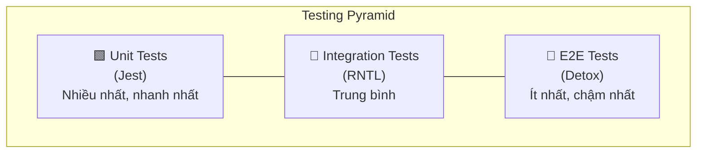

| Loại test | Tool | Tốc độ | Số lượng | Test gì |
|:---|:---|:---:|:---:|:---|
| Unit | Jest | ⚡ Rất nhanh | 70% | Functions, hooks, utils, stores |
| Component | RNTL | 🔵 Nhanh | 20% | Components, user interactions |
| E2E | Detox | 🐢 Chậm | 10% | Toàn bộ user flow |

### 📝 Thực hành Bài 18
- **BT1:** Viết unit test cho utility functions và Zustand store
- **BT2:** Viết component test cho form validation
- **BT3:** Viết E2E test cho login flow

---

## 📘 Bài 19: Build & Publish — Đưa App Lên Store

### 🎯 Mục tiêu bài học
- [ ] Cấu hình app cho production (icons, splash, version)
- [ ] Build với EAS Build (Expo Application Services)
- [ ] Code Signing (iOS certificates, Android keystore)
- [ ] Submit lên App Store và Google Play
- [ ] Over-the-Air (OTA) Updates

### 19.1 Quy trình Build & Publish

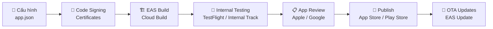

### 19.2 Checklist trước khi submit

| Mục | iOS | Android | Ghi chú |
|:---|:---:|:---:|:---|
| App Icon (1024x1024) | ✅ | ✅ | Không có alpha channel (iOS) |
| Splash Screen | ✅ | ✅ | Animated hoặc static |
| Screenshots | ✅ 6.7" & 5.5" | ✅ Phone & Tablet | Tối thiểu 2, tối đa 10 |
| Privacy Policy URL | ✅ Bắt buộc | ✅ Bắt buộc | Host trên web |
| App Description | ✅ | ✅ | Tối đa 4000 ký tự |
| Version & Build Number | ✅ | ✅ | Semantic versioning |
| Bundle ID | ✅ `com.company.app` | ✅ `com.company.app` | Phải unique |
| Certificates | ✅ Apple Developer ($99/năm) | ✅ Google Play ($25 một lần) | |

### 📝 Thực hành Bài 19
- **BT1:** Cấu hình app.json đầy đủ (icon, splash, version, permissions)
- **BT2:** Build APK/AAB cho Android và IPA cho iOS bằng EAS Build
- **BT3:** Setup EAS Update cho OTA updates

---

# 🟣 PHASE 6: CAPSTONE PROJECT (Bài 20)

---

## 📘 Bài 20: Xây Dựng Ứng Dụng Hoàn Chỉnh Từ A Đến Z

### 🎯 Mục tiêu bài học
- [ ] Áp dụng tất cả kiến thức đã học
- [ ] Trải qua quy trình phát triển thực tế: Design → Code → Test → Deploy
- [ ] Có portfolio project chất lượng

### 20.1 Gợi ý Capstone Project

| Dự án | Độ khó | Kiến thức áp dụng |
|:---|:---:|:---|
| 🛒 **E-Commerce App** | ⭐⭐⭐⭐ | Auth, API, Cart (Zustand), Payment, Push Notification |
| 📝 **Note/Todo App (Offline-first)** | ⭐⭐⭐ | SQLite, Sync, Rich text, Animations |
| 🍔 **Food Delivery App** | ⭐⭐⭐⭐⭐ | Maps, Location tracking, Realtime (Socket), Payment |
| 💬 **Chat App (Realtime)** | ⭐⭐⭐⭐ | WebSocket, Push Notifications, Media upload |
| 🏋️ **Fitness Tracker** | ⭐⭐⭐⭐ | Sensors, Charts, Local storage, Notifications |

### 20.2 Quy trình phát triển (cho E-Commerce App)

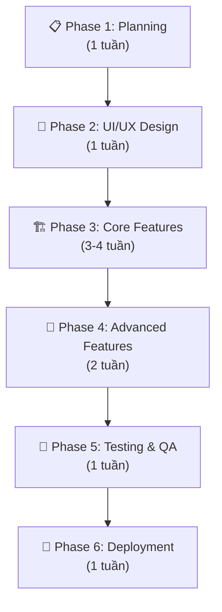

#### Tính năng cho E-Commerce App

**Core Features:**
- [ ] Authentication (Login / Register / Social Login)
- [ ] Product listing với search, filter, sort
- [ ] Product detail với image carousel
- [ ] Shopping cart (Zustand + persist)
- [ ] Checkout flow
- [ ] Order history
- [ ] User profile

**Advanced Features:**
- [ ] Push notifications (order updates)
- [ ] Wishlist / Favorites
- [ ] Ratings & Reviews
- [ ] Address management (Maps)
- [ ] Payment integration (Stripe)
- [ ] Offline support
- [ ] Dark mode

### 20.3 Cấu trúc dự án đề xuất

```
src/
├── app/                   # Expo Router screens
│   ├── (auth)/           # Auth screens (login, register)
│   ├── (tabs)/           # Main app tabs
│   ├── product/          # Product screens
│   └── _layout.tsx       # Root layout
├── components/           # Shared components
│   ├── ui/              # Base UI components (Button, Input, Card)
│   ├── product/         # Product-related components
│   └── layout/          # Layout components (Header, Footer)
├── hooks/               # Custom hooks
├── stores/              # Zustand stores
├── services/            # API services
├── utils/               # Utility functions
├── constants/           # Colors, sizes, config
├── types/               # TypeScript types
└── assets/              # Images, fonts
```

### 📝 Thực hành Bài 20
- **BT1:** Lên wireframe và thiết kế database schema
- **BT2:** Code core features (auth, product listing, cart)
- **BT3:** Thêm advanced features (notifications, offline, dark mode)
- **BT4:** Testing và deploy lên store

---

## 📚 Tài Nguyên Tham Khảo

| Tài nguyên | Link | Mô tả |
|:---|:---|:---|
| React Native Docs | reactnative.dev | Documentation chính thức |
| Expo Docs | docs.expo.dev | Hướng dẫn Expo |
| React Navigation | reactnavigation.org | Navigation library |
| React Native Paper | callstack.github.io/react-native-paper | UI Component library |
| NativeWind | nativewind.dev | TailwindCSS cho RN |
| Notjust.dev (YouTube) | youtube.com/@notjustdev | Video tutorials |

---

> [!IMPORTANT]
> ## Cần User Review
> 1. **Mức độ chi tiết:** Bạn muốn mỗi bài học chi tiết đến mức nào? (Tôi có thể triển khai từng bài riêng với full code mẫu)
> 2. **Expo Router vs React Navigation:** Lộ trình trên sử dụng **Expo Router** (file-based routing). Bạn muốn dùng Expo Router hay React Navigation thuần?
> 3. **Thứ tự ưu tiên:** Có bài nào bạn muốn ưu tiên học trước hoặc bỏ qua?
> 4. **Capstone Project:** Bạn thích project nào nhất trong danh sách gợi ý? Hoặc bạn có ý tưởng riêng?
> 5. **Bắt đầu ngay:** Bạn muốn tôi bắt đầu triển khai chi tiết từ **Bài 1** luôn không?
