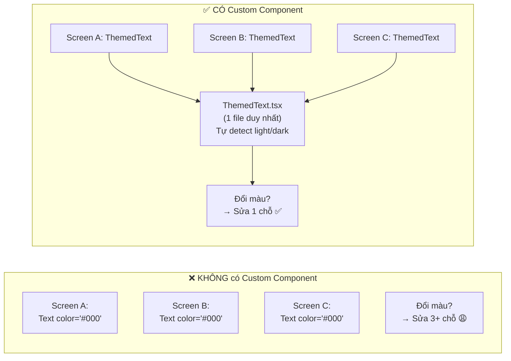

# 🧩 Custom Component Tái Sử Dụng — Pattern Quan Trọng Nhất Trong React

> **Chủ đề:** Cách tạo component "bọc" (wrapper component) để tái sử dụng code  
> **Áp dụng:** ✅ React Web + ✅ React Native  
> **Ví dụ thực tế:** Phân tích `ThemedView` và `ThemedText` trong dự án Bai1_HelloReactNative

---

## 📑 Mục lục
1. [Vấn đề: Tại sao cần Custom Component?](#phần-1-vấn-đề-tại-sao-cần-custom-component)
2. [Phân tích ThemedView — File đơn giản](#phần-2-phân-tích-themedview--file-đơn-giản)
3. [Phân tích ThemedText — File phức tạp hơn](#phần-3-phân-tích-themedtext--file-phức-tạp-hơn)
4. [Cơ chế Mảng Style trong React Native](#phần-4-cơ-chế-mảng-style-trong-react-native)
5. [Tự tạo Custom Component: MyButton](#phần-5-tự-tạo-custom-component-mybutton)
6. [FAQ: Áp dụng được cho cả React Web lẫn React Native?](#phần-6-faq-áp-dụng-được-cho-cả-react-web-lẫn-react-native)

---

## Phần 1: Vấn đề — Tại Sao Cần Custom Component?

### ❌ Cách viết tệ: Copy-paste style khắp nơi

Giả sử app của bạn có 50 chỗ hiển thị text, mỗi chỗ bạn phải viết:

```tsx
// Trong Screen A:
<Text style={{ color: darkMode ? '#fff' : '#000', fontSize: 16 }}>Chào bạn</Text>

// Trong Screen B:
<Text style={{ color: darkMode ? '#fff' : '#000', fontSize: 16 }}>Xin chào</Text>

// Trong Screen C:
<Text style={{ color: darkMode ? '#fff' : '#000', fontSize: 48, fontWeight: 'bold' }}>Tiêu đề</Text>

// ... Lặp lại 50 lần 😩
```

**Vấn đề:**
- Ngày mai muốn đổi `#000` thành `#333`? → **Phải sửa 50 chỗ!**
- Thêm font family mới? → **Phải sửa 50 chỗ!**
- Dễ quên 1 chỗ → UI không nhất quán, khó debug

### ✅ Giải pháp: Tạo Custom Component "bọc" lại

```tsx
// Chỉ viết THẾ NÀY — gọn, sạch, nhất quán:
<ThemedText>Chào bạn</ThemedText>                   // Tự động đúng màu light/dark
<ThemedText>Xin chào</ThemedText>                    // Viết 1 lần, dùng mãi
<ThemedText type="title">Tiêu đề</ThemedText>       // Thêm prop "type" để chọn preset style
```

Muốn đổi màu toàn bộ app? → **Sửa đúng 1 file** (`theme.ts`), cả 50 chỗ đổi theo!



---

## Phần 2: Phân Tích `ThemedView` — File Đơn Giản

File: [themed-view.tsx](file:///Users/vovantu/HTML_CSS/ReactNative/Bai1_HelloReactNative/src/components/themed-view.tsx)

### Code gốc (chỉ 17 dòng):

```tsx
import { View, type ViewProps } from 'react-native';       // ← Bước 1: Import View gốc
import { ThemeColor } from '@/constants/theme';
import { useTheme } from '@/hooks/use-theme';

// Bước 2: Định nghĩa kiểu Props (Mở rộng từ ViewProps gốc)
export type ThemedViewProps = ViewProps & {
  type?: ThemeColor;     // Thêm prop mới "type" (optional, có dấu ?)
};

// Bước 3: Tạo component "bọc" View gốc
export function ThemedView({ style, type, ...otherProps }: ThemedViewProps) {
  const theme = useTheme();   // Hook lấy bảng màu theo light/dark hiện tại

  return (
    <View
      style={[
        { backgroundColor: theme[type ?? 'background'] },   // Màu nền tự động
        style,                                                // Style riêng (ghi đè nếu cần)
      ]}
      {...otherProps}   // Chuyển tiếp TẤT CẢ props còn lại xuống View gốc
    />
  );
}
```

### Giải thích từng kỹ thuật:

#### 🔹 Kỹ thuật 1: Mở rộng Props — `ViewProps & { type?: ThemeColor }`

```tsx
export type ThemedViewProps = ViewProps & {
  type?: ThemeColor;
};
```

| Phần | Ý nghĩa |
|:---|:---|
| `ViewProps` | Tất cả props mà `<View>` gốc của React Native chấp nhận (style, children, testID, accessible, ...) |
| `&` | Toán tử **giao** (intersection) trong TypeScript — nối 2 type lại |
| `{ type?: ThemeColor }` | Thêm 1 prop mới tên `type`, kiểu `ThemeColor`, optional (có `?`) |

→ Kết quả: `ThemedView` chấp nhận **mọi prop của View gốc** + thêm prop `type` riêng.

#### 🔹 Kỹ thuật 2: Destructuring + Rest Operator — `{ style, type, ...otherProps }`

```tsx
function ThemedView({ style, type, ...otherProps }: ThemedViewProps) {
```

Tưởng tượng props truyền vào là 1 cái hộp:
```
Props = { style: {...}, type: "backgroundElement", children: <Text>...</Text>, testID: "abc" }
```

Destructuring tách ra:
```
style      = {...}
type       = "backgroundElement"
otherProps = { children: <Text>...</Text>, testID: "abc" }   ← Gom TẤT CẢ phần còn lại
```

#### 🔹 Kỹ thuật 3: Nullish Coalescing — `type ?? 'background'`

```tsx
theme[type ?? 'background']
```

| `type` truyền vào | `type ?? 'background'` | Kết quả |
|:---|:---|:---|
| `"backgroundElement"` | `"backgroundElement"` | `theme.backgroundElement` → `#F0F0F3` |
| `undefined` (không truyền) | `"background"` (giá trị mặc định) | `theme.background` → `#ffffff` |

#### 🔹 Kỹ thuật 4: Spread Props — `{...otherProps}`

```tsx
<View {...otherProps} />
```

Chuyển tiếp **mọi prop còn lại** xuống `<View>` gốc. Nhờ vậy, `ThemedView` dùng được tất cả props của View mà không cần khai báo từng cái:

```tsx
// Tất cả đều hoạt động mà KHÔNG cần sửa ThemedView:
<ThemedView testID="my-view">...</ThemedView>
<ThemedView accessible={true}>...</ThemedView>
<ThemedView onLayout={(e) => console.log(e)}>...</ThemedView>
```

### Kết quả sử dụng:

```tsx
// Light mode:
<ThemedView>                          →  <View backgroundColor="#ffffff">
// Dark mode:
<ThemedView>                          →  <View backgroundColor="#000000">
// Với type cụ thể:
<ThemedView type="backgroundElement"> →  <View backgroundColor="#F0F0F3">
```

---

## Phần 3: Phân Tích `ThemedText` — File Phức Tạp Hơn

File: [themed-text.tsx](file:///Users/vovantu/HTML_CSS/ReactNative/Bai1_HelloReactNative/src/components/themed-text.tsx)

### Điểm khác biệt so với ThemedView: Có thêm hệ thống **Preset Styles**

```tsx
export type ThemedTextProps = TextProps & {
  type?: 'default' | 'title' | 'small' | 'smallBold' | 'subtitle' | 'link' | 'linkPrimary' | 'code';
  themeColor?: ThemeColor;
};
```

Prop `type` ở đây không phải là tên màu, mà là **tên preset** — mỗi preset ánh xạ tới 1 bộ style định sẵn:

| `type` | fontSize | fontWeight | Dùng khi |
|:---|:---:|:---:|:---|
| `"default"` | 16 | 500 | Đoạn văn bản bình thường |
| `"title"` | 48 | 600 | Tiêu đề trang |
| `"subtitle"` | 32 | 600 | Tiêu đề phụ |
| `"small"` | 14 | 500 | Ghi chú nhỏ |
| `"code"` | 12 | 500-700 | Code, lệnh kỹ thuật (font mono) |
| `"link"` | 14 | — | Link bình thường |
| `"linkPrimary"` | 14 | — | Link xanh dương nổi bật |

### Cách chọn preset — Conditional rendering trong mảng style:

```tsx
style={[
  { color: theme[themeColor ?? 'text'] },      // 1️⃣ Luôn có: Màu chữ theo theme
  type === 'default' && styles.default,         // 2️⃣ Nếu type="default" → thêm style default
  type === 'title'   && styles.title,           // 2️⃣ Nếu type="title"   → thêm style title
  type === 'code'    && styles.code,            // 2️⃣ Nếu type="code"    → thêm style code
  // ...
  style,                                         // 3️⃣ Style tùy chỉnh từ người dùng (ưu tiên cao nhất)
]}
```

**Cơ chế `&&` trong mảng:**

| Biểu thức | Kết quả | Giải thích |
|:---|:---|:---|
| `type === 'title' && styles.title` (khi type = "title") | `styles.title` | Điều kiện đúng → trả về object style |
| `type === 'title' && styles.title` (khi type = "code") | `false` | Điều kiện sai → trả về `false`, React Native **bỏ qua** `false` trong mảng style |

---

## Phần 4: Cơ Chế Mảng Style Trong React Native

Trong React Native, prop `style` chấp nhận **1 object** hoặc **1 mảng objects**. Khi dùng mảng, **phần tử sau ghi đè phần tử trước** (giống CSS cascade):

```tsx
style={[
  { color: '#000', fontSize: 16 },    // Lớp 1: Mặc định
  { fontSize: 48, fontWeight: '600' }, // Lớp 2: Preset title → GHI ĐÈ fontSize
  { color: '#e74c3c' },               // Lớp 3: User truyền vào → GHI ĐÈ color
]}
```

**Kết quả hợp nhất:**
```tsx
{
  color: '#e74c3c',      // ← Từ Lớp 3 (ghi đè Lớp 1)
  fontSize: 48,          // ← Từ Lớp 2 (ghi đè Lớp 1)
  fontWeight: '600',     // ← Từ Lớp 2 (không bị ghi đè)
}
```

> [!TIP]
> **Quy tắc vàng:** Luôn đặt `style` (prop của người dùng) **cuối cùng** trong mảng. Như vậy người dùng component của bạn luôn có quyền ghi đè bất kỳ style nào.

---

## Phần 5: Tự Tạo Custom Component — `MyButton`

Áp dụng pattern đã học, hãy tự tạo một nút bấm tái sử dụng:

```tsx
import { Pressable, Text, StyleSheet, type PressableProps } from 'react-native';

// Bước 1: Định nghĩa props
type MyButtonProps = PressableProps & {
  title: string;                              // Bắt buộc: text hiển thị
  variant?: 'primary' | 'secondary' | 'danger'; // Optional: kiểu nút
};

// Bước 2: Tạo component
export function MyButton({ title, variant = 'primary', style, ...rest }: MyButtonProps) {
  return (
    <Pressable
      style={({ pressed }) => [
        styles.base,                                  // Style chung
        variant === 'primary' && styles.primary,      // Preset theo variant
        variant === 'secondary' && styles.secondary,
        variant === 'danger' && styles.danger,
        pressed && { opacity: 0.8, transform: [{ scale: 0.97 }] },
        style as any,                                 // Style tùy chỉnh (ghi đè cuối)
      ]}
      {...rest}
    >
      <Text style={[
        styles.text,
        variant === 'secondary' && styles.secondaryText,
      ]}>
        {title}
      </Text>
    </Pressable>
  );
}

// Bước 3: Định nghĩa styles
const styles = StyleSheet.create({
  base: {
    paddingVertical: 14,
    paddingHorizontal: 24,
    borderRadius: 10,
    alignItems: 'center',
  },
  primary:   { backgroundColor: '#3498db' },
  secondary: { backgroundColor: '#fff', borderWidth: 2, borderColor: '#3498db' },
  danger:    { backgroundColor: '#e74c3c' },
  text:          { color: '#fff', fontSize: 16, fontWeight: '600' },
  secondaryText: { color: '#3498db' },
});
```

**Cách sử dụng — cực kỳ gọn:**

```tsx
<MyButton title="Lưu" onPress={handleSave} />
<MyButton title="Hủy" variant="secondary" onPress={handleCancel} />
<MyButton title="Xóa" variant="danger" onPress={handleDelete} />
<MyButton title="Custom" style={{ borderRadius: 50 }} onPress={handleCustom} />
```

---

## Phần 6: FAQ — Áp Dụng Được Cho Cả React Web Lẫn React Native?

### ✅ CÓ! Pattern Custom Component là **cốt lõi của React** — áp dụng 100% cho cả React Web lẫn React Native.

Tất cả các kỹ thuật bạn vừa học đều thuộc về **React core**, KHÔNG phải riêng của React Native:

| Kỹ thuật | React Web | React Native |
|:---|:---:|:---:|
| Tạo component tái sử dụng | ✅ | ✅ |
| Nhận props + TypeScript type | ✅ | ✅ |
| Destructuring `{ style, ...rest }` | ✅ | ✅ |
| Spread props `{...rest}` | ✅ | ✅ |
| useState, useEffect, hooks | ✅ | ✅ |
| Conditional rendering (`&&`, `? :`) | ✅ | ✅ |
| Children components | ✅ | ✅ |

### Điểm khác biệt DUY NHẤT nằm ở phần **styling**, không phải logic:

| Tiêu chí | React Web | React Native |
|:---|:---|:---|
| **Styling** | CSS file, className, Tailwind | `StyleSheet.create()`, inline objects |
| **Mảng style** | Dùng `clsx()` hoặc `cn()` để nối className | Dùng mảng `style={[a, b, c]}` (có sẵn) |
| **Component gốc để bọc** | `<div>`, `<p>`, `<button>`, `<input>` | `<View>`, `<Text>`, `<Pressable>`, `<TextInput>` |

### Ví dụ so sánh cùng 1 pattern trên Web vs React Native:

```tsx
// ============ REACT WEB ============
import React from 'react';

type MyButtonProps = React.ButtonHTMLAttributes<HTMLButtonElement> & {
  variant?: 'primary' | 'danger';
};

export function MyButton({ variant = 'primary', className, children, ...rest }: MyButtonProps) {
  return (
    <button
      className={`btn btn-${variant} ${className || ''}`}   // ← CSS className
      {...rest}
    >
      {children}
    </button>
  );
}

// ============ REACT NATIVE ============
import { Pressable, Text, type PressableProps } from 'react-native';

type MyButtonProps = PressableProps & {
  title: string;
  variant?: 'primary' | 'danger';
};

export function MyButton({ title, variant = 'primary', style, ...rest }: MyButtonProps) {
  return (
    <Pressable
      style={[styles.base, styles[variant], style as any]}   // ← StyleSheet objects
      {...rest}
    >
      <Text style={styles.text}>{title}</Text>
    </Pressable>
  );
}
```

> [!IMPORTANT]
> **Kết luận:** Pattern Custom Component tái sử dụng là **kiến thức React thuần (React core)**, không phải kiến thức riêng của React Native hay React Web. Bạn học 1 lần, **áp dụng mãi mãi** trên cả 2 nền tảng. Chỉ cần thay đổi phần styling (CSS ↔ StyleSheet) và component gốc (`<div>` ↔ `<View>`) cho phù hợp với từng nền tảng.

---

## 📌 Bảng Tổng Kết Thuật Ngữ

| Thuật ngữ | Ý nghĩa |
|:---|:---|
| **Custom Component** | Component do bạn tự tạo, bọc lại component gốc (`Text`, `View`, `button`, `div`) và thêm logic/style riêng |
| **Tái sử dụng (Reusable)** | Viết 1 lần trong 1 file, import dùng ở mọi nơi. Sửa 1 chỗ → cả app đổi theo |
| **Wrapper Component** | Component bọc bên ngoài component khác, thêm tính năng (theme, animation, validation, ...) |
| **Preset Styles** | Bộ style định sẵn, chọn qua prop `type` hoặc `variant`. Ví dụ: `type="title"` → fontSize 48 |
| **`...rest` / `...otherProps`** | Spread operator — gom tất cả props còn lại và chuyển tiếp xuống component gốc |
| **Mảng style `[a, b, c]`** | Kỹ thuật React Native — style sau ghi đè style trước, cho phép vừa có preset vừa tùy chỉnh |
| **`??` (Nullish Coalescing)** | Toán tử JavaScript — nếu giá trị bên trái là `null`/`undefined` thì dùng giá trị bên phải |
