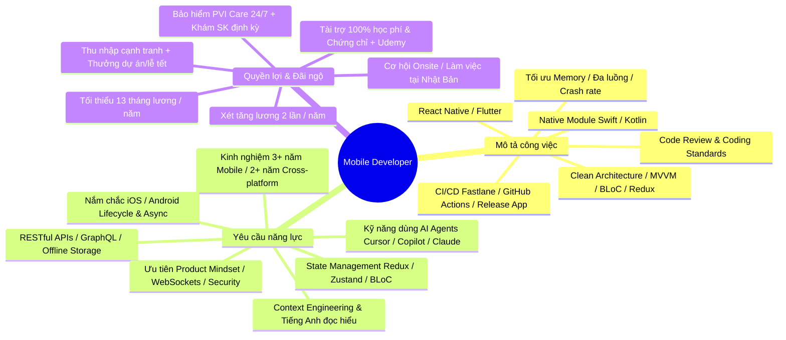

# 📱 VNEXT SOFTWARE - Tuyển dụng Senior Mobile Developer

---

## 🏢 Tổng Quan Về VNEXT SOFTWARE
- **Quy mô**: 450+ nhân sự | 17+ năm kinh nghiệm
- **Văn phòng**: 5 văn phòng tại **Hà Nội, Đà Nẵng** (Việt Nam) & **Tokyo, Fukuoka, Osaka** (Nhật Bản).
- **Lĩnh vực**: Phần mềm hệ thống, Mobile App, AI, Blockchain (thị trường Nhật, Á, Âu, Mỹ).

---

## 🗺️ Sơ Đồ Toàn Cảnh (JD Mindmap)

---

## 📋 Chi Tiết Từng Khối

### 1. ⚙️ Trách Nhiệm Kỹ Thuật (Responsibilities)
| Hạng mục | Chi tiết thực hiện |
| :--- | :--- |
| **Phát triển App** | Xây dựng và tối ưu ứng dụng iOS/Android bằng **React Native** hoặc **Flutter** |
| **Kiến trúc** | Áp dụng **Clean Architecture, MVVM, BLoC, Redux**, đảm bảo scalability & high-performance |
| **Native Integration** | Tự chủ viết **Native Modules / Plugins (Swift / Kotlin)** khi cross-platform chưa hỗ trợ |
| **Tối ưu hóa** | Xử lý đa luồng, tối ưu RAM, giảm thiểu rò rỉ bộ nhớ (memory leaks) và crash |
| **DevOps Mobile** | Thiết lập **CI/CD** (Fastlane, GitHub Actions, Bitrise), tự động hóa build & release lên App Store / Google Play |
| **Chất lượng code** | Thực hiện Code Review chéo, chuẩn hóa Coding Conventions cho team |

---

### 2. 🎯 Tiêu Chuẩn Tuyển Dụng (Requirements)
| Nhóm | Yêu cầu |
| :--- | :--- |
| **Kinh nghiệm** | • **3+ năm Mobile** (tối thiểu **2 năm thực chiến với React Native / Flutter**) |
| **Nền tảng Native** | • Nắm vững Lifecycle, Memory Management, Asynchronous trên iOS (Swift) hoặc Android (Kotlin/Java) |
| **Quản lý State & Data** | • Thành thạo Redux / Zustand / BLoC / Provider / Riverpod • RESTful, GraphQL, Offline Data (SQLite, Realm, Hive, Room) |
| **AI Tools & Năng suất** | • Thành thạo AI Agent trong công việc: **Cursor, Claude Code, GitHub Copilot, Codex** • Hiểu và áp dụng **Context Engineering** để tối ưu hóa năng suất |
| **Ngoại ngữ** | • Tiếng Anh đọc hiểu tài liệu kỹ thuật tốt |
| **Điểm cộng (Ưu tiên)** | • Tư duy Product Mindset (UX, Business Metrics, Firebase Analytics, A/B Testing) • Kinh nghiệm với WebSockets, Micro-apps, App Security / Obfuscation |

---

### 3. 🎁 Chế Độ Đãi Ngộ (Benefits)
- 💰 **Thu nhập**: Cạnh tranh + Thưởng dự án, lễ Tết + **Tối thiểu 13 tháng lương/năm**.
- 📈 **Đánh giá**: Xét tăng lương định kỳ **2 lần/năm**.
- 🏥 **Sức khỏe & Phúc lợi**: Bảo hiểm **PVI Care 24/24**, khám sức khỏe định kỳ hàng năm, đầy đủ BHXH/BHYT/BHTN.
- ⏰ **Thời gian**: Nghỉ cố định Thứ 7, Chủ Nhật + phép năm theo luật.
- 🎓 **Đào tạo & Phát triển**:
  - **Tài trợ 100% chi phí** học tập chuyên môn, kỹ năng mềm và thi chứng chỉ uy tín (kèm thưởng khi đạt chứng chỉ).
  - Học không giới hạn trên **Udemy Business**.
  - **Cơ hội onsite / làm việc tại Nhật Bản** (với ứng viên có tiếng Nhật).
- ⚽ **Đời sống**: CLB bóng đá, game, teambuilding, gala, du lịch nghỉ mát hàng năm.
